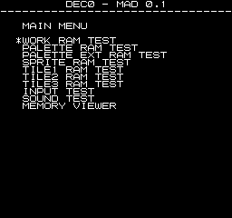
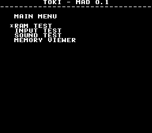

# MAD - Multiple Arcade Diagnostic
**IMPORTANT**: This is an experiment at this point.  There maybe large changes as I get things figured out.

Having created a couple different diagnostic roms/bios for arcade boards I wanted to look into making it easier/faster to write new ones.  The idea behind this project is to have a framework that contains all of the common code that exists between diag roms from different boards.  Stuff like ram tests, menu systems, memory viewer, displaying player/dsw inputs, sending a byte to the sound latch, etc.

Currently I've been soley focusing on m68k based boards.  Once I'm satisfied with the m68k code and layout I want to look into adding other cpus.  I think ideally I would want to be able to have diag roms for both the main cpu and the sound cpu for each board.  But thats a long way off.

In general adding a new board entails understanding how to initialize the hardware, figuring out how to print to the screen (including palette setup), then just hooking up the commom tests (ram, io, sound, etc).  MAD has already helped me track down issues in my toki (bad joystick inputs) and wwfsstar (failed palette upper ram chip) boards.

Below is the list of boards that I'm currently using to develope MAD.  These were picked because I have them and its a good mix of manufacturers, individual game boards vs multiple games (rom boards) on a single platform.  This has been to help me understand what all can be merged into common code and what type of one-offs may exist and how to deal with them.

### CPS1
**Three Wonders** (3wonders with cps_b21_bts1)<br>


**Captain Commando** (captcomm with cps_b21_bts3)<br>


**Ghouls'n Ghosts** (ghouls with cps_b01)<br>


**Street Fighter II: The World Warrior** (sf2 with cps_b11)<br>


### dec0 based games
**Bad Dudes vs. Dragonninja** (baddudes)<br>


**Heavy Barrel** (hbarrel)<br>


**Hippodrome** (hippodrm)<br>


**Robocop** (robocop)<br>


### Teenage Mutant Ninja Turtles (tmnt)


### Toki


### WWF Superstars (wwfsstar)


### WWF Wrestlefest (wwfwfest)


## Building
I've been doing most of my developemnt in window subsystem for linux (wsl).  This makes it easy to compile, test in mame, and then burn to an eprom for testing on hardware.

I'm using debian wsl.  You will want to `apt-get install build-essential` to get gcc/make.

vasm and vlink are need to for compiling the m68k source code, which are available here

http://sun.hasenbraten.de/vasm/<br>
http://sun.hasenbraten.de/vlink/

For vasm you will need the vasmm68k_mot and vasmz80_oldsytle variants.  If you are building vasm from source, you can build it with the following commands from where ever you decompressed vasm.tar.gz.

```
$ make CPU=m68k SYNTAX=mot
$ make CPU=z80 SYNTAX=oldstyle
```

Copy the resulting vasmm68k_mot and vasmz80_oldsytle (and vlink, when you get that compiled) so they are within your $PATH (ie: /usr/local/bin/)

The first thing you will want to is run `make` in the `util` dir, which has a couple utils that deal with crc/mirror injection and rom splitting.

Under the machine/ directory are the available board types:

```
jwestfall@DESKTOP-7LADK23:/mnt/c/Users/jwestfall/Desktop/mad/machine$ ls -la
total 0
drwxrwxrwx 1 jwestfall jwestfall 4096 May  9 17:56 .
drwxrwxrwx 1 jwestfall jwestfall 4096 May 13 18:31 ..
drwxrwxrwx 1 jwestfall jwestfall 4096 May 12 14:22 cps1
drwxrwxrwx 1 jwestfall jwestfall 4096 May 12 14:22 dec0
drwxrwxrwx 1 jwestfall jwestfall 4096 May 12 14:22 toki
drwxrwxrwx 1 jwestfall jwestfall 4096 May 12 14:21 wwfsstar
drwxrwxrwx 1 jwestfall jwestfall 4096 May 12 14:19 wwfwfest
```

Inside of these will be a `main` directory and sometimes a `sound` directory.  The former is the diag rom for the main cpu, and the latter the sound cpu.  In side those directories will be Makefiles for generating the roms for the given board/romset.  In some cases there will be different Makefiles for mame vs hardware. These will be do to a behavior difference between mame vs hardware.  The most common case is mame not allowing reads on some memory regions while its allowed on hardware.  The mame build will have the corresponding tests disabled to prevent false errors.

```
jwestfall@DESKTOP-7LADK23:/mnt/c/Users/jwestfall/Desktop/mad/machine/dec0/main$ ls -la
total 4
-rwxrwxrwx 1 jwestfall jwestfall  106 May 14 21:59 build-baddudes-hardware.sh
-rwxrwxrwx 1 jwestfall jwestfall  154 May 14 22:00 build-baddudes-mame.sh
-rwxrwxrwx 1 jwestfall jwestfall  105 May 14 21:59 build-hbarrel-hardware.sh
-rwxrwxrwx 1 jwestfall jwestfall  153 May 14 22:00 build-hbarrel-mame.sh
-rwxrwxrwx 1 jwestfall jwestfall  106 May 14 21:59 build-hippodrm-hardware.sh
-rwxrwxrwx 1 jwestfall jwestfall  154 May 14 22:01 build-hippodrm-mame.sh
-rwxrwxrwx 1 jwestfall jwestfall  105 May 14 22:00 build-robocop-hardware.sh
-rwxrwxrwx 1 jwestfall jwestfall  153 May 14 22:01 build-robocop-mame.sh
-rwxrwxrwx 1 jwestfall jwestfall 2526 May 17 18:02 common.mk
drwxrwxrwx 1 jwestfall jwestfall 4096 May 17 18:03 include
-rwxrwxrwx 1 jwestfall jwestfall  325 May 16 17:44 mad_dec0.ld
-rwxrwxrwx 1 jwestfall jwestfall  201 May 14 22:03 Makefile.baddudes-hardware
-rwxrwxrwx 1 jwestfall jwestfall  212 May 14 22:03 Makefile.baddudes-mame
-rwxrwxrwx 1 jwestfall jwestfall  216 May 14 22:03 Makefile.hbarrel-hardware
-rwxrwxrwx 1 jwestfall jwestfall  227 May 14 22:03 Makefile.hbarrel-mame
-rwxrwxrwx 1 jwestfall jwestfall  191 May 14 22:03 Makefile.hippodrm-hardware
-rwxrwxrwx 1 jwestfall jwestfall  202 May 14 22:03 Makefile.hippodrm-mame
-rwxrwxrwx 1 jwestfall jwestfall  201 May 14 22:03 Makefile.robocop-hardware
-rwxrwxrwx 1 jwestfall jwestfall  212 May 14 22:03 Makefile.robocop-mame
drwxrwxrwx 1 jwestfall jwestfall 4096 May 17 18:47 src
```

The build*.sh are specific to my setup and may not work for you.  They build the roms then copy them into my mame's roms/[romset]/ directory.  However you can just run `make -f Makefile.xxx` to build the roms for the specific board/romset.

```
jwestfall@DESKTOP-7LADK23:/mnt/c/Users/jwestfall/Desktop/mad/machine/dec0/main$ make -f Makefile.robocop-hardware
mkdir -p build/hardware/robocop/work
mkdir -p build/hardware/robocop/obj/tests build/hardware/robocop/obj/cpu/68000/handlers build/hardware/robocop/obj/cpu/68000/tests
make: Warning: File 'build/hardware/robocop' has modification time 2.5 s in the future
vasmm68k_mot -Fvobj -m68000 -spaces -chklabels -Iinclude -I../../../common/include  -quiet -D_ROMSET_ROBOCOP_ -o build/hardware/robocop/obj/cpu/68000/crc32.o ../../../common/src/cpu/68000/crc32.asm
vasmm68k_mot -Fvobj -m68000 -spaces -chklabels -Iinclude -I../../../common/include  -quiet -D_ROMSET_ROBOCOP_ -o build/hardware/robocop/obj/cpu/68000/dsub.o ../../../common/src/cpu/68000/dsub.asm
vasmm68k_mot -Fvobj -m68000 -spaces -chklabels -Iinclude -I../../../common/include  -quiet -D_ROMSET_ROBOCOP_ -o build/hardware/robocop/obj/cpu/68000/error_address.o ../../../common/src/cpu/68000/error_address.asm
vasmm68k_mot -Fvobj -m68000 -spaces -chklabels -Iinclude -I../../../common/include  -quiet -D_ROMSET_ROBOCOP_ -o build/hardware/robocop/obj/cpu/68000/input_update.o ../../../common/src/cpu/68000/input_update.asm

...

vasmm68k_mot -Fvobj -m68000 -spaces -chklabels -Iinclude -I../../../common/include  -quiet -D_ROMSET_ROBOCOP_ -o build/hardware/robocop/obj/tests/tile2_ram.o src/tests/tile2_ram.asm
vasmm68k_mot -Fvobj -m68000 -spaces -chklabels -Iinclude -I../../../common/include  -quiet -D_ROMSET_ROBOCOP_ -o build/hardware/robocop/obj/tests/tile3_ram.o src/tests/tile3_ram.asm
vasmm68k_mot -Fvobj -m68000 -spaces -chklabels -Iinclude -I../../../common/include  -quiet -D_ROMSET_ROBOCOP_ -o build/hardware/robocop/obj/tests/work_ram.o src/tests/work_ram.asm
vlink -brawbin1 -Tmad_dec0.ld -o build/hardware/robocop/work/mad_dec0.bin build/hardware/robocop/obj/cpu/68000/crc32.o build/hardware/robocop/obj/cpu/68000/dsub.o build/hardware/robocop/obj/cpu/68000/error_address.o build/hardware/robocop/obj/cpu/68000/input_update.o build/hardware/robocop/obj/cpu/68000/memory_fill.o build/hardware/robocop/obj/cpu/68000/menu_input_generic.o build/hardware/robocop/obj/cpu/68000/print_error.o build/hardware/robocop/obj/cpu/68000/util.o build/hardware/robocop/obj/cpu/68000/xy_string.o build/hardware/robocop/obj/cpu/68000/handlers/error.o build/hardware/robocop/obj/cpu/68000/handlers/memory_viewer.o build/hardware/robocop/obj/cpu/68000/handlers/memory_tests.o build/hardware/robocop/obj/cpu/68000/handlers/menu.o build/hardware/robocop/obj/cpu/68000/handlers/sound.o build/hardware/robocop/obj/cpu/68000/tests/auto.o build/hardware/robocop/obj/cpu/68000/tests/input.o build/hardware/robocop/obj/cpu/68000/tests/mad_rom.o build/hardware/robocop/obj/cpu/68000/tests/memory.o build/hardware/robocop/obj/mad_dec0.o build/hardware/robocop/obj/errors.o build/hardware/robocop/obj/footer.o build/hardware/robocop/obj/main_menu.o build/hardware/robocop/obj/memory_viewer_menu.o build/hardware/robocop/obj/print.o build/hardware/robocop/obj/screen.o build/hardware/robocop/obj/vector_table.o build/hardware/robocop/obj/tests/auto.o build/hardware/robocop/obj/tests/input.o build/hardware/robocop/obj/tests/palette_ram.o build/hardware/robocop/obj/tests/palette_ext_ram.o build/hardware/robocop/obj/tests/sound.o build/hardware/robocop/obj/tests/sprite_ram.o build/hardware/robocop/obj/tests/tile1_ram.o build/hardware/robocop/obj/tests/tile2_ram.o build/hardware/robocop/obj/tests/tile3_ram.o build/hardware/robocop/obj/tests/work_ram.o
../../../util/rom-inject-crc-mirror -f build/hardware/robocop/work/mad_dec0.bin -t 131072
Using ROM: build/hardware/robocop/work/mad_dec0.bin
Start Size:   0x8000
Target Size:  0x20000
CRC32 Range:  0x0 - 0x7ffb
CRC32:        0x3b6a6732
Mirrors:      0x3
../../../util/rom-byte-split build/hardware/robocop/work/mad_dec0.bin build/hardware/robocop/ep05-4.11c build/hardware/robocop/ep01-4.11b
Input ROM: build/hardware/robocop/work/mad_dec0.bin (131072 bytes)
Output ROM #1: build/hardware/robocop/ep05-4.11c (65536 bytes)
Output ROM #2: build/hardware/robocop/ep01-4.11b (65536 bytes)
make: warning:  Clock skew detected.  Your build may be incomplete.
```

From there you can use the Output ROMs in the build/ directory with mame or burn them to eproms to use on the hardware.
