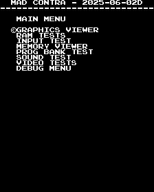
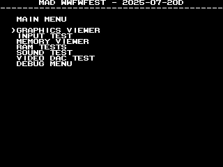

# MAD - Multiple Arcade Diagnostic
**IMPORTANT**: This is an experiment at this point.  There maybe
large changes as I get things figured out.

Having created a couple different diagnostic roms/bios for arcade boards I
wanted to look into making it easier/faster to write new ones.  The idea behind
this project is to have a framework that contains all of the common code that
exists between diag roms from different boards.  Stuff like ram tests, menu
systems, memory viewer, displaying player/dsw inputs, sending a byte to the
sound latch, etc.

In general adding a new board entails understanding how to initialize the
hardware, figuring out how to print to the screen (including palette setup),
then just hooking up the common tests (ram, io, sound, etc).  MAD has already
helped me track down issues in my toki (bad joystick inputs) and wwfsstar
(failed palette upper ram chip) boards. Additionally its been used to help
[MAME](https://github.com/search?q=repo%3Amamedev%2Fmame+Westfall&type=commits) better understand how some of the custom chips work.

You can grab the latest compiled version here

https://www.mvs-scans.com/mad/mad-main.zip

Support boards

### 1943 (1943)


### Aliens (aliens)


### Alpha68K II based games
<br>
**Sky Solder (skysoldr)**<br>
**Time Solder (timesold)**<br>

### Blades of Steel (bladestl)


### Block Hole (blockhl)


### Capcom 85608 Board


**Avengers (avengers)**<br>
**Trojan (trojan)**

### Contra (contra)


### CPS1
**Three Wonders** (3wonders with cps_b21_bts1)<br>


**Captain Commando** (captcomm with cps_b21_bts3)<br>


**Ghouls'n Ghosts** (ghouls with cps_b01)<br>


**Street Fighter II: The World Warrior** (sf2 with cps_b11)<br>


### CPS2 (suicided & encrypted boards)


**1944: The Loop Master (Euro)** (1944)<br>
**19XX: The War Against Destiny (Euro)** (19xx)<br>
**Dungeons & Dragons: Tower of Doom (Euro)** (ddotd)<br>
**Vampire Savior: The Lord of Vampire (USA)** (vsavu)<br>
**X-Men: Children of the Atom (Asia)** (xmcotaa)<br>
**Generic Suicided Games**

### Crime Fighters (crimfght)


### dec0 based games
**Bad Dudes vs. Dragonninja** (baddudes)<br>


**Heavy Barrel** (hbarrel)<br>


**Hippodrome** (hippodrm)<br>


**Hyper Dyne Side Arms** (sidearms)<br>


**Robocop** (robocop)<br>


### Devastators (devstors)


### Mitchell based games
<br>
**Mahjong Gakuen 2 Gakuen-chou no Fukushuu (mgakeun2)**<br>
**Pang/Buster Bros**<br>
**Poker Ladies**<br>
**Quiz Sangokushi**<br>
**Quiz Tonosama no Yabou (qtono1)**<br>
**Super Pang/Super Buster Bros**<br>

### MX5000 / Flak Attack (mx5000)


### Ninja Gaiden (gaiden)


### Rollergames (rollerg)


### Rush 'n Attack (rushatck)


### Teenage Mutant Ninja Turtles (tmnt)


### The Main Event (mainevt)


### The Real Ghostbusters (ghostb)


### The Simpsons (simpsons)


### Toki (toki)


### Vendetta (vendetta)


### WWF Superstars (wwfsstar)


### WWF Wrestlefest (wwfwfest)


### X-Men (xmen)


## Building
I've been doing most of my development in window subsystem for linux (wsl).
This makes it easy to compile, test in mame, and then burn to an eprom for
testing on hardware.

I'm using debian wsl.  You will want to `apt-get install build-essential` to get gcc/make.

vasm and vlink are need to for compiling the m68k source code, which are available here

http://sun.hasenbraten.de/vasm/<br>
http://sun.hasenbraten.de/vlink/

The version of vasm needs to be >= 2.0c.  For vasm you will need the
vasm6809_mot, vasmm68k_mot and vasmz80_mot variants. If you are building vasm
from source, you can build it with the following commands from where ever you
decompressed vasm.tar.gz.

```
$ make CPU=6809 SYNTAX=mot
$ make CPU=m68k SYNTAX=mot
$ make CPU=z80 SYNTAX=mot
```

Copy the resulting vasm6809_mot, vasmm68k_mot and vasmz80_mot (and vlink, when
you get that compiled) so they are within your $PATH (ie: /usr/local/bin/)

The top level `Makefile` should be able to build everything.

```
jwestfall@DESKTOP-7LADK23:/mnt/c/Users/jwestfall/Desktop/mad$ make
make -C util
make[1]: Entering directory '/mnt/c/Users/jwestfall/Desktop/mad/util'
cc rom-byte-split.c -o rom-byte-split
cc rom-inject-crc-mirror.c -o rom-inject-crc-mirror
make[1]: Leaving directory '/mnt/c/Users/jwestfall/Desktop/mad/util'
make -C machine
make[1]: Entering directory '/mnt/c/Users/jwestfall/Desktop/mad/machine'
for DIR in aliens/main/ alpha68k_ii/main/ blades_of_steel/main/ block_hole/main/ contra/main/ cps1/main/ cps2/main/ crime_fighters/main/ dec0/main/ devastators/main/ mitchell/main/ ninja_gaiden/main/ rollergames/main/ rush_n_attack/main/ the_main_event/main/ the_real_ghostbusters/main/ tmnt/main/ toki/main/ vendetta/main/ wwf_superstars/main/ wwf_wrestlefest/main/; do \
        make -C $DIR; \
done
make[2]: Entering directory '/mnt/c/Users/jwestfall/Desktop/mad/machine/aliens/main'
mkdir -p build/work
make[2]: Warning: File 'build' has modification time 74 s in the future
vasm6809_mot -konami2 -Fvobj -spaces -chklabels -Iinclude -I../../../common -wfail -quiet -D_CPU_KONAMI2_ -D_DEBUG_HARDWARE_ -o build/obj/cpu/6x09/src/header.o ../../../common/cpu/6x09/src/header.asm
vasm6809_mot -konami2 -Fvobj -spaces -chklabels -Iinclude -I../../../common -wfail -quiet -D_CPU_KONAMI2_ -D_DEBUG_HARDWARE_ -o build/obj/cpu/6x09/src/input_update.o ../../../common/cpu/6x09/src/input_update.asm
vasm6809_mot -konami2 -Fvobj -spaces -chklabels -Iinclude -I../../../common -wfail -quiet -D_CPU_KONAMI2_ -D_DEBUG_HARDWARE_ -o build/obj/cpu/6x09/src/print_error.o ../../../common/cpu/6x09/src/print_error.asm
vasm6809_mot -konami2 -Fvobj -spaces -chklabels -Iinclude -I../../../common -wfail -quiet -D_CPU_KONAMI2_ -D_DEBUG_HARDWARE_ -o build/obj/cpu/6x09/src/util.o ../../../common/cpu/6x09/src/util.asm
vasm6809_mot -konami2 -Fvobj -spaces -chklabels -Iinclude -I../../../common -wfail -quiet -D_CPU_KONAMI2_ -D_DEBUG_HARDWARE_ -o build/obj/cpu/6x09/src/xy_string.o ../../../common/cpu/6x09/src/xy_string.asm
vasm6809_mot -konami2 -Fvobj -spaces -chklabels -Iinclude -I../../../common -wfail -quiet -D_CPU_KONAMI2_ -D_DEBUG_HARDWARE_ -o build/obj/cpu/6x09/src/debug/error_address_test.o ../../../common/cpu/6x09/src/debug/error_address_test.asm
vasm6809_mot -konami2 -Fvobj -spaces -chklabels -Iinclude -I../../../common -wfail -quiet -D_CPU_KONAMI2_ -D_DEBUG_HARDWARE_ -o build/obj/cpu/6x09/src/debug/mad_git_hash.o ../../../common/cpu/6x09/src/debug/mad_git_hash.asm
vasm6809_mot -konami2 -Fvobj -spaces -chklabels -Iinclude -I../../../common -wfail -quiet -D_CPU_KONAMI2_ -D_DEBUG_HARDWARE_ -o build/obj/cpu/6x09/src/handlers/auto_test.o ../../../common/cpu/6x09/src/handlers/auto_test.asm
vasm6809_mot -konami2 -Fvobj -spaces -chklabels -Iinclude -I../../../common -wfail -quiet -D_CPU_KONAMI2_ -D_DEBUG_HARDWARE_ -o build/obj/cpu/6x09/src/handlers/error.o ../../../common/cpu/6x09/src/handlers/error.asm
vasm6809_mot -konami2 -Fvobj -spaces -chklabels -Iinclude -I../../../common -wfail -quiet -D_CPU_KONAMI2_ -D_DEBUG_HARDWARE_ -o build/obj/cpu/6x09/src/handlers/memory_viewer.o ../../../common/cpu/6x09/src/handlers/memory_viewer.asm
vasm6809_mot -konami2 -Fvobj -spaces -chklabels -Iinclude -I../../../common -wfail -quiet -D_CPU_KONAMI2_ -D_DEBUG_HARDWARE_ -o build/obj/cpu/6x09/src/handlers/menu.o ../../../common/cpu/6x09/src/handlers/menu.asm
vasm6809_mot -konami2 -Fvobj -spaces -chklabels -Iinclude -I../../../common -wfail -quiet -D_CPU_KONAMI2_ -D_DEBUG_HARDWARE_ -o build/obj/cpu/6x09/src/handlers/sound.o ../../../common/cpu/6x09/src/handlers/sound.asm
...
```

If you are want to mess with a specific machine/board you can run the `Makefile`
under `machine/<machine>`.  Each machine will have a `main` directory which will
be MAD for the main CPU.  Some machines will have a `sound` directory which will
be MAD for the sound CPU.

Once compiled the roms will be located under
`machine/<machine>/(main|sound)/build` directory.  In some cases there will be
separate builds for MAME and hardware.  This will be because MAME is doing
something different from hardware and it warrents having the different builds.
