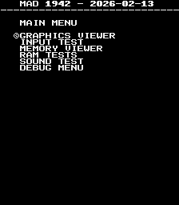
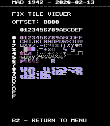
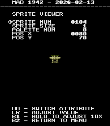

# 1942
- [MAD Pictures](#mad-pictures)
- [PCB Pictures](#pcb-pictures)
  - [Original](#original)
  - [Factory Conversion (from Vulgus)](#factory-conversion-from-vulgus)
- [Manual / Schematics](#manual-schematics)
- [MAD Eproms](#mad-eproms)
- [RAM Locations](#ram-locations)
- [Errors/Error Codes](#errorserror-codes)
  - [Main CPU](#main-cpu)
  - [Sound CPU](#sound-cpu)
- [MAD Notes](#mad-notes)
  - [Sprite garbage on boot](#sprite-garbage-on-boot)
  - [Static palette colors](#static-palette-colors)
  - [No Video DAC Test](#no-video-dac-test)
- [MAME vs Hardware](#mame-vs-hardware)

## MAD Pictures

## PCB Pictures
**IMPORTANT**: These board are **NOT** JAMMA.  Using a JAMMA harness will damage
the board!!!. You need to use a 1942/Vulgus to JAMMA converter.

Also its not safe to use metal standoffs between the boards.  This can lead to a
direct short to ground as the outside of the parts side of the board is ground,
while on the solder side its VCC.

The CPU and Graphics PCB have their solder sides facing each other.

### Original
on the way

### Factory Conversion (from Vulgus)

## Manual / Schematics
[Manual](docs/1942_manual.pdf) 
[Schematics](docs/1942_schematics.pdf) 

## MAD Eproms

| Diag | Eprom Type | Location | Notes |
| ---- | ---------- | ----------- | ----- |
| Main | 27c128 | srb-03.m3 @ N4 on CPU Board srb-04.m4 @ N5 on CPU Board | |
| Sound | 27c128 | C11 | No MAD ROM exists yet |

## RAM Locations
| RAM | Location | Type |
| -------- | :------- | ----- |
| BG Tile RAM | A10 on Graphics Board | TMM2016AP-10 (2k x 8bit) |
| Fix Tile RAM | H2 on CPU Board | M58725P-15 (2k x 8bit) |
| Sound RAM | C10 on CPU Board | M58725P-15 (2k x 8bit) |
| Work RAM | N9 on CPU Board | M58725P-15 (2k x 8bit) |
| Work High RAM | N10 on CPU Board | M58725P-15 (2k x 8bit) |

Work RAM consists of 2 RAM chips 0xe000 to 0xe7ff and 0xe800 to 0xefff.  MAD is
setup so it only accesses 0xe000 to 0xe7ff range.  Work RAM errors refer to the
chip at N9 on the CPU board and Work *High* RAM refer to the chip at N10 on the CPU board

There are additional RAM chips on the graphics board which the CPU doesn't have
access too.  Likely sprite RAM and line buffers.

## Errors/Error Codes
MAD for the main CPU is expecting the game's original sound rom to be there
in order to play sounds, including making beep codes.

### Main CPU
The main CPU is a Z80.  If an error is encountered during tests, MAD will print
the error to the screen, play the beep code, then jump to the error address

On Z80's the error address is `$6000 | error_code << 7`.  Error codes on the
Z80 CPU are are 6 bits.

<!-- ec_table_main_start -->
| Hex  | Number | Beep Code |     Error Address (A15..A0)    |           Error Text           |
| ---: | -----: | --------: | :----------------------------: | :----------------------------- |
| 0x01 |      1 | 0000 0001 |      0110 0000 1xxx xxxx       | BG TILE RAM ADDRESS            |
| 0x02 |      2 | 0000 0010 |      0110 0001 0xxx xxxx       | BG TILE RAM DATA               |
| 0x03 |      3 | 0000 0011 |      0110 0001 1xxx xxxx       | BG TILE RAM MARCH              |
| 0x04 |      4 | 0000 0100 |      0110 0010 0xxx xxxx       | BG TILE RAM OUTPUT             |
| 0x05 |      5 | 0000 0101 |      0110 0010 1xxx xxxx       | BG TILE RAM WRITE              |
| 0x06 |      6 | 0000 0110 |      0110 0011 0xxx xxxx       | FIX TILE RAM ADDRESS           |
| 0x07 |      7 | 0000 0111 |      0110 0011 1xxx xxxx       | FIX TILE RAM DATA              |
| 0x08 |      8 | 0000 1000 |      0110 0100 0xxx xxxx       | FIX TILE RAM MARCH             |
| 0x09 |      9 | 0000 1001 |      0110 0100 1xxx xxxx       | FIX TILE RAM OUTPUT            |
| 0x0a |     10 | 0000 1010 |      0110 0101 0xxx xxxx       | FIX TILE RAM WRITE             |
| 0x0b |     11 | 0000 1011 |      0110 0101 1xxx xxxx       | WORK RAM ADDRESS               |
| 0x0c |     12 | 0000 1100 |      0110 0110 0xxx xxxx       | WORK RAM DATA                  |
| 0x0d |     13 | 0000 1101 |      0110 0110 1xxx xxxx       | WORK RAM MARCH                 |
| 0x0e |     14 | 0000 1110 |      0110 0111 0xxx xxxx       | WORK RAM OUTPUT                |
| 0x0f |     15 | 0000 1111 |      0110 0111 1xxx xxxx       | WORK RAM WRITE                 |
| 0x10 |     16 | 0001 0000 |      0110 1000 0xxx xxxx       | WORK HIGH RAM ADDRESS          |
| 0x11 |     17 | 0001 0001 |      0110 1000 1xxx xxxx       | WORK HIGH RAM DATA             |
| 0x12 |     18 | 0001 0010 |      0110 1001 0xxx xxxx       | WORK HIGH RAM MARCH            |
| 0x13 |     19 | 0001 0011 |      0110 1001 1xxx xxxx       | WORK HIGH RAM OUTPUT           |
| 0x14 |     20 | 0001 0100 |      0110 1010 0xxx xxxx       | WORK HIGH RAM WRITE            |
| 0x3e |     62 | 0011 1110 |      0111 1111 0xxx xxxx       | MAD ROM ADDRESS                |
| 0x3f |     63 | 0011 1111 |      0111 1111 1xxx xxxx       | MAD ROM CRC32                  |

Table last updated by gen-error-codes-markdown-table on 2026-02-15 @ 18:24 UTC
<!-- ec_table_main_end -->

### Sound CPU
The sound CPU is a z80.  No MAD rom exists yet for the sound CPU.

## MAD Notes

### Sprite garbage on boot
During boot there will be random garbage in sprite ram.  It only possible to
write to sprite ram during a vblank, but we won't know when there is a vblank
until we can enable irqs (rst10).  This can't be done until after we have tested
work ram.

### Static palette colors
The game's palette comes from proms and are unchangeable.

### No Video DAC Test
The static palette makes it impossible to do this test.

## MAME vs Hardware
Nothing that required a MAME specific build
