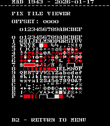
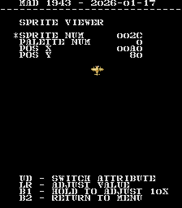

# 1943
- [MAD Pictures](#mad-pictures)
- [PCB Pictures](#pcb-pictures)
- [Manual / Schematics](#manual---schematics)
- [MAD Eproms](#mad-eproms)
- [RAM Locations](#ram-locations)
- [Errors/Error Codes](#errors-error-codes)
  * [Main CPU](#main-cpu)
  * [Sound CPU](#sound-cpu)
- [MAD Notes](#mad-notes)
  * [Tile Layers](#tile-layers)
  * [Sprite Viewer](#sprite-viewer)
- [MAME vs Hardware](#mame-vs-hardware)

## MAD Pictures

## PCB Pictures

The CPU and Graphics PCB have their solder sides facing each other.

## Manual / Schematics
[Manual w/Schematics](docs/1943_manual_schematics.pdf) 

## MAD Eproms

| Diag | Eprom Type | Location | Notes |
| ---- | ---------- | ----------- | ----- |
| Main | 27c256 | bme01.12d @ 12D | |
| Sound | 27c256 | 4K | No MAD ROM exists yet |

## RAM Locations
| RAM | Location | Type |
| -------- | :------- | ----- |
| Sound RAM | 1K on CPU Board | TMM2015BP-15 (2k x 8bit) |
| Tile RAM | 6D on CPU Board | TMM2015BP-15 (2k x 8bit) |
| Work/Sprite RAM | 10D on CPU Board | TMM2063P-15 (8k x 8bit) |

There are CXK5814P-45L (2k x 8bit) RAM chips on the graphics board which are not
accessible by the CPU.  They are likely related to line buffering.

## Errors/Error Codes
MAD for the main CPU is expecting the game's original sound rom to be there
in order to play sounds, including making beep codes.

### Main CPU
The main CPU is a Z80.  If an error is encountered during tests, MAD will print
the error to the screen, play the beep code, then jump to the error address

On Z80's the error address is `$6000 | error_code << 7`.  Error codes on the
Z80 CPU are are 6 bits.

<!-- ec_table_main_start -->
| Hex  | Number | Beep Code |     Error Address (A15..A0)    |           Error Text           |
| ---: | -----: | --------: | :----------------------------: | :----------------------------- |
| 0x01 |      1 | 0000 0001 |      0110 0000 1xxx xxxx       | TILE RAM ADDRESS               |
| 0x02 |      2 | 0000 0010 |      0110 0001 0xxx xxxx       | TILE RAM DATA                  |
| 0x03 |      3 | 0000 0011 |      0110 0001 1xxx xxxx       | TILE RAM MARCH                 |
| 0x04 |      4 | 0000 0100 |      0110 0010 0xxx xxxx       | TILE RAM OUTPUT                |
| 0x05 |      5 | 0000 0101 |      0110 0010 1xxx xxxx       | TILE RAM WRITE                 |
| 0x06 |      6 | 0000 0110 |      0110 0011 0xxx xxxx       | WORK RAM ADDRESS               |
| 0x07 |      7 | 0000 0111 |      0110 0011 1xxx xxxx       | WORK RAM DATA                  |
| 0x08 |      8 | 0000 1000 |      0110 0100 0xxx xxxx       | WORK RAM MARCH                 |
| 0x09 |      9 | 0000 1001 |      0110 0100 1xxx xxxx       | WORK RAM OUTPUT                |
| 0x0a |     10 | 0000 1010 |      0110 0101 0xxx xxxx       | WORK RAM WRITE                 |
| 0x3e |     62 | 0011 1110 |      0111 1111 0xxx xxxx       | MAD ROM ADDRESS                |
| 0x3f |     63 | 0011 1111 |      0111 1111 1xxx xxxx       | MAD ROM CRC32                  |

Table last updated by gen-error-codes-markdown-table on 2026-01-19 @ 02:40 UTC
<!-- ec_table_main_end -->

### Sound CPU
The sound CPU is a z80.  No MAD rom exists yet for the sound CPU.

## MAD Notes

### BG1/BG2 Tile Viewers

BG1/BG2 Tiles are hardcoded and the only thing you can do is scroll through
them.  So instead of the normal tile viewer you are just provided a way to
scroll them.

### Static palette colors
The game's palette comes from proms and are unchangeable.

### No Video DAC Test
The static palette makes it impossible to do this test.

## MAME vs Hardware
Nothing that required a MAME specific build
