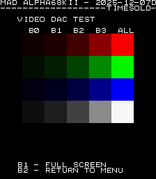
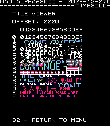
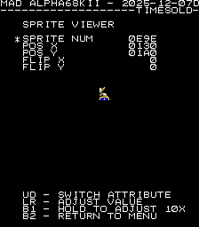

# Alpha68k II Hardware

- [MAD Pictures](#mad-pictures)
- [PCBs / ROM sets](#pcbs-rom-sets)
  - [Sky Soldiers (skysoldr)](#sky-soldiers-skysoldr)
    - [MAD Eprom](#mad-eprom)
    - [Manual](#manual)
  - [Time Soldiers (timesold)](#time-soldiers-timesold)
    - [MAD Eprom](#mad-eprom-1)
    - [Manual](#manual-1)
- [Schematic](#schematic)
- [RAM Locations](#ram-locations)
- [Errors/Error Codes](#errorserror-codes)
  - [Main CPU](#main-cpu)
  - [Sound CPU](#sound-cpu)
- [MAD Notes](#mad-notes)
  - [Sprite RAM](#sprite-ram)
- [MAME vs Hardware](#mame-vs-hardware)

## MAD Pictures

<br>



## PCBs / ROM sets
### Sky Soldiers (skysoldr)
<a href="docs/images/skysoldr/skysoldr_pcb_top.png"></a>
<a href="docs/images/skysoldr/skysoldr_pcb_bottom.png"></a>

#### MAD Eprom
| Diag | Eprom Type | Location |
| ---- | ---------- | ----------- |
| Main | 27c010 or 27c1001 | ss.3 @ B5<br>ss.4 @ D5 |
| Sound | 27c512 | ss.7 @ D21 |

#### Manual
[Sky Soldiers Manual](docs/sky_soldiers_manual.pdf)

### Time Soldiers (timesold)
<a href="docs/images/timesold/timesold_pcb_bottom.png"></a>
<a href="docs/images/timesold/timesold_pcb_bottom.png"></a>

#### MAD Eprom
| Diag | Eprom Type | Location |
| ---- | ---------- | ----------- |
| Main | 27c512  | bf.3 @ B5<br>bf.4 @ D5 |
| Sound | 27c512 | bf.7 @ D21 |

#### Manual
[Time Soldiers Manual](docs/time_soldiers_manual.pdf)

## Schematics
[Alpha-68K96II Schematics](docs/alpha-68K96II_schematics.pdf)

## RAM Locations
| RAM | Location | Type |
| -------- | :------- | ----- |
| Tile RAM | D17 | D4016CX-12 (2k x 8bit) |
| Palette RAM Lower | B8 | D4016CX-12 (2k x 8bit) |
| Palette RAM Upper | B7 | D4016CX-12 (2k x 8bit) |
| Sound RAM | E27 | D4016CX-12 (2k x 8bit) |
| Sprite #1 RAM | K15 | HM6264LP-10 (8k x 8bit) |
| Sprite #2 RAM | K19 | HM6264LP-10 (8k x 8bit) |
| Sprite #3 RAM | K17 | HM6264LP-10 (8k x 8bit) |
| Work RAM Lower | D2 | D4016CX-12 (2k x 8bit) |
| Work RAM Upper | D1 | D4016CX-12 (2k x 8bit) |

## Errors/Error Codes
The main CPU and sound CPU MAD rom should be used independently from each
other.  ie: MAD for the main CPU is expecting the games origin sound rom to be there
in order to play sounds, including making beep codes.

### Main CPU
The main CPU is a motorola 68000.  If an error is encountered during tests
MAD will print the error to the screen, play the beep code, then jump to the
error address

On 68000 the error address is `$6000 | error_code << 5`.  Error codes on 68000
are 7 bits.  alpha68k_ii however has a watchdog address that must be written to
periodically or the game will reset.

```
watchdog address: $0e8000 = 0000 1110 1000 0000 0000 0000
error address:    $006000 = 0000 0000 0110 EEEE EEE0 0000
  E = error code
```
The watchdog address is in conflict with the error address.  However instead of
doing a loop to self instruction at the error address, MAD instead does a delay loop
so it stays within the error address range 99.9% of the time and 0.1% of the
time it will ping the watchdog.  This is enough for the error addresses to still
be viable to use with a logic probe.  It just means address lines not be 100%
high or low, but 99% of the time.

<!-- ec_table_main_start -->
| Hex  | Number | Beep Code |     Error Address (A23..A1)    |           Error Text           |
| ---: | -----: | --------: | :----------------------------: | :----------------------------- |
| 0x01 |      1 | 0000 0001 |  000 0000 0011 0000 0001 xxxx  | PALETTE RAM ADDRESS            |
| 0x02 |      2 | 0000 0010 |  000 0000 0011 0000 0010 xxxx  | PALETTE RAM DATA LOWER         |
| 0x03 |      3 | 0000 0011 |  000 0000 0011 0000 0011 xxxx  | PALETTE RAM DATA UPPER         |
| 0x04 |      4 | 0000 0100 |  000 0000 0011 0000 0100 xxxx  | PALETTE RAM DATA BOTH          |
| 0x05 |      5 | 0000 0101 |  000 0000 0011 0000 0101 xxxx  | PALETTE RAM MARCH LOWER        |
| 0x06 |      6 | 0000 0110 |  000 0000 0011 0000 0110 xxxx  | PALETTE RAM MARCH UPPER        |
| 0x07 |      7 | 0000 0111 |  000 0000 0011 0000 0111 xxxx  | PALETTE RAM MARCH BOTH         |
| 0x08 |      8 | 0000 1000 |  000 0000 0011 0000 1000 xxxx  | PALETTE RAM OUTPUT LOWER       |
| 0x09 |      9 | 0000 1001 |  000 0000 0011 0000 1001 xxxx  | PALETTE RAM OUTPUT UPPER       |
| 0x0a |     10 | 0000 1010 |  000 0000 0011 0000 1010 xxxx  | PALETTE RAM OUTPUT BOTH        |
| 0x0b |     11 | 0000 1011 |  000 0000 0011 0000 1011 xxxx  | PALETTE RAM WRITE LOWER        |
| 0x0c |     12 | 0000 1100 |  000 0000 0011 0000 1100 xxxx  | PALETTE RAM WRITE UPPER        |
| 0x0d |     13 | 0000 1101 |  000 0000 0011 0000 1101 xxxx  | PALETTE RAM WRITE BOTH         |
| 0x0e |     14 | 0000 1110 |  000 0000 0011 0000 1110 xxxx  | SPRITE RAM ADDRESS             |
| 0x0f |     15 | 0000 1111 |  000 0000 0011 0000 1111 xxxx  | SPRITE RAM DATA                |
| 0x12 |     18 | 0001 0010 |  000 0000 0011 0001 0010 xxxx  | SPRITE RAM MARCH               |
| 0x15 |     21 | 0001 0101 |  000 0000 0011 0001 0101 xxxx  | SPRITE RAM OUTPUT              |
| 0x18 |     24 | 0001 1000 |  000 0000 0011 0001 1000 xxxx  | SPRITE RAM WRITE               |
| 0x1b |     27 | 0001 1011 |  000 0000 0011 0001 1011 xxxx  | TILE RAM ADDRESS               |
| 0x1c |     28 | 0001 1100 |  000 0000 0011 0001 1100 xxxx  | TILE RAM DATA                  |
| 0x1f |     31 | 0001 1111 |  000 0000 0011 0001 1111 xxxx  | TILE RAM MARCH                 |
| 0x22 |     34 | 0010 0010 |  000 0000 0011 0010 0010 xxxx  | TILE RAM OUTPUT                |
| 0x25 |     37 | 0010 0101 |  000 0000 0011 0010 0101 xxxx  | TILE RAM WRITE                 |
| 0x28 |     40 | 0010 1000 |  000 0000 0011 0010 1000 xxxx  | WORK RAM ADDRESS               |
| 0x29 |     41 | 0010 1001 |  000 0000 0011 0010 1001 xxxx  | WORK RAM DATA LOWER            |
| 0x2a |     42 | 0010 1010 |  000 0000 0011 0010 1010 xxxx  | WORK RAM DATA UPPER            |
| 0x2b |     43 | 0010 1011 |  000 0000 0011 0010 1011 xxxx  | WORK RAM DATA BOTH             |
| 0x2c |     44 | 0010 1100 |  000 0000 0011 0010 1100 xxxx  | WORK RAM MARCH LOWER           |
| 0x2d |     45 | 0010 1101 |  000 0000 0011 0010 1101 xxxx  | WORK RAM MARCH UPPER           |
| 0x2e |     46 | 0010 1110 |  000 0000 0011 0010 1110 xxxx  | WORK RAM MARCH BOTH            |
| 0x2f |     47 | 0010 1111 |  000 0000 0011 0010 1111 xxxx  | WORK RAM OUTPUT LOWER          |
| 0x30 |     48 | 0011 0000 |  000 0000 0011 0011 0000 xxxx  | WORK RAM OUTPUT UPPER          |
| 0x31 |     49 | 0011 0001 |  000 0000 0011 0011 0001 xxxx  | WORK RAM OUTPUT BOTH           |
| 0x32 |     50 | 0011 0010 |  000 0000 0011 0011 0010 xxxx  | WORK RAM WRITE LOWER           |
| 0x33 |     51 | 0011 0011 |  000 0000 0011 0011 0011 xxxx  | WORK RAM WRITE UPPER           |
| 0x34 |     52 | 0011 0100 |  000 0000 0011 0011 0100 xxxx  | WORK RAM WRITE BOTH            |
| 0x7e |    126 | 0111 1110 |  000 0000 0011 0111 1110 xxxx  | MAD ROM ADDRESS                |
| 0x7f |    127 | 0111 1111 |  000 0000 0011 0111 1111 xxxx  | MAD ROM CRC32                  |

<sup>Table last updated by gen-error-codes-markdown-table on 2025-12-11 @ 03:59 UTC</sup>
<!-- ec_table_main_end -->

### Sound CPU
The sound CPU is a z80.  If an error is encountered (or all tests pass) MAD will jump
to one of the below error addresses.

On z80 the error address is `$2000 | error_code << 7`.  Error codes on z80 are 6 bits.

<!-- ec_table_sound_start -->
| Hex  | Number |     Error Address (A15..A0)    |           Error Text           |
| ---: | -----: | :----------------------------: | :----------------------------- |
| 0x00 |      0 |      0010 0000 0xxx xxxx       | ALL TESTS PASSED               |
| 0x01 |      1 |      0010 0000 1xxx xxxx       | WORK RAM ADDRESS               |
| 0x02 |      2 |      0010 0001 0xxx xxxx       | WORK RAM DATA                  |
| 0x03 |      3 |      0010 0001 1xxx xxxx       | WORK RAM MARCH                 |
| 0x04 |      4 |      0010 0010 0xxx xxxx       | WORK RAM OUTPUT                |
| 0x05 |      5 |      0010 0010 1xxx xxxx       | WORK RAM WRITE                 |
| 0x06 |      6 |      0010 0011 0xxx xxxx       | YM2203 TIMERA IRQ              |
| 0x07 |      7 |      0010 0011 1xxx xxxx       | YM2203 TIMERB IRQ              |
| 0x08 |      8 |      0010 0100 0xxx xxxx       | YM2203 UNEXPECTED IRQ          |
| 0x3e |     62 |      0011 1111 0xxx xxxx       | MAD ROM ADDRESS                |
| 0x3f |     63 |      0011 1111 1xxx xxxx       | MAD ROM CRC32                  |

<sup>Table last updated by gen-error-codes-markdown-table on 2025-12-11 @ 04:00 UTC</sup>
<!-- ec_table_sound_end -->

## MAD Notes
### Sprite RAM
Sprite RAM has a weird setup on this machine.  There are 3x 8bit chips that
comprise 24 bits out of every 32bits

```
 ADDR
200000 = not connected
200001 = sprite ram #1
200002 = sprite ram #2
200003 = sprite ram #3
200004 = not connected
200005 = sprite ram #1
200006 = sprite ram #2
200007 = sprite ram #3
...
```

Currently MAD is only testing the lower byte of each word of the sprite ram.  So
sprite ram #2 is not being tested.  At some point I will write one-off ram tests
to handle this.

## MAME vs Hardware
   * Hardware has the ym2203 wired up to the Z80/sound CPU's interrupt pin,
     while MAME doesn't.  The games don't make use of the ym2203's interrupt
     timer, but MAD does to help test that ym2203 is working.  Because of
     this there are separate versions of the MAD sound diag for hardware and MAME.
