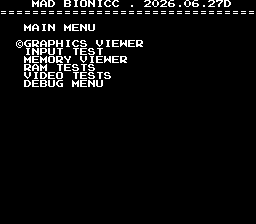
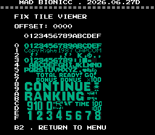
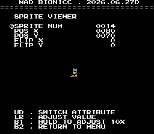
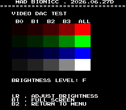
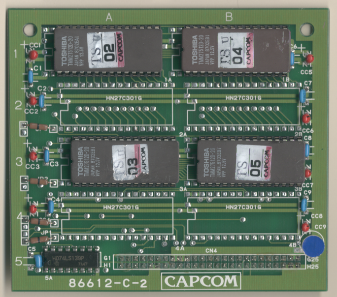
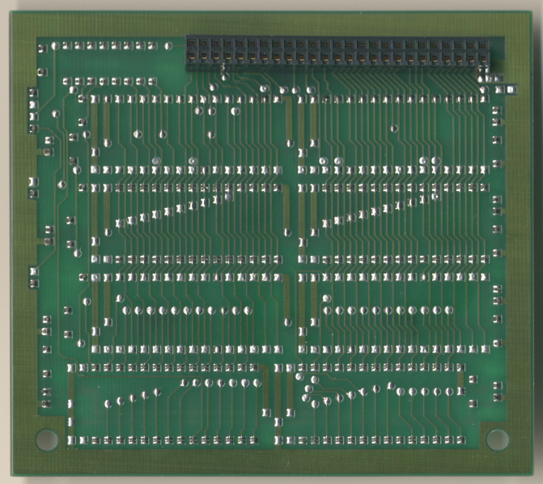

# Bionic Commando
- [MAD Pictures](#mad-pictures)
- [PCB Pictures](#pcb-pictures)
- [Manual / Schematics](#manual-schematics)
- [MAD Eproms](#mad-eproms)
- [RAM Locations](#ram-locations)
- [Errors/Error Codes](#errorserror-codes)
   - [Main CPU](#main-cpu)
   - [Sound CPU](#sound-cpu)
- [MAD Notes](#mad-notes)
  - [Palette wrong on boot](#palette-wrong-on-boot)
  - [Sprite garbage on boot](#sprite-garbage-on-boot)
  - [No Sound / Beep Codes](#no-sound-beep-codes)
- [MAME vs Hardware](#mame-vs-hardware)

## MAD Pictures

 

<!-- TOC -->
## PCB Pictures
ROM Board: 

CPU Board: 

Graphics Board: 

The CPU and graphics board are oriented such that the solder side of the boards
face each other.

## Manual / Schematics
[Manual](docs/bionic_commando_manual_schematics.pdf)

## MAD Eproms
| Diag | Eprom Type | Location(s) | Notes |
| ---- | ---------- | ----------- | ----- |
| Main on CPU PCB | 27c512 | tse_02.1a @ 1A on ROM PCB tse_04.1b @ 1B on ROM PCB | |
| Sound on CPU PCB | 27c256 | 4E on CPU PCB | No MAD ROM exists yet |

## RAM Locations
| RAM | Location | Type |
| -------- | :------- | ----- |
| BG RAM Lower | 12J on CPU PCB | TMM2063P-15 (8k x 8bit) |
| FG RAM Lower | 4E on Graphics PCB | TMM2063P-15 (8k x 8bit) |
| Fix RAM Lower | 16J on CPU PCB | TMM2015BP-10 (2k x 8bit) |
| Sound CPU RAM | 15H on CPU PCB | TMM2015BP-10 (2k x 8bit) |
| Sprite RAM Lower | 9H on CPU PCB | TMM2015BP-10 (2k x 8bit) |
| Sprite RAM Upper | 9F on CPU PCB | TMM2015BP-10 (2k x 8bit) |
| Work RAM Lower | 8H on CPU PCB | TMM2063P-15 (8k x 8bit) |
| Work RAM Upper | 8F on CPU PCB | TMM2063P-15 (8k x 8bit) |

Palette RAM is at 11D (lower/blue+brightness ) and 11C (upper/red + green) which
is writable by the CPU but not readable.  Making it impossible to test.

There are a number of additional RAM chips on the graphics board that the CPU
doesn't have access to and thus is unable to test.

## Errors/Error Codes
MAD for the main CPU is expecting the game's original sound rom to be there
in order to play sounds, including making beep codes.

### Main CPU
The main CPU is a motorola 68000.  If an error is encountered during tests
MAD will print the error to the screen, play the beep code, then jump to the
error address

On 68000 the error address is `$6000 | error_code << 5`.  Error codes on 68000
are 7 bits.

<!-- ec_table_main_start -->
| Hex  | Number | Beep Code |     Error Address (A23..A1)    |           Error Text           |
| ---: | -----: | --------: | :----------------------------: | :----------------------------- |
| 0x01 |      1 | 0000 0001 |  000 0000 0011 0000 0001 xxxx  | BG TILE RAM ADDRESS            |
| 0x02 |      2 | 0000 0010 |  000 0000 0011 0000 0010 xxxx  | BG TILE RAM DATA               |
| 0x05 |      5 | 0000 0101 |  000 0000 0011 0000 0101 xxxx  | BG TILE RAM MARCH              |
| 0x08 |      8 | 0000 1000 |  000 0000 0011 0000 1000 xxxx  | BG TILE RAM OUTPUT             |
| 0x0b |     11 | 0000 1011 |  000 0000 0011 0000 1011 xxxx  | BG TILE RAM WRITE              |
| 0x0e |     14 | 0000 1110 |  000 0000 0011 0000 1110 xxxx  | FG TILE RAM ADDRESS            |
| 0x0f |     15 | 0000 1111 |  000 0000 0011 0000 1111 xxxx  | FG TILE RAM DATA               |
| 0x12 |     18 | 0001 0010 |  000 0000 0011 0001 0010 xxxx  | FG TILE RAM MARCH              |
| 0x15 |     21 | 0001 0101 |  000 0000 0011 0001 0101 xxxx  | FG TILE RAM OUTPUT             |
| 0x18 |     24 | 0001 1000 |  000 0000 0011 0001 1000 xxxx  | FG TILE RAM WRITE              |
| 0x1b |     27 | 0001 1011 |  000 0000 0011 0001 1011 xxxx  | FIX TILE RAM ADDRESS           |
| 0x1c |     28 | 0001 1100 |  000 0000 0011 0001 1100 xxxx  | FIX TILE RAM DATA              |
| 0x1f |     31 | 0001 1111 |  000 0000 0011 0001 1111 xxxx  | FIX TILE RAM MARCH             |
| 0x22 |     34 | 0010 0010 |  000 0000 0011 0010 0010 xxxx  | FIX TILE RAM OUTPUT            |
| 0x25 |     37 | 0010 0101 |  000 0000 0011 0010 0101 xxxx  | FIX TILE RAM WRITE             |
| 0x28 |     40 | 0010 1000 |  000 0000 0011 0010 1000 xxxx  | SPRITE RAM ADDRESS             |
| 0x29 |     41 | 0010 1001 |  000 0000 0011 0010 1001 xxxx  | SPRITE RAM DATA LOWER          |
| 0x2a |     42 | 0010 1010 |  000 0000 0011 0010 1010 xxxx  | SPRITE RAM DATA UPPER          |
| 0x2b |     43 | 0010 1011 |  000 0000 0011 0010 1011 xxxx  | SPRITE RAM DATA BOTH           |
| 0x2c |     44 | 0010 1100 |  000 0000 0011 0010 1100 xxxx  | SPRITE RAM MARCH LOWER         |
| 0x2d |     45 | 0010 1101 |  000 0000 0011 0010 1101 xxxx  | SPRITE RAM MARCH UPPER         |
| 0x2e |     46 | 0010 1110 |  000 0000 0011 0010 1110 xxxx  | SPRITE RAM MARCH BOTH          |
| 0x2f |     47 | 0010 1111 |  000 0000 0011 0010 1111 xxxx  | SPRITE RAM OUTPUT LOWER        |
| 0x30 |     48 | 0011 0000 |  000 0000 0011 0011 0000 xxxx  | SPRITE RAM OUTPUT UPPER        |
| 0x31 |     49 | 0011 0001 |  000 0000 0011 0011 0001 xxxx  | SPRITE RAM OUTPUT BOTH         |
| 0x32 |     50 | 0011 0010 |  000 0000 0011 0011 0010 xxxx  | SPRITE RAM WRITE LOWER         |
| 0x33 |     51 | 0011 0011 |  000 0000 0011 0011 0011 xxxx  | SPRITE RAM WRITE UPPER         |
| 0x34 |     52 | 0011 0100 |  000 0000 0011 0011 0100 xxxx  | SPRITE RAM WRITE BOTH          |
| 0x35 |     53 | 0011 0101 |  000 0000 0011 0011 0101 xxxx  | WORK RAM ADDRESS               |
| 0x36 |     54 | 0011 0110 |  000 0000 0011 0011 0110 xxxx  | WORK RAM DATA LOWER            |
| 0x37 |     55 | 0011 0111 |  000 0000 0011 0011 0111 xxxx  | WORK RAM DATA UPPER            |
| 0x38 |     56 | 0011 1000 |  000 0000 0011 0011 1000 xxxx  | WORK RAM DATA BOTH             |
| 0x39 |     57 | 0011 1001 |  000 0000 0011 0011 1001 xxxx  | WORK RAM MARCH LOWER           |
| 0x3a |     58 | 0011 1010 |  000 0000 0011 0011 1010 xxxx  | WORK RAM MARCH UPPER           |
| 0x3b |     59 | 0011 1011 |  000 0000 0011 0011 1011 xxxx  | WORK RAM MARCH BOTH            |
| 0x3c |     60 | 0011 1100 |  000 0000 0011 0011 1100 xxxx  | WORK RAM OUTPUT LOWER          |
| 0x3d |     61 | 0011 1101 |  000 0000 0011 0011 1101 xxxx  | WORK RAM OUTPUT UPPER          |
| 0x3e |     62 | 0011 1110 |  000 0000 0011 0011 1110 xxxx  | WORK RAM OUTPUT BOTH           |
| 0x3f |     63 | 0011 1111 |  000 0000 0011 0011 1111 xxxx  | WORK RAM WRITE LOWER           |
| 0x40 |     64 | 0100 0000 |  000 0000 0011 0100 0000 xxxx  | WORK RAM WRITE UPPER           |
| 0x41 |     65 | 0100 0001 |  000 0000 0011 0100 0001 xxxx  | WORK RAM WRITE BOTH            |
| 0x7e |    126 | 0111 1110 |  000 0000 0011 0111 1110 xxxx  | MAD ROM ADDRESS                |
| 0x7f |    127 | 0111 1111 |  000 0000 0011 0111 1111 xxxx  | MAD ROM CRC32                  |

Table last updated by gen-error-codes-markdown-table on 2026-06-30 @ 01:42 UTC
<!-- ec_table_main_end -->

### Sound CPU
The sound CPU is a z80.  No MAD rom exists yet for the sound CPU.

## MAD Notes

### Palette wrong on boot
Its only possible to write to palette RAM during vblank, but we won't know when
there is a vblank until we can enable irqs.  This can't be done until after we
have tested work ram.

### Sprite garbage on boot
Its only possible to a sprite DMA copy during vblank, but we won't know when
there is a vblank until we can enable irqs.  This can't be done until after we
have tested work ram.

### No Sound / Beep Codes
Interacting with the sound CPU is done through an MCU and I haven't looked into
that yet.  So for now there is no sound or beep code.

## MAME vs Hardware
Nothing that required a MAME specific build
