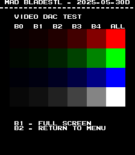
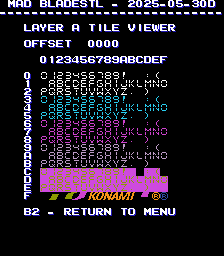
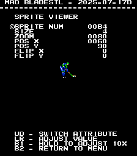

# Blades of Steel
  * [MAD Pictures](#mad-pictures)
  * [PCB Pictures](#pcb-pictures)
  * [Manual / Schematics](#manual---schematics)
  * [MAD Eproms](#mad-eproms)
  * [RAM Locations](#ram-locations)
  * [Errors/Error Codes](#errors-error-codes)
    + [Main CPU](#main-cpu)
    + [Sound CPU](#sound-cpu)
  * [MAD Notes](#mad-notes)
    + [Tile Layers](#tile-layers)
    + [Sprite Viewer](#sprite-viewer)
  * [MAME vs Hardware](#mame-vs-hardware)

## MAD Pictures

<br>



## PCB Pictures
<a href="docs/images/blades_of_steel_pcb_top.png"></a>
<a href="docs/images/blades_of_steel_pcb_bottom.png"></a>
<p>

## Manual / Schematics
[Manual](docs/blades_of_steel_manual.pdf)<br>
[Schematics](docs/blades_of_steel_schematics.pdf)

## MAD Eproms
| Diag | Eprom Type | Location | Notes |
| ---- | ---------- | ----------- | ----- |
| Main | 27c512 | 797-t01.19c @ 19C | |
| Sound | 27c256 | 12D | No MAD ROM exists yet |

## RAM Locations
| RAM | Location | Type |
| -------- | :------- | ----- |
| Palette RAM | 8D | Inside 007327? |
| Sound RAM | 11D | MB8416A-15L-SK (2k x 8bit) |
| Sprite RAM | 19E | Integrated in 007420 |
| Tile RAM | 18F | MB8464A-80L-SK (8k x 8bit) |
| Work RAM | 16A | D4364CX-15LL (8k x 8bit) |

## Errors/Error Codes
MAD for the main CPU is expecting the game's original sound rom to be there
in order to play sounds, including making beep codes.

### Main CPU
The main CPU is a HD6309 CPU.  If an error is encountered during
tests, MAD will print the error to the screen, play the beep code, then jump to
the error address

On Konami2 the error address is `$f000 | error_code << 4`.  Error codes on the
Konami2 CPU are are 6 bits.  Blades of steel however has a watchdog address that must
be written to periodically or the game will reset.

```
watchdog address: $2ec0 = 0010 1110 1100 0000
error address:    $f000 = 1111 00EE EEEE 0000
  E = error code
```
The watchdog address is in conflict with the error address.  However instead of
doing a loop to self instruction at the error address, MAD instead does a delay
loop so it stays within the error address range 99.9% of the time and 0.1% of
the time it will ping the watchdog.  This is enough for the error addresses to
still be viable to use with a logic probe.  It just means address lines not be
100% high or low, but 99% of the time.

<!-- ec_table_main_start -->
| Hex  | Number | Beep Code |     Error Address (A15..A0)    |           Error Text           |
| ---: | -----: | --------: | :----------------------------: | :----------------------------- |
| 0x01 |      1 | 0000 0001 |      1111 0000 0001 xxxx       | PALETTE RAM ADDRESS            |
| 0x02 |      2 | 0000 0010 |      1111 0000 0010 xxxx       | PALETTE RAM DATA               |
| 0x03 |      3 | 0000 0011 |      1111 0000 0011 xxxx       | PALETTE RAM MARCH              |
| 0x04 |      4 | 0000 0100 |      1111 0000 0100 xxxx       | PALETTE RAM OUTPUT             |
| 0x05 |      5 | 0000 0101 |      1111 0000 0101 xxxx       | PALETTE RAM WRITE              |
| 0x06 |      6 | 0000 0110 |      1111 0000 0110 xxxx       | TILE RAM ADDRESS               |
| 0x07 |      7 | 0000 0111 |      1111 0000 0111 xxxx       | TILE RAM DATA                  |
| 0x08 |      8 | 0000 1000 |      1111 0000 1000 xxxx       | TILE RAM MARCH                 |
| 0x09 |      9 | 0000 1001 |      1111 0000 1001 xxxx       | TILE RAM OUTPUT                |
| 0x0a |     10 | 0000 1010 |      1111 0000 1010 xxxx       | TILE RAM WRITE                 |
| 0x0b |     11 | 0000 1011 |      1111 0000 1011 xxxx       | SPRITE RAM ADDRESS             |
| 0x0c |     12 | 0000 1100 |      1111 0000 1100 xxxx       | SPRITE RAM DATA                |
| 0x0d |     13 | 0000 1101 |      1111 0000 1101 xxxx       | SPRITE RAM MARCH               |
| 0x0e |     14 | 0000 1110 |      1111 0000 1110 xxxx       | SPRITE RAM OUTPUT              |
| 0x0f |     15 | 0000 1111 |      1111 0000 1111 xxxx       | SPRITE RAM WRITE               |
| 0x10 |     16 | 0001 0000 |      1111 0001 0000 xxxx       | WORK RAM ADDRESS               |
| 0x11 |     17 | 0001 0001 |      1111 0001 0001 xxxx       | WORK RAM DATA                  |
| 0x12 |     18 | 0001 0010 |      1111 0001 0010 xxxx       | WORK RAM MARCH                 |
| 0x13 |     19 | 0001 0011 |      1111 0001 0011 xxxx       | WORK RAM OUTPUT                |
| 0x14 |     20 | 0001 0100 |      1111 0001 0100 xxxx       | WORK RAM WRITE                 |
| 0x3e |     62 | 0011 1110 |      1111 0011 1110 xxxx       | MAD ROM ADDRESS                |
| 0x3f |     63 | 0011 1111 |      1111 0011 1111 xxxx       | MAD ROM CRC32                  |

<sup>Table last updated by gen-error-codes-markdown-table on 2025-06-01 @ 01:16 UTC</sup>
<!-- ec_table_main_end -->

### Sound CPU
The sound CPU is a 6809.  No MAD rom exists yet for the sound CPU.

## MAD Notes

### Tile Layers

There are 2 tile layers (layer a, and layer b).  Both layers use the same set
of tiles.  When you use the tile viewer for each they will display the same
tiles, but are on the corresponding layer.

The color palette is just a random one I picked, so none of the colors for the
tiles will look right compared to in game.

### Sprite Viewer
There is a basic sprite viewer in MAD.  Sprites are a little tricky to
setup/view because I don't know the correct width/height of each sprite.  There
are options to change those values in the viewer.

The color palette is the one the game uses for the player.  So the colors for the player should
be correct, but maybe completely wrong for other sprites.

## MAME vs Hardware
Nothing that required a MAME specific build
