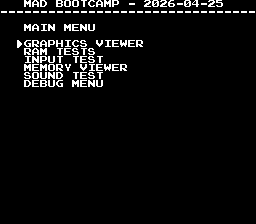
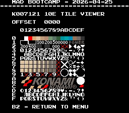
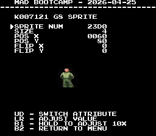

# Boot Camp

This machine is a WIP

- [MAD Pictures](#mad-pictures)
- [PCB Pictures](#pcb-pictures)
- [Manual / Schematics](#manual-schematics)
- [MAD Eproms](#mad-eproms)
- [RAM Locations](#ram-locations)
- [Errors/Error Codes](#errorserror-codes)
   - [Main CPU](#main-cpu)
   - [Sound CPU](#sound-cpu)
- [MAD Notes](#mad-notes)
- [MAME vs Hardware](#mame-vs-hardware)


## MAD Pictures




## PCB Pictures
<a href="docs/images/boot_camp_pcb_top.png"></a>
<a href="docs/images/boot_camp_pcb_bottom.png"></a>
<p>

## Manual / Schematics
[Manual](docs/boot_camp_manual.pdf)<br>
[Schematics](docs/boot_camp_schematics.pdf)

## MAD Eproms
| Diag | Eprom Type | Location | Notes |
| ---- | ---------- | ----------- | ----- |
| Main | 27c512 | xxx-v01.12a @ A14 | |
| Sound | 27c256 | 611g03.rom @ A8 | |

## RAM Locations
| RAM | Location | Type | Notes |
| -------- | :------- | ----- | ----- |
| Palette RAM | H1 | Inside 007327? | | 
| Sound RAM | 16C | MB8416A-15L-SK (2k x 8bit) | |
| 007121 @ G8 | G10 | MB8464A-10L-SK (8k x 8bit) | |
| 007121 @ G15 | G17 | MB8464A-10L-SK (8k x 8bit) | |
| Work RAM | 18C16A | MB8464A-15L-SK (8k x 8bit) | |

## Errors/Error Codes
MAD for the main CPU is expecting the game's original sound rom to be there
in order to play sounds, including making beep codes.

### Main CPU
The main CPU is a HD6309 CPU.  If an error is encountered during
tests, MAD will print the error to the screen, play the beep code, then jump to
the error address

On HD6309 the error address is `$f000 | error_code << 4`.  Error codes on the
HD6309 CPU are are 6 bits.  bootcamp however has a watchdog address that must
be written to periodically or the game will reset.

```
watchdog address: $041c = 0000 0100 0001 1100
error address:    $f000 = 1111 00EE EEEE 0000
  E = error code
```
The watchdog address is in conflict with the error address.  However instead of
doing a loop to self instruction at the error address, MAD instead does a delay
loop so it stays within the error address range 99.9% of the time and 0.1% of
the time it will ping the watchdog.  This is enough for the error addresses to
still be viable to use with a logic probe.  It just means address lines not be
100% high or low, but 99% of the time.

<!-- ec_table_main_start -->
| Hex  | Number | Beep Code |     Error Address (A15..A0)    |           Error Text           |
| ---: | -----: | --------: | :----------------------------: | :----------------------------- |
| 0x01 |      1 | 0000 0001 |      1111 0000 0001 xxxx       | PALETTE RAM ADDRESS            |
| 0x02 |      2 | 0000 0010 |      1111 0000 0010 xxxx       | PALETTE RAM DATA               |
| 0x03 |      3 | 0000 0011 |      1111 0000 0011 xxxx       | PALETTE RAM MARCH              |
| 0x04 |      4 | 0000 0100 |      1111 0000 0100 xxxx       | PALETTE RAM OUTPUT             |
| 0x05 |      5 | 0000 0101 |      1111 0000 0101 xxxx       | PALETTE RAM WRITE              |
| 0x06 |      6 | 0000 0110 |      1111 0000 0110 xxxx       | K007121 G8 RAM ADDRESS         |
| 0x07 |      7 | 0000 0111 |      1111 0000 0111 xxxx       | K007121 G8 RAM DATA            |
| 0x08 |      8 | 0000 1000 |      1111 0000 1000 xxxx       | K007121 G8 RAM MARCH           |
| 0x09 |      9 | 0000 1001 |      1111 0000 1001 xxxx       | K007121 G8 RAM OUTPUT          |
| 0x0a |     10 | 0000 1010 |      1111 0000 1010 xxxx       | K007121 G8 RAM WRITE           |
| 0x0b |     11 | 0000 1011 |      1111 0000 1011 xxxx       | K007121 G15 RAM ADDRESS        |
| 0x0c |     12 | 0000 1100 |      1111 0000 1100 xxxx       | K007121 G15 RAM DATA           |
| 0x0d |     13 | 0000 1101 |      1111 0000 1101 xxxx       | K007121 G15 RAM MARCH          |
| 0x0e |     14 | 0000 1110 |      1111 0000 1110 xxxx       | K007121 G15 RAM OUTPUT         |
| 0x0f |     15 | 0000 1111 |      1111 0000 1111 xxxx       | K007121 G15 RAM WRITE          |
| 0x10 |     16 | 0001 0000 |      1111 0001 0000 xxxx       | WORK RAM ADDRESS               |
| 0x11 |     17 | 0001 0001 |      1111 0001 0001 xxxx       | WORK RAM DATA                  |
| 0x12 |     18 | 0001 0010 |      1111 0001 0010 xxxx       | WORK RAM MARCH                 |
| 0x13 |     19 | 0001 0011 |      1111 0001 0011 xxxx       | WORK RAM OUTPUT                |
| 0x14 |     20 | 0001 0100 |      1111 0001 0100 xxxx       | WORK RAM WRITE                 |
| 0x3e |     62 | 0011 1110 |      1111 0011 1110 xxxx       | MAD ROM ADDRESS                |
| 0x3f |     63 | 0011 1111 |      1111 0011 1111 xxxx       | MAD ROM CRC32                  |

<sup>Table last updated by gen-error-codes-markdown-table on 2026-04-23 @ 01:19 UTC</sup>
<!-- ec_table_main_end -->

### Sound CPU
The sound CPU is a Z80.  No MAD rom exists yet for the sound CPU.

## MAD Notes
MAD is expecting a trackball input, unknown if it will work right if its a
joystick version of the board.

TODOs:<br>
  * scroll ram tests
  * video dac test
  * scroll test?
  * prog bank switch test
  * fix writing the tile number to tile ram/registers/bank

## MAME vs Hardware
Nothing that required a MAME specific build
