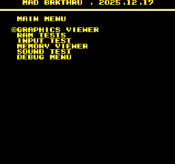
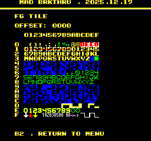
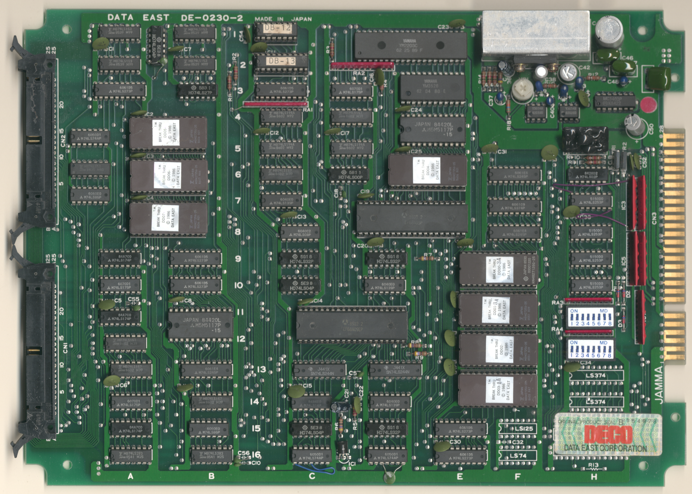
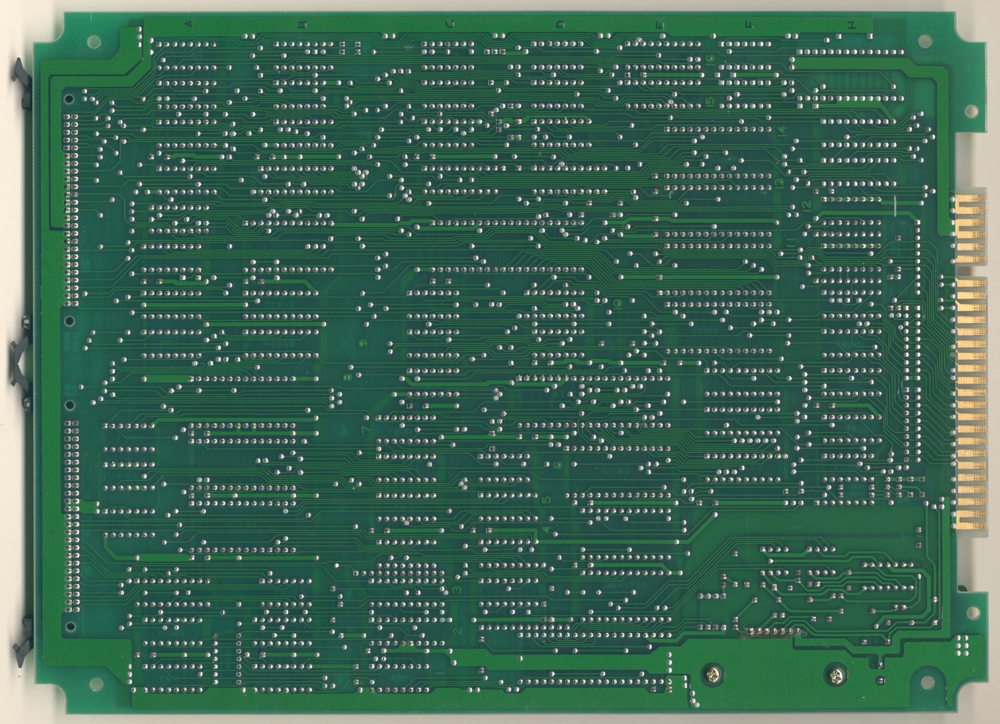
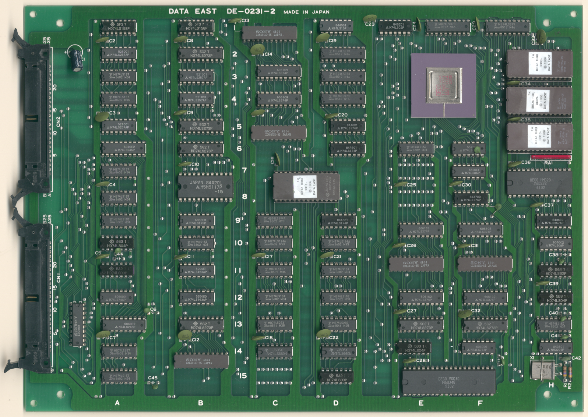
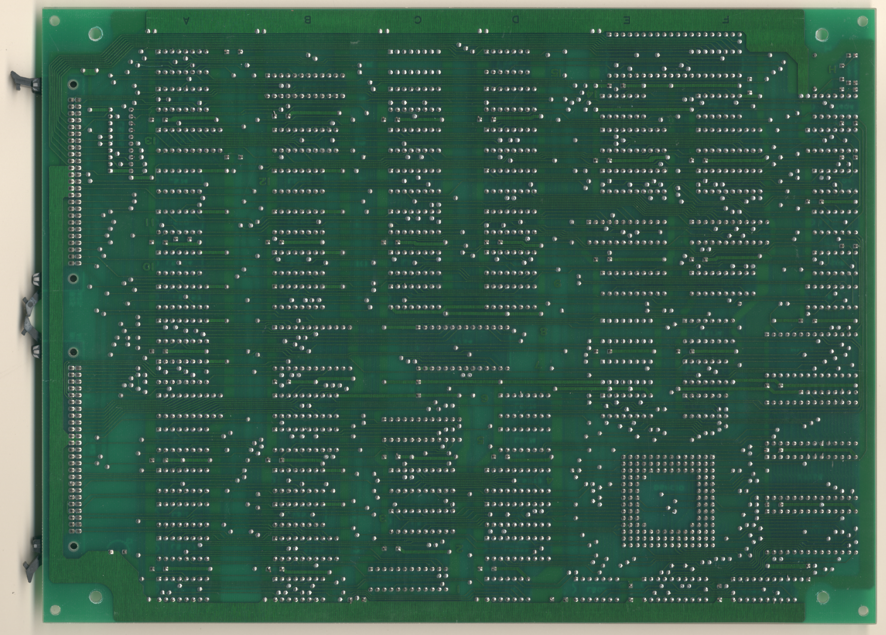

# Break Thru
- [MAD Pictures](#mad-pictures)
- [PCB Pictures](#pcb-pictures)
- [Manual / Schematics](#manual---schematics)
- [MAD Eproms](#mad-eproms)
- [RAM Locations](#ram-locations)
- [Errors/Error Codes](#errors-error-codes)
  * [Main CPU](#main-cpu)
  * [Sound CPU](#sound-cpu)
- [MAD Notes](#mad-notes)
  * [Static palette colors](#static-palette-colors)
  * [No Video DAC Test](#no-video-dac-test)
- [MAME vs Hardware](#mame-vs-hardware)

## MAD Pictures

## PCB Pictures

The CPU board in on top of the graphics board, with the parts side of the
graphics board facing the solder side of the CPU board.  There are 2x50pin
ribbon cables that connect the boards on the side side of the board relative to
the jamma edge

## Manual / Schematics
[Manual](docs/break_thru_manual.pdf)

Schematics don't seem to exist.

## MAD Eproms
| Diag | Eprom Type | Location | Notes |
| ---- | ---------- | ----------- | ----- |
| Main | 27c256 | 2.f11 @  | |
| Sound | 27c256 | 5.d6 @ 5F | No MAD ROM exists yet ||

## RAM Locations
| RAM | Location | Type | Notes |
| -------- | :------- | ----- | ----- |
| BG/Work RAM | B11H16 on CPU PCB | M5M5117P-15 (2k x 8bit) | |
| FG RAM | B8 on Graphics PCB | M5M5117P-15 (2k x 8bit) | |
| Sound RAM | D4 on CPU PCB | M5M5117P-15 (2k x 8bit) | |
| Sprite RAM | B14 on Graphics PCB | CXK5813D-55L (2k x 8bit) | |

There are also 4x CXK5813D-55L (2k x 8bit) on the graphics PCB that aren't
accessible directly by the CPU and are thus untestable.

## Errors/Error Codes
MAD for the main CPU is expecting the game's original sound rom to be there
in order to play sounds, including making beep codes.

### Main CPU
The main CPU is a 6809 CPU.  If an error is encountered during tests, MAD will
print the error to the screen, play the beep code, then jump to the error
address

On 6809 CPU the error address is `$f000 | error_code << 4`.  Error codes on the
6809 CPU are are 6 bits.  The games does not have a watchdog.

<!-- ec_table_main_start -->
| Hex  | Number |     Error Address (A15..A0)    |           Error Text           |
| ---: | -----: | :----------------------------: | :----------------------------- |
| 0x01 |      1 |      1111 0000 0001 xxxx       | FG RAM ADDRESS                 |
| 0x02 |      2 |      1111 0000 0010 xxxx       | FG RAM DATA                    |
| 0x03 |      3 |      1111 0000 0011 xxxx       | FG RAM MARCH                   |
| 0x04 |      4 |      1111 0000 0100 xxxx       | FG RAM OUTPUT                  |
| 0x05 |      5 |      1111 0000 0101 xxxx       | FG RAM WRITE                   |
| 0x06 |      6 |      1111 0000 0110 xxxx       | SPRITE RAM ADDRESS             |
| 0x07 |      7 |      1111 0000 0111 xxxx       | SPRITE RAM DATA                |
| 0x08 |      8 |      1111 0000 1000 xxxx       | SPRITE RAM MARCH               |
| 0x09 |      9 |      1111 0000 1001 xxxx       | SPRITE RAM OUTPUT              |
| 0x0a |     10 |      1111 0000 1010 xxxx       | SPRITE RAM WRITE               |
| 0x0b |     11 |      1111 0000 1011 xxxx       | WORK RAM ADDRESS               |
| 0x0c |     12 |      1111 0000 1100 xxxx       | WORK RAM DATA                  |
| 0x0d |     13 |      1111 0000 1101 xxxx       | WORK RAM MARCH                 |
| 0x0e |     14 |      1111 0000 1110 xxxx       | WORK RAM OUTPUT                |
| 0x0f |     15 |      1111 0000 1111 xxxx       | WORK RAM WRITE                 |
| 0x3e |     62 |      1111 0011 1110 xxxx       | MAD ROM ADDRESS                |
| 0x3f |     63 |      1111 0011 1111 xxxx       | MAD ROM CRC16                  |

Table last updated by gen-error-codes-markdown-table on 2025-12-21 @ 03:10 UTC
<!-- ec_table_main_end -->

### Sound CPU
The sound CPU is a DEC 222?.  No MAD rom exists yet for the sound CPU.

## MAD Notes
### Static palette colors
The game's palette comes from proms and are unchangeable.  This is why the text
has the red shadow.

### No Video DAC Test
The static palette makes it impossible to do this test.

### DSW2
Switches 6, 7 and 8 on DSW2 don't wire to the CPU, instead those bits come from
P1/P2 insert coin and service buttons.

## MAME vs Hardware
Nothing to warrant different builds.  But be mindful that labels on roms don't
match up with whats in MAME.  For example my boards program rom labels are 0 to 3,
while MAME has them as 1 to 4.