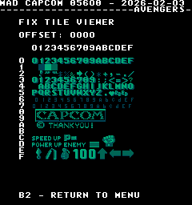
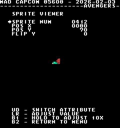
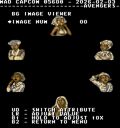

# Capcom 85608 (avengers and trojan)
- [MAD Pictures](#mad-pictures)
- [PCB Pictures](#pcb-pictures)
  - [Avengers](#avengers)
  - [Trojan](#trojan)
- [Manual / Schematics](#manual-schematics)
- [MAD Eproms](#mad-eproms)
- [RAM Locations](#ram-locations)
- [Errors/Error Codes](#errorserror-codes)
  - [Main CPU](#main-cpu)
  - [Sound CPUs](#sound-cpus)
- [MAD Notes](#mad-notes)
  - [Corrupt Screen/Palette at Startup](#corrupt-screenpalette-at-startup)
  - [No FM Sound test on Avengers](#no-fm-sound-test-on-avengers)
  - [No Video DAC Test](#no-video-dac-test)
- [MAME vs Hardware](#mame-vs-hardware)

## MAD Pictures

 

## PCB Pictures
### Avengers

### Trojan

The CPU and Graphics PCB have their solder sides facing each other.

These boards have 2 sounds CPUs.  The ADPCM sounds CPU is at 9D and the FM sound
CPU and RAM is within the 85H001 black plastic box.  Additionally Avengers has
an MCU underneath the 85H001.

## Manual / Schematics
[Capcom 85608 Schematics](docs/capcom_85608_schematics.pdf) 
[Avengers Manual](docs/avengers_manual.pdf) 
[Trojan Manual](docs/trojan_manual.pdf) 

## MAD Eproms

| Diag | Eprom Type | Location | Notes |
| ---- | ---------- | ----------- | ----- |
| Main | 27c256 | xx_04.10n @ 10N | |
| ADPCM Sound | 27c256 | 6D | No MAD ROM exists yet |
| FM Sound | 27c256 | 15H | No MAD ROM exists yet |

## RAM Locations
| RAM | Location | Type |
| -------- | :------- | ----- |
| BG Tile RAM | 9B on Graphics Board | TMM2016P-1 (2k x 8bit) |
| FM Sound RAM | Inside 85H001 on CPU Board | ??? (2k x 8bit) |
| Fix Tile RAM | 8H on CPU Board | D4016C-2 (2k x 8bit) |
| Work/Sprite RAM | 9N on CPU Board | D4364C-15L (8k x 8bit) |

The ADPCM Sound CPU does not have any RAM.

There are 3 additional TMM2016P-1 (2k x 8bit) and 2 CXK5808-50 (1k x 8bit) RAM
chips on the graphics board which are not accessible by the CPU.

## Errors/Error Codes
MAD for the main CPU is expecting the game's original ADPCM sound rom to be there
in order to play sounds, including making beep codes.

### Main CPU
The main CPU is a Z80.  If an error is encountered during tests, MAD will print
the error to the screen, play the beep code, then jump to the error address

On Z80's the error address is `$6000 | error_code << 7`.  Error codes on the
Z80 CPU are are 6 bits.

<!-- ec_table_main_start -->
| Hex  | Number | Beep Code |     Error Address (A15..A0)    |           Error Text           |
| ---: | -----: | --------: | :----------------------------: | :----------------------------- |
| 0x01 |      1 | 0000 0001 |      0110 0000 1xxx xxxx       | BG TILE RAM ADDRESS            |
| 0x02 |      2 | 0000 0010 |      0110 0001 0xxx xxxx       | BG TILE RAM DATA               |
| 0x03 |      3 | 0000 0011 |      0110 0001 1xxx xxxx       | BG TILE RAM MARCH              |
| 0x04 |      4 | 0000 0100 |      0110 0010 0xxx xxxx       | BG TILE RAM OUTPUT             |
| 0x05 |      5 | 0000 0101 |      0110 0010 1xxx xxxx       | BG TILE RAM WRITE              |
| 0x06 |      6 | 0000 0110 |      0110 0011 0xxx xxxx       | FIX TILE RAM ADDRESS           |
| 0x07 |      7 | 0000 0111 |      0110 0011 1xxx xxxx       | FIX TILE RAM DATA              |
| 0x08 |      8 | 0000 1000 |      0110 0100 0xxx xxxx       | FIX TILE RAM MARCH             |
| 0x09 |      9 | 0000 1001 |      0110 0100 1xxx xxxx       | FIX TILE RAM OUTPUT            |
| 0x0a |     10 | 0000 1010 |      0110 0101 0xxx xxxx       | FIX TILE RAM WRITE             |
| 0x0b |     11 | 0000 1011 |      0110 0101 1xxx xxxx       | WORK RAM ADDRESS               |
| 0x0c |     12 | 0000 1100 |      0110 0110 0xxx xxxx       | WORK RAM DATA                  |
| 0x0d |     13 | 0000 1101 |      0110 0110 1xxx xxxx       | WORK RAM MARCH                 |
| 0x0e |     14 | 0000 1110 |      0110 0111 0xxx xxxx       | WORK RAM OUTPUT                |
| 0x0f |     15 | 0000 1111 |      0110 0111 1xxx xxxx       | WORK RAM WRITE                 |
| 0x3e |     62 | 0011 1110 |      0111 1111 0xxx xxxx       | MAD ROM ADDRESS                |
| 0x3f |     63 | 0011 1111 |      0111 1111 1xxx xxxx       | MAD ROM CRC32                  |

Table last updated by gen-error-codes-markdown-table on 2026-02-03 @ 01:17 UTC
<!-- ec_table_main_end -->

### Sound CPUs
The sound CPUs is a z80.  No MAD rom exists yet for the sound CPU.

## MAD Notes
### Corrupt Screen/Palette at Startup
The board has some pretty strict timing around writing to palette ram.  It needs
to happen within vblank or weird stuff happens to the screen.  The only way
we can do this is during an nmi, but we can't enable nmi until work ram as been
tested good.  Thus prior to work ram test completing the screen/palette will
likely be corrupt.

### No FM Sound test on Avengers
Talking to the FM Sound CPU happens through the MCU on avengers and I've yet
figured out how to reliably get it to latch.  For now the menu entry for this is
not included in the avengers build.

### No Video DAC Test
It should be possible to make one, but will be a pita to do.  Fix tile only has
3 colors per palette.

## MAME vs Hardware
MAME and hardware don't agree on screen orientation/flip so there are separate builds.
