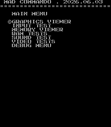
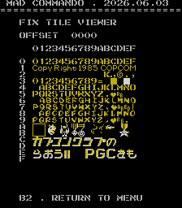
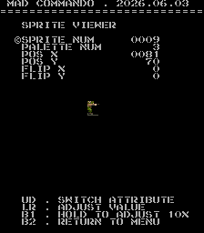
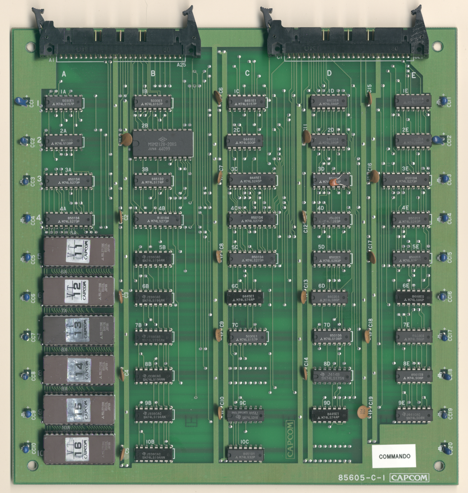
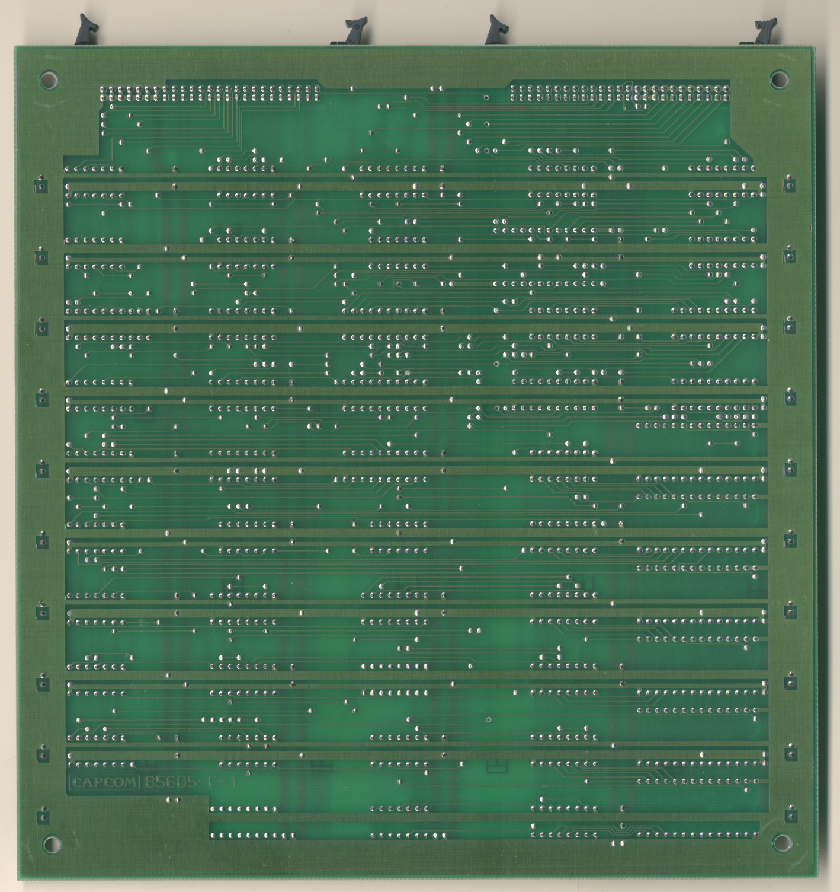

# Commando
- [MAD Pictures](#mad-pictures)
- [PCB Pictures](#pcb-pictures)
- [Manual / Schematics](#manual-schematics)
- [MAD Eproms](#mad-eproms)
- [RAM Locations](#ram-locations)
- [Errors/Error Codes](#errorserror-codes)
   - [Main CPU](#main-cpu)
   - [Sound CPU](#sound-cpu)
- [MAD Notes](#mad-notes)
   - [Encoded ROM](#encoded-rom)
   - [Sprite garbage on boot](#sprite-garbage-on-boot)
   - [Static palette colors](#static-palette-colors)
   - [No Video DAC Test](#no-video-dac-test)
- [MAME vs Hardware](#mame-vs-hardware)

## MAD Pictures

## PCB Pictures
**IMPORTANT**: This board is **NOT** JAMMA.  Using a JAMMA harness will damage
the board!!!. You need to use a capcom classics to JAMMA converter.

The game consists of 3 PCBs.  All boards have their parts sides facing up.

BG Tile PCB (Top): 

CPU PCB (Middle): 

Sprite PCB (Bottom): 

## Manual / Schematics
[Manual w/Schematics](docs/commando_manual_schematics.pdf) 

## MAD Eproms

| Diag | Eprom Type | Location | Notes |
| ---- | ---------- | ----------- | ----- |
| Main | 27c256 | cm04.9m @ 9M on CPU Board | |
| Sound | 27c128 | 9F on CPU Board | No MAD ROM exists yet |

## RAM Locations
| RAM | Location | Type |
| -------- | :------- | ----- |
| BG Tile RAM | 2B on BG Tile Board | MSM2128-20RS (2k x 8bit) |
| Fix Tile RAM | 7F on CPU Board | M58725P (2k x 8bit) |
| Sound RAM | 8F on CPU Board | M58725P (2k x 8bit) |
| Work RAM | 7M on CPU Board | TC5565PL-15 (8k x 8bit) |

There are additional RAM chips on the sprite board which the CPU doesn't have
access too.  The CPU writes sprite data into a specific memory range in work RAM
then issues a sprite dma request, which will trigger the sprite logic to copy
the sprite data out of work ram.

## Errors/Error Codes
MAD for the main CPU is expecting the game's original sound rom to be there
in order to play sounds, including making beep codes.

### Main CPU
The main CPU is a Z80.  If an error is encountered during tests, MAD will print
the error to the screen, play the beep code, then jump to the error address

On Z80's the error address is `$6000 | error_code << 7`.  Error codes on the
Z80 CPU are are 6 bits.

<!-- ec_table_main_start -->
| Hex  | Number | Beep Code |     Error Address (A15..A0)    |           Error Text           |
| ---: | -----: | --------: | :----------------------------: | :----------------------------- |
| 0x01 |      1 | 0000 0001 |      0110 0000 1xxx xxxx       | BG TILE RAM ADDRESS            |
| 0x02 |      2 | 0000 0010 |      0110 0001 0xxx xxxx       | BG TILE RAM DATA               |
| 0x03 |      3 | 0000 0011 |      0110 0001 1xxx xxxx       | BG TILE RAM MARCH              |
| 0x04 |      4 | 0000 0100 |      0110 0010 0xxx xxxx       | BG TILE RAM OUTPUT             |
| 0x05 |      5 | 0000 0101 |      0110 0010 1xxx xxxx       | BG TILE RAM WRITE              |
| 0x06 |      6 | 0000 0110 |      0110 0011 0xxx xxxx       | FIX TILE RAM ADDRESS           |
| 0x07 |      7 | 0000 0111 |      0110 0011 1xxx xxxx       | FIX TILE RAM DATA              |
| 0x08 |      8 | 0000 1000 |      0110 0100 0xxx xxxx       | FIX TILE RAM MARCH             |
| 0x09 |      9 | 0000 1001 |      0110 0100 1xxx xxxx       | FIX TILE RAM OUTPUT            |
| 0x0a |     10 | 0000 1010 |      0110 0101 0xxx xxxx       | FIX TILE RAM WRITE             |
| 0x0b |     11 | 0000 1011 |      0110 0101 1xxx xxxx       | WORK RAM ADDRESS               |
| 0x0c |     12 | 0000 1100 |      0110 0110 0xxx xxxx       | WORK RAM DATA                  |
| 0x0d |     13 | 0000 1101 |      0110 0110 1xxx xxxx       | WORK RAM MARCH                 |
| 0x0e |     14 | 0000 1110 |      0110 0111 0xxx xxxx       | WORK RAM OUTPUT                |
| 0x0f |     15 | 0000 1111 |      0110 0111 1xxx xxxx       | WORK RAM WRITE                 |
| 0x3e |     62 | 0011 1110 |      0111 1111 0xxx xxxx       | MAD ROM ADDRESS                |
| 0x3f |     63 | 0011 1111 |      0111 1111 1xxx xxxx       | MAD ROM CRC32                  |

Table last updated by gen-error-codes-markdown-table on 2026-06-04 @ 04:02 UTC
<!-- ec_table_main_end -->

### Sound CPU
The sound CPU is a z80.  No MAD rom exists yet for the sound CPU.

## MAD Notes

### Encoded ROM
This game uses an encoded ROM where opcodes have some bit shifts done to them,
but opargs and read ROM data is not encoded.

### Sprite garbage on boot
During boot there will be random garbage in sprite ram.  Its only possible to
trigger a sprite dma copy within vblank (rst10 irq).  This can't be done until
after we have tested work ram.

### Static palette colors
The game's palette comes from proms and are unchangeable.

### No Video DAC Test
The static palette makes it impossible to do this test.

## MAME vs Hardware
Nothing that required a MAME specific build
