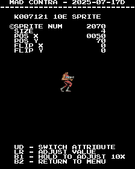

# Contra
- [MAD Pictures](#mad-pictures)
- [PCB Pictures](#pcb-pictures)
- [Manual / Schematics](#manual---schematics)
- [MAD Eproms](#mad-eproms)
- [RAM Locations](#ram-locations)
- [Errors/Error Codes](#errors-error-codes)
  * [Main CPU](#main-cpu)
  * [Sound CPU](#sound-cpu)
- [MAD Notes](#mad-notes)
  * [007121 ICs](#007121-ics)
  * [Tile Viewer](#tile-viewer)
  * [Sprite Viewer](#sprite-viewer)
- [MAME vs Hardware](#mame-vs-hardware)
  * [Sprite Ram/Rendering (007121)](#sprite-ram-rendering--007121-)

## MAD Pictures

<br>



## PCB Pictures
<a href="docs/images/contra_pcb_top.png"></a>
<a href="docs/images/contra_pcb_bottom.png"></a>
<p>

## Manual / Schematics
[Manual w/Schematics](docs/contra_manual_schematics.pdf)

## MAD Eproms
| Diag | Eprom Type | Location | Notes |
| ---- | ---------- | ----------- | ----- |
| Main | 27c512 | 633m03.18a @ 18A | |
| Sound | 27c256 | 633e01.12a @ 12A | |

## RAM Locations
| RAM | Location | Type | Notes |
| -------- | :------- | ----- | ----- |
| Palette RAM | 1F| Inside 007593? | | 
| Sound RAM | 16C | MB8416A-15L-SK (2k x 8bit) | |
| 007121 @ 10E | 14E | MB8464A-10L-SK (8k x 8bit) | header/foreground tiles + sprites|
| 007121 @ 18E | 22E | MB8464A-10L-SK (8k x 8bit) | background tiles + sprites |
| Work RAM | 18C16A | MB8464A-10L-SK (8k x 8bit) | |

## Errors/Error Codes
MAD for the main CPU is expecting the game's original sound rom to be there
in order to play sounds, including making beep codes.

### Main CPU
The main CPU is a HD6309 CPU.  If an error is encountered during
tests, MAD will print the error to the screen, play the beep code, then jump to
the error address

On Konami2 the error address is `$f000 | error_code << 4`.  Error codes on the
Konami2 CPU are are 6 bits.  contra however has a watchdog address that must
be written to periodically or the game will reset.

```
watchdog address: $001e = 0000 0000 0001 1110
error address:    $f000 = 1111 00EE EEEE 0000
  E = error code
```
The watchdog address is in conflict with the error address.  However instead of
doing a loop to self instruction at the error address, MAD instead does a delay
loop so it stays within the error address range 99.9% of the time and 0.1% of
the time it will ping the watchdog.  This is enough for the error addresses to
still be viable to use with a logic probe.  It just means address lines not be
100% high or low, but 99% of the time.

<!-- ec_table_main_start -->
| Hex  | Number | Beep Code |     Error Address (A15..A0)    |           Error Text           |
| ---: | -----: | --------: | :----------------------------: | :----------------------------- |
| 0x01 |      1 | 0000 0001 |      1111 0000 0001 xxxx       | PALETTE RAM ADDRESS            |
| 0x02 |      2 | 0000 0010 |      1111 0000 0010 xxxx       | PALETTE RAM DATA               |
| 0x03 |      3 | 0000 0011 |      1111 0000 0011 xxxx       | PALETTE RAM MARCH              |
| 0x04 |      4 | 0000 0100 |      1111 0000 0100 xxxx       | PALETTE RAM OUTPUT             |
| 0x05 |      5 | 0000 0101 |      1111 0000 0101 xxxx       | PALETTE RAM WRITE              |
| 0x06 |      6 | 0000 0110 |      1111 0000 0110 xxxx       | K007121 10E RAM ADDRESS        |
| 0x07 |      7 | 0000 0111 |      1111 0000 0111 xxxx       | K007121 10E RAM DATA           |
| 0x08 |      8 | 0000 1000 |      1111 0000 1000 xxxx       | K007121 10E RAM MARCH          |
| 0x09 |      9 | 0000 1001 |      1111 0000 1001 xxxx       | K007121 10E RAM OUTPUT         |
| 0x0a |     10 | 0000 1010 |      1111 0000 1010 xxxx       | K007121 10E RAM WRITE          |
| 0x0b |     11 | 0000 1011 |      1111 0000 1011 xxxx       | K007121 18E RAM ADDRESS        |
| 0x0c |     12 | 0000 1100 |      1111 0000 1100 xxxx       | K007121 18E RAM DATA           |
| 0x0d |     13 | 0000 1101 |      1111 0000 1101 xxxx       | K007121 18E RAM MARCH          |
| 0x0e |     14 | 0000 1110 |      1111 0000 1110 xxxx       | K007121 18E RAM OUTPUT         |
| 0x0f |     15 | 0000 1111 |      1111 0000 1111 xxxx       | K007121 18E RAM WRITE          |
| 0x10 |     16 | 0001 0000 |      1111 0001 0000 xxxx       | WORK RAM ADDRESS               |
| 0x11 |     17 | 0001 0001 |      1111 0001 0001 xxxx       | WORK RAM DATA                  |
| 0x12 |     18 | 0001 0010 |      1111 0001 0010 xxxx       | WORK RAM MARCH                 |
| 0x13 |     19 | 0001 0011 |      1111 0001 0011 xxxx       | WORK RAM OUTPUT                |
| 0x14 |     20 | 0001 0100 |      1111 0001 0100 xxxx       | WORK RAM WRITE                 |
| 0x3e |     62 | 0011 1110 |      1111 0011 1110 xxxx       | MAD ROM ADDRESS                |
| 0x3f |     63 | 0011 1111 |      1111 0011 1111 xxxx       | MAD ROM CRC32                  |

<sup>Table last updated by gen-error-codes-markdown-table on 2025-06-07 @ 01:41 UTC</sup>
<!-- ec_table_main_end -->

### Sound CPU
The sound CPU is a 6809.  This is very much a work in progress so it might not
work right.  

<!-- ec_table_sound_start -->
| Hex  | Number |     Error Address (A15..A0)    |           Error Text           |
| ---: | -----: | :----------------------------: | :----------------------------- |
| 0x00 |      0 |      1111 0000 0000 xxxx       | ALL TESTS PASSED               |
| 0x01 |      1 |      1111 0000 0001 xxxx       | WORK RAM ADDRESS               |
| 0x02 |      2 |      1111 0000 0010 xxxx       | WORK RAM DATA                  |
| 0x03 |      3 |      1111 0000 0011 xxxx       | WORK RAM MARCH                 |
| 0x04 |      4 |      1111 0000 0100 xxxx       | WORK RAM OUTPUT                |
| 0x05 |      5 |      1111 0000 0101 xxxx       | WORK RAM WRITE                 |
| 0x06 |      6 |      1111 0000 0110 xxxx       | YM2151 BUSY BIT                |
| 0x07 |      7 |      1111 0000 0111 xxxx       | YM2151 OUTPUT                  |
| 0x3e |     62 |      1111 0011 1110 xxxx       | MAD ROM ADDRESS                |
| 0x3f |     63 |      1111 0011 1111 xxxx       | MAD ROM CRC16                  |

<sup>Table last updated by gen-error-codes-markdown-table on 2025-06-07 @ 01:42 UTC</sup>
<!-- ec_table_sound_end -->

## MAD Notes

### 007121 ICs
There are 2x 007121 custom ICs. Each can handle 2x tile layers and sprites.  On
Contra the 007121 @ 10E, layer B is the top 5 tile lines of the game and are
always on top.  While layer A is the foreground.  The 007121 @ 18E has layer A
as the background layer and layer B is unused (or hooked up?).  Each 007121 has
its own mask roms for the tiles and sprites it can display.  The tile layers on
each 007121 share the same tile sets.

### Tile Viewer
MAD only has tile viewers for layer A of each 007121.  It seems pointless to try
and show tiles on layer B of 007121 @ 10E since its only 5 tiles high and it
uses the same tile set as layer A.

007121 @ 10E is used for rendering the text on screen.  Tile numbers are 14 bits,
where the high bit comes from a global setting within one of the 007121's
control registers.  I'm assuming this is causing a bank switch on the tile mask
rom.  As such if the tile offset is >= $2000 it will cause the text on screen to
become corrupt since text will no longer be pointing at the font tiles.

Additionally it seems like there is only one palette available for the tile
layers (per 007121) and is why there is a orange shadow on the text when using
the tile viewier of 007121 @ 10E.

The color palette is just a random one I picked, so none of the colors for the
tiles will look right compared to in game.

### Sprite Viewer
There is a basic sprite viewer in MAD.  Sprites are a little tricky to
setup/view because I don't know the correct width/height of each sprite.  There
are options to change those values in the viewer.

The color palette is the one the game uses for the player.  So the colors for
the player should be correct, but maybe completely wrong for other sprites.

## MAME vs Hardware
Nothing that required a MAME specific build
