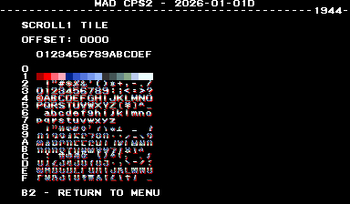
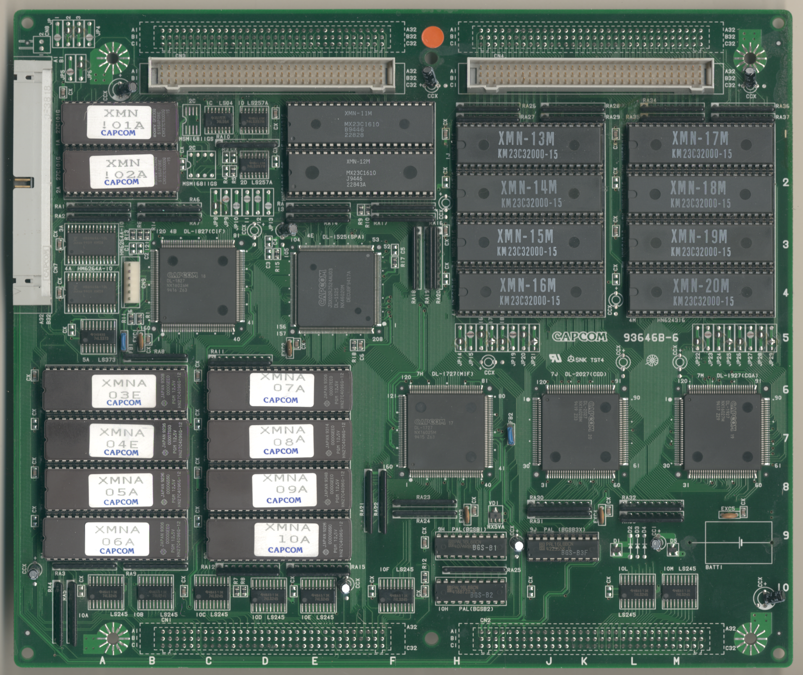
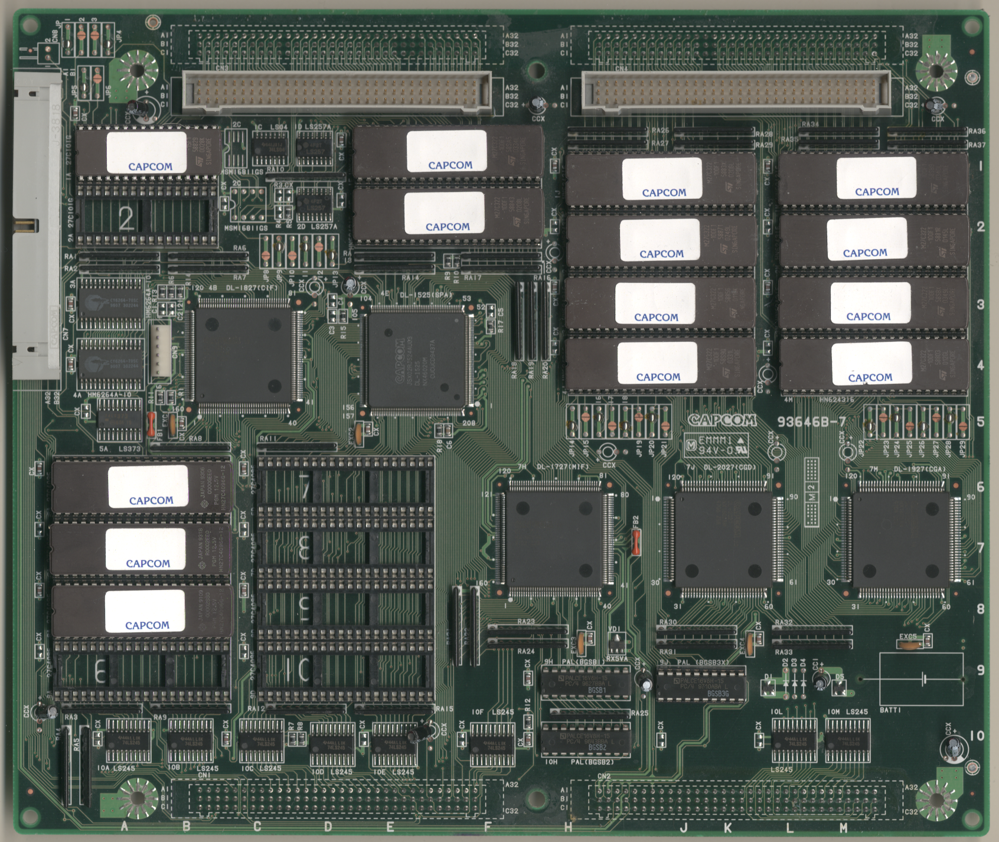

# CPS2 Games/Hardware
- [MAD Pictures](#mad-pictures)
- [PCBs Pictures](#pcbs-pictures)
  - [A Boards](#a-boards)
    - [93646A-4](#93646a-4)
    - [93646A-5](#93646a-5)
    - [93646A-6](#93646a-6)
    - [93646A-7](#93646a-7)
  - [B Boards](#b-boards)
    - [93646B-3](#93646b-3)
    - [93646B-4](#93646b-4)
    - [93646B-5](#93646b-5)
    - [93646B-6](#93646b-6)
    - [93646B-7](#93646b-7)
- [MAD Eprom](#mad-eprom)
- [Schematics](#schematics)
- [RAM Locations](#ram-locations)
- [Errors/Error Codes](#errorserror-codes)
  - [Main CPU](#main-cpu)
  - [Sound CPU](#sound-cpu)
- [MAD Notes](#mad-notes)
  - [Tiles/Sprite Viewers](#tilessprite-viewers)
  - [Building and Keys](#building-and-keys)
- [MAME vs Hardware](#mame-vs-hardware)

## MAD Pictures

<br>



## PCBs Pictures
### A Boards
#### 93646A-4
<a href="docs/images/a_boards/cps2_a_board_93646A-4_pcb_top.png"></a>
<a href="docs/images/a_boards/cps2_a_board_93646A-4_pcb_bottom.png"></a>

#### 93646A-5
NEED SCANS

#### 93646A-6
<a href="docs/images/a_boards/cps2_a_board_93646A-6_pcb_top.png"></a>
<a href="docs/images/a_boards/cps2_a_board_93646A-6_pcb_bottom.png"></a>

#### 93646A-7
NEED SCANS

### B Boards
#### 93646B-3
NEED SCANS

#### 93646B-4
NEED SCANS

#### 93646B-5
NEED SCANS

#### 93646B-6
<a href="docs/images/b_boards/cps2_b_board_93646B-6_pcb_top.png"></a>
<a href="docs/images/b_boards/cps2_b_board_93646B-6_pcb_top.png"></a>

#### 93646B-7
<a href="docs/images/b_boards/cps2_b_board_93646B-7_cb_top.png"></a>
<a href="docs/images/b_boards/cps2_b_board_93646B-7pcb_top.png"></a>


## MAD Eprom
| Diag | Eprom Type | Location |
| ---- | ---------- | ----------- |
| Main | 27c4096 | 03 on B board |
| Sound | 27c010 or 27c1001 | 01 on B board |

There are encrypted and suicide versions for each romset currently supported by
MAD.  If you have a B board thats not directly supported by a MAD romset you can
try using the generic or generic-tate version of MAD.  These should in theory
work on any B board, but expect the font to look messed up.  

## Schematics
[CPS2 Schematics](https://gitlab.com/loic.petit/cps2-reverse) created by Loïc
Petit.  Amazing stuff!

## RAM Locations
| RAM | Location | Type |
| -------- | :------- | ----- |
| Object RAM Lower | 4A on B Board | CY6264-70SC (8k x 8bit) |
| Object RAM Upper | 3A on B Board | CY6264-70SC (8k x 8bit) |
| Sound/QSound RAM | 2K on A Board | MB8464R-10L (8k x 8bit) |
| Work/GFX RAM Lower | 14R on A Board | 658128ALFP-10 (128k x 8bit) |
| Work/GFX RAM Upper | 13R on A Board | 658128ALFP-10 (128k x 8bit) |

Work/GFX RAM seem to be on the same physical RAM chips on the A board, but their
address space on the CPU is disjointed.

```
$900000 - $92ffff = GFX RAM
$ff0000 - $ffffff = Work RAM
```
Because of this MAD is doing separate RAM tests for each region.

There are a couple additional RAM chips on the A board that are not accessible
by the CPU.

  * 2x MB81C78A-45P-SK (8k x 8bit) at 4D/4F on A Board
    * The CPU writes palette info to part of GFX RAM and then writes to a register on
the CPS-A chip to trigger a DMA transfer of that data.  I'm assume this is where
that palette data is transferred to.
  * 2x HM514260AJ7 (256k x 16bit, DRAM) at 13V/14V on A Board
    * Likely something related to rendering

## Errors/Error Codes
MAD for the main CPU is expecting the game's original sound rom to be there in
order to play sounds, including making beep codes.

### Main CPU
The main CPU is a motorola 68000.  If an error is encountered during tests
MAD will print the error to the screen, play the beep code, then jump to the
error address

On 68000 the error address is `$6000 | error_code << 5`.  Error codes on 68000
are 7 bits.

```
error address:    $006000 = 0000 0000 0110 EEEE EEE0 0000
  E = error code
```
CPS2 games have different watchdog CPU instructions, which may or
may not touch memory.  If the watchdog is reading from memory it may conflict
with the error address.  However instead of doing a loop to self instruction
at the error address, MAD instead does a delay loop so it stays within the error
address range 99.9% of the time and 0.1% of the time it will ping the watchdog.
This is enough for the error addresses to still be viable to use with a logic
probe.  It just means address lines not be 100% high or low, but 99% of the time.

<!-- ec_table_main_start -->
| Hex  | Number | Beep Code |     Error Address (A23..A1)    |           Error Text           |
| ---: | -----: | --------: | :----------------------------: | :----------------------------- |
| 0x01 |      1 | 0000 0001 |  000 0000 0011 0000 0001 xxxx  | GFX RAM ADDRESS                |
| 0x02 |      2 | 0000 0010 |  000 0000 0011 0000 0010 xxxx  | GFX RAM DATA LOWER             |
| 0x03 |      3 | 0000 0011 |  000 0000 0011 0000 0011 xxxx  | GFX RAM DATA UPPER             |
| 0x04 |      4 | 0000 0100 |  000 0000 0011 0000 0100 xxxx  | GFX RAM DATA BOTH              |
| 0x05 |      5 | 0000 0101 |  000 0000 0011 0000 0101 xxxx  | GFX RAM MARCH LOWER            |
| 0x06 |      6 | 0000 0110 |  000 0000 0011 0000 0110 xxxx  | GFX RAM MARCH UPPER            |
| 0x07 |      7 | 0000 0111 |  000 0000 0011 0000 0111 xxxx  | GFX RAM MARCH BOTH             |
| 0x08 |      8 | 0000 1000 |  000 0000 0011 0000 1000 xxxx  | GFX RAM OUTPUT LOWER           |
| 0x09 |      9 | 0000 1001 |  000 0000 0011 0000 1001 xxxx  | GFX RAM OUTPUT UPPER           |
| 0x0a |     10 | 0000 1010 |  000 0000 0011 0000 1010 xxxx  | GFX RAM OUTPUT BOTH            |
| 0x0b |     11 | 0000 1011 |  000 0000 0011 0000 1011 xxxx  | GFX RAM WRITE LOWER            |
| 0x0c |     12 | 0000 1100 |  000 0000 0011 0000 1100 xxxx  | GFX RAM WRITE UPPER            |
| 0x0d |     13 | 0000 1101 |  000 0000 0011 0000 1101 xxxx  | GFX RAM WRITE BOTH             |
| 0x0e |     14 | 0000 1110 |  000 0000 0011 0000 1110 xxxx  | OBJECT RAM ADDRESS             |
| 0x0f |     15 | 0000 1111 |  000 0000 0011 0000 1111 xxxx  | OBJECT RAM DATA LOWER          |
| 0x10 |     16 | 0001 0000 |  000 0000 0011 0001 0000 xxxx  | OBJECT RAM DATA UPPER          |
| 0x11 |     17 | 0001 0001 |  000 0000 0011 0001 0001 xxxx  | OBJECT RAM DATA BOTH           |
| 0x12 |     18 | 0001 0010 |  000 0000 0011 0001 0010 xxxx  | OBJECT RAM MARCH LOWER         |
| 0x13 |     19 | 0001 0011 |  000 0000 0011 0001 0011 xxxx  | OBJECT RAM MARCH UPPER         |
| 0x14 |     20 | 0001 0100 |  000 0000 0011 0001 0100 xxxx  | OBJECT RAM MARCH BOTH          |
| 0x15 |     21 | 0001 0101 |  000 0000 0011 0001 0101 xxxx  | OBJECT RAM OUTPUT LOWER        |
| 0x16 |     22 | 0001 0110 |  000 0000 0011 0001 0110 xxxx  | OBJECT RAM OUTPUT UPPER        |
| 0x17 |     23 | 0001 0111 |  000 0000 0011 0001 0111 xxxx  | OBJECT RAM OUTPUT BOTH         |
| 0x18 |     24 | 0001 1000 |  000 0000 0011 0001 1000 xxxx  | OBJECT RAM WRITE LOWER         |
| 0x19 |     25 | 0001 1001 |  000 0000 0011 0001 1001 xxxx  | OBJECT RAM WRITE UPPER         |
| 0x1a |     26 | 0001 1010 |  000 0000 0011 0001 1010 xxxx  | OBJECT RAM WRITE BOTH          |
| 0x1b |     27 | 0001 1011 |  000 0000 0011 0001 1011 xxxx  | OBJECT RAM BANK                |
| 0x1c |     28 | 0001 1100 |  000 0000 0011 0001 1100 xxxx  | QSOUND RAM ADDRESS             |
| 0x1d |     29 | 0001 1101 |  000 0000 0011 0001 1101 xxxx  | QSOUND RAM DATA                |
| 0x20 |     32 | 0010 0000 |  000 0000 0011 0010 0000 xxxx  | QSOUND RAM MARCH               |
| 0x23 |     35 | 0010 0011 |  000 0000 0011 0010 0011 xxxx  | QSOUND RAM OUTPUT              |
| 0x26 |     38 | 0010 0110 |  000 0000 0011 0010 0110 xxxx  | QSOUND RAM WRITE               |
| 0x29 |     41 | 0010 1001 |  000 0000 0011 0010 1001 xxxx  | WORK RAM ADDRESS               |
| 0x2a |     42 | 0010 1010 |  000 0000 0011 0010 1010 xxxx  | WORK RAM DATA LOWER            |
| 0x2b |     43 | 0010 1011 |  000 0000 0011 0010 1011 xxxx  | WORK RAM DATA UPPER            |
| 0x2c |     44 | 0010 1100 |  000 0000 0011 0010 1100 xxxx  | WORK RAM DATA BOTH             |
| 0x2d |     45 | 0010 1101 |  000 0000 0011 0010 1101 xxxx  | WORK RAM MARCH LOWER           |
| 0x2e |     46 | 0010 1110 |  000 0000 0011 0010 1110 xxxx  | WORK RAM MARCH UPPER           |
| 0x2f |     47 | 0010 1111 |  000 0000 0011 0010 1111 xxxx  | WORK RAM MARCH BOTH            |
| 0x30 |     48 | 0011 0000 |  000 0000 0011 0011 0000 xxxx  | WORK RAM OUTPUT LOWER          |
| 0x31 |     49 | 0011 0001 |  000 0000 0011 0011 0001 xxxx  | WORK RAM OUTPUT UPPER          |
| 0x32 |     50 | 0011 0010 |  000 0000 0011 0011 0010 xxxx  | WORK RAM OUTPUT BOTH           |
| 0x33 |     51 | 0011 0011 |  000 0000 0011 0011 0011 xxxx  | WORK RAM WRITE LOWER           |
| 0x34 |     52 | 0011 0100 |  000 0000 0011 0011 0100 xxxx  | WORK RAM WRITE UPPER           |
| 0x35 |     53 | 0011 0101 |  000 0000 0011 0011 0101 xxxx  | WORK RAM WRITE BOTH            |
| 0x7e |    126 | 0111 1110 |  000 0000 0011 0111 1110 xxxx  | MAD ROM ADDRESS                |
| 0x7f |    127 | 0111 1111 |  000 0000 0011 0111 1111 xxxx  | MAD ROM CRC32                  |

<sup>Table last updated by gen-error-codes-markdown-table on 2026-01-03 @ 01:50 UTC</sup>
<!-- ec_table_main_end -->

### Sound CPU
The sound CPU is a z80. No MAD rom exists yet for the sound CPU.

## MAD Notes
### Tiles/Sprite Viewers
There are 3 tiles layers (scroll1 = 8x8 tiles, scroll2 = 16x16 tiles, scroll3 =
32x32 tiles).  Tile and Sprite pixel data seem to be all stored in the same ROMs.
This can cause weird outputs when trying to view different tiles layers /
sprites.  For example you could have scroll2 viewer up and it might be trying to
load 16x16 tiles from the location where 8x8 tiles are stored in the ROM causing
it to display borderline gibberish on screen.

### Building and Keys
Encryption keys are not supplied by MAD with the exception of the
suicide/phoenix key.  In order to build MAD for CPS2, you will need to place the
required keys in the keys directory, which can be found in MAME.  The required
key keys can be found in each Makefile.[romset] file.  

## MAME vs Hardware
Nothing that required a MAME specific build