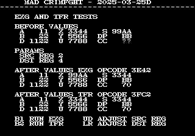

# Crime Fighters
This machine is mostly a test while I work through adding support for the konami
cpu (6809 based) to vasm.  If you want to build it you will need to use the
daily builds of vasm.

The only thing mad rom does at this point it being up a screen that allows
testing EXG/TFR instructions with different values for the registers.



In testing on hardware it appears EXG (0x3e) and TFR (0x3f) have the same exact
behavior on the CPU.  What ends up determining if the behavior is an exchange vs
a transfer is the high bit on the oparg.

register values are 3 bits each, with the high nibble in the oparg being the
destination register and lower nibble the source.

register values:
```
0 = a
1 = b/d (d when being read, b when being written)
2 = x
3 = y
4 = dp (this one is screwy)
5 = u
6 = s
7 = pc
```

The effect of the `b/d` stuff is you can transfer the `d` register to another
16bit register, but there is no way to transfer a 16bit register to `d`.
Instead it always results in just `b` being set to the lower byte of the 16bit
register and `a` remains untouched.  Super annoying.

`dp` seems to be part of a 16bit register where, `dp` is the high byte and the
lower byte seems hidden.  If you do a EXG with `dp` with another 16bit
register the CPU does a full 16bit EXG.  `dp` ends up in the high byte and the
hidden byte ends up in the lower byte.  Likewise contents of the other 16bit
register ends up `dp` + hidden byte.

Additionally on the hidden part of `dp`. Limited testing shows you can store a
byte in it and retrieve it later on.  `TFR a, dp` or `TFR b, dp` will cause a/b to
get stored in the hidden byte, which you could then retrieve by doing the
opposite TFR.
