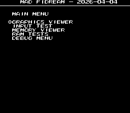
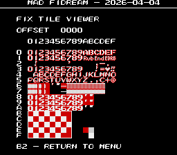
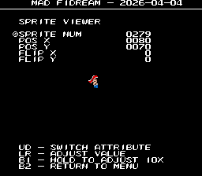

# F1 Dream
- [MAD Pictures](#mad-pictures)
- [PCB Pictures](#pcb-pictures)
- [Manual / Schematics](#manual-schematics)
- [MAD Eproms](#mad-eproms)
- [RAM Locations](#ram-locations)
- [Errors/Error Codes](#errorserror-codes)
   - [Main CPU](#main-cpu)
   - [Sound CPU](#sound-cpu)
- [MAD Notes](#mad-notes)
   - [No Video DAC Test](#no-video-dac-test)
   - [No Sound Test](#no-sound-test)
- [MAME vs Hardware](#mame-vs-hardware)

## MAD Pictures

## PCB Pictures
CPU Board: 

Graphics Board: 

The CPU and graphics board are oriented such that the solder side of the boards
face each other.

## Manual / Schematics
[Manual](docs/f1_dream_manual.pdf)

Schematics don't seem to exist, but there are tiger road schematics [here](https://github.com/DocteurPCB/schematics/blob/main/Tiger%20Road%20%5Bschematics%5D(Capcom).pdf), which should basically be the same.

## MAD Eproms
| Diag | Eprom Type | Location(s) | Notes |
| ---- | ---------- | ----------- | ----- |
| Main on CPU PCB | 27c301 | f1_hi.6j @ 6J on CPU PCB f1_lo.6k @ 6K on CPU PCB | |
| Sound on CPU PCB | 27c512 | 12K on CPU PCB | No MAD ROM exists yet |

## RAM Locations
| RAM | Location | Type |
| -------- | :------- | ----- |
| Fix RAM Lower | 5D on CPU PCB | D4016CX-12 (2k x 8bit) |
| Fix RAM Upper | 4D on CPU PCB | D4016CX-12 (2k x 8bit) |
| Sound CPU RAM | 4K on CPU PCB | D4016CX-12 (2k x 8bit) |
| Sprite RAM Lower | 2K on CPU PCB | D4016CX-12 (2k x 8bit) |
| Sprite RAM Upper | 3K on CPU PCB | D4016CX-12 (2k x 8bit) |
| Work RAM Lower | 4J on CPU PCB | D4364CX-10LL (8k x 8bit) |
| Work RAM Upper | 4K on CPU PCB | D4364CX-10LL (8k x 8bit) |

There are a number of additional RAM chips on the graphics board that the CPU
doesn't have read/write access to and thus is unable to test.  13L abnd 15L on
the graphics PCB are the palette RAM.

## Errors/Error Codes

### Main CPU
The main CPU is a motorola 68000.  If an error is encountered during tests
MAD will print the error to the screen, then jump to the error address.

**IMPORTANT**: beep codes are not currently supported.

On 68000 the error address is `$6000 | error_code << 5`.  Error codes on 68000
are 7 bits.

<!-- ec_table_main_start -->
| Hex  | Number | Beep Code |     Error Address (A23..A1)    |           Error Text           |
| ---: | -----: | --------: | :----------------------------: | :----------------------------- |
| 0x01 |      1 | 0000 0001 |  000 0000 0011 0000 0001 xxxx  | FIX TILE RAM ADDRESS           |
| 0x02 |      2 | 0000 0010 |  000 0000 0011 0000 0010 xxxx  | FIX TILE RAM DATA LOWER        |
| 0x03 |      3 | 0000 0011 |  000 0000 0011 0000 0011 xxxx  | FIX TILE RAM DATA UPPER        |
| 0x04 |      4 | 0000 0100 |  000 0000 0011 0000 0100 xxxx  | FIX TILE RAM DATA BOTH         |
| 0x05 |      5 | 0000 0101 |  000 0000 0011 0000 0101 xxxx  | FIX TILE RAM MARCH LOWER       |
| 0x06 |      6 | 0000 0110 |  000 0000 0011 0000 0110 xxxx  | FIX TILE RAM MARCH UPPER       |
| 0x07 |      7 | 0000 0111 |  000 0000 0011 0000 0111 xxxx  | FIX TILE RAM MARCH BOTH        |
| 0x08 |      8 | 0000 1000 |  000 0000 0011 0000 1000 xxxx  | FIX TILE RAM OUTPUT LOWER      |
| 0x09 |      9 | 0000 1001 |  000 0000 0011 0000 1001 xxxx  | FIX TILE RAM OUTPUT UPPER      |
| 0x0a |     10 | 0000 1010 |  000 0000 0011 0000 1010 xxxx  | FIX TILE RAM OUTPUT BOTH       |
| 0x0b |     11 | 0000 1011 |  000 0000 0011 0000 1011 xxxx  | FIX TILE RAM WRITE LOWER       |
| 0x0c |     12 | 0000 1100 |  000 0000 0011 0000 1100 xxxx  | FIX TILE RAM WRITE UPPER       |
| 0x0d |     13 | 0000 1101 |  000 0000 0011 0000 1101 xxxx  | FIX TILE RAM WRITE BOTH        |
| 0x0e |     14 | 0000 1110 |  000 0000 0011 0000 1110 xxxx  | SPRITE RAM ADDRESS             |
| 0x0f |     15 | 0000 1111 |  000 0000 0011 0000 1111 xxxx  | SPRITE RAM DATA LOWER          |
| 0x10 |     16 | 0001 0000 |  000 0000 0011 0001 0000 xxxx  | SPRITE RAM DATA UPPER          |
| 0x11 |     17 | 0001 0001 |  000 0000 0011 0001 0001 xxxx  | SPRITE RAM DATA BOTH           |
| 0x12 |     18 | 0001 0010 |  000 0000 0011 0001 0010 xxxx  | SPRITE RAM MARCH LOWER         |
| 0x13 |     19 | 0001 0011 |  000 0000 0011 0001 0011 xxxx  | SPRITE RAM MARCH UPPER         |
| 0x14 |     20 | 0001 0100 |  000 0000 0011 0001 0100 xxxx  | SPRITE RAM MARCH BOTH          |
| 0x15 |     21 | 0001 0101 |  000 0000 0011 0001 0101 xxxx  | SPRITE RAM OUTPUT LOWER        |
| 0x16 |     22 | 0001 0110 |  000 0000 0011 0001 0110 xxxx  | SPRITE RAM OUTPUT UPPER        |
| 0x17 |     23 | 0001 0111 |  000 0000 0011 0001 0111 xxxx  | SPRITE RAM OUTPUT BOTH         |
| 0x18 |     24 | 0001 1000 |  000 0000 0011 0001 1000 xxxx  | SPRITE RAM WRITE LOWER         |
| 0x19 |     25 | 0001 1001 |  000 0000 0011 0001 1001 xxxx  | SPRITE RAM WRITE UPPER         |
| 0x1a |     26 | 0001 1010 |  000 0000 0011 0001 1010 xxxx  | SPRITE RAM WRITE BOTH          |
| 0x1b |     27 | 0001 1011 |  000 0000 0011 0001 1011 xxxx  | WORK RAM ADDRESS               |
| 0x1c |     28 | 0001 1100 |  000 0000 0011 0001 1100 xxxx  | WORK RAM DATA LOWER            |
| 0x1d |     29 | 0001 1101 |  000 0000 0011 0001 1101 xxxx  | WORK RAM DATA UPPER            |
| 0x1e |     30 | 0001 1110 |  000 0000 0011 0001 1110 xxxx  | WORK RAM DATA BOTH             |
| 0x1f |     31 | 0001 1111 |  000 0000 0011 0001 1111 xxxx  | WORK RAM MARCH LOWER           |
| 0x20 |     32 | 0010 0000 |  000 0000 0011 0010 0000 xxxx  | WORK RAM MARCH UPPER           |
| 0x21 |     33 | 0010 0001 |  000 0000 0011 0010 0001 xxxx  | WORK RAM MARCH BOTH            |
| 0x22 |     34 | 0010 0010 |  000 0000 0011 0010 0010 xxxx  | WORK RAM OUTPUT LOWER          |
| 0x23 |     35 | 0010 0011 |  000 0000 0011 0010 0011 xxxx  | WORK RAM OUTPUT UPPER          |
| 0x24 |     36 | 0010 0100 |  000 0000 0011 0010 0100 xxxx  | WORK RAM OUTPUT BOTH           |
| 0x25 |     37 | 0010 0101 |  000 0000 0011 0010 0101 xxxx  | WORK RAM WRITE LOWER           |
| 0x26 |     38 | 0010 0110 |  000 0000 0011 0010 0110 xxxx  | WORK RAM WRITE UPPER           |
| 0x27 |     39 | 0010 0111 |  000 0000 0011 0010 0111 xxxx  | WORK RAM WRITE BOTH            |
| 0x7e |    126 | 0111 1110 |  000 0000 0011 0111 1110 xxxx  | MAD ROM ADDRESS                |
| 0x7f |    127 | 0111 1111 |  000 0000 0011 0111 1111 xxxx  | MAD ROM CRC32                  |

Table last updated by gen-error-codes-markdown-table on 2026-04-12 @ 17:49 UTC
<!-- ec_table_main_end -->

### Sound CPU
The sound CPU is a z80.  No MAD rom exists yet for the sound CPU.

## MAD Notes
### No Video DAC Test
It should be possible to make one, but will be a pita to do.  Fix tile only has
3 colors per palette.

### No Sound Test
The board uses an MCU for communication between the main CPU and the sound CPU.
I haven't looked into getting this working. 

## MAME vs Hardware
Nothing that required a MAME specific build
