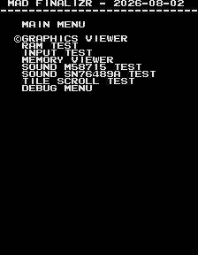
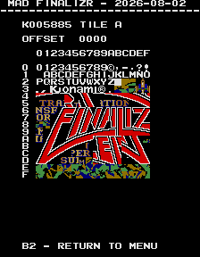
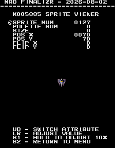
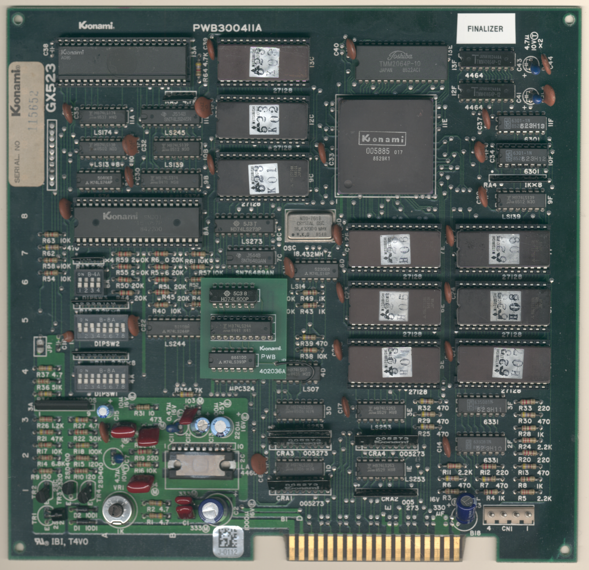
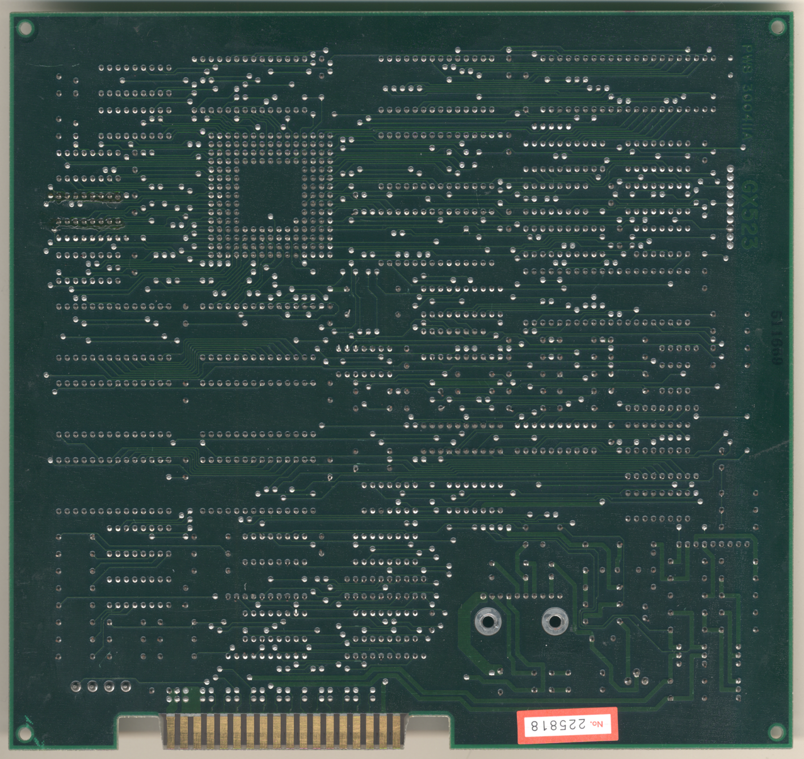

# Finalizer: Super Transformation
- [MAD Pictures](#mad-pictures)
- [PCB Pictures](#pcb-pictures)
- [Manual / Schematics](#manual-schematics)
- [MAD Eproms](#mad-eproms)
- [RAM Locations](#ram-locations)
- [Errors/Error Codes](#errorserror-codes)
   - [Main CPU](#main-cpu)
   - [Sound CPU](#sound-cpu)
- [MAD Notes](#mad-notes)
   - [Static palette colors](#static-palette-colors)
   - [No Video DAC Test](#no-video-dac-test)
- [MAME vs Hardware](#mame-vs-hardware)

## MAD Pictures

## PCB Pictures

## Manual / Schematics
[Manual](docs/finalizer_manual.pdf)

Schematics don't seem to exist.

## MAD Eproms
| Diag | Eprom Type | Location | Notes |
| ---- | ---------- | ----------- | ----- |
| Main | 27c128 | 523k03.13c @ 13C | |

## RAM Locations
| RAM | Location | Type | Notes |
| -------- | :------- | ----- | ----- |
| RAM | 13E | TMM2064-10 (8k x 8bit) | |

All work/sprite/tile data is within that single SRAM chip.  There are 2x
TMM41464-12 (64k x 4 bit) DRAM chips that are not accessible by the CPU and
probably line buffers used by th 005885 custom chip.

## Errors/Error Codes
Error codes play through the m58715 IC.

### Main CPU

The main CPU is a 6809 CPU.  If an error is encountered during tests, MAD will
print the error to the screen, play the beep code, then jump to the error
address

On 6809 CPU the error address is `$f000 | error_code << 4`.  Error codes on the
6809 CPU are are 6 bits.  The games does not have a watchdog.

<!-- ec_table_main_start -->
| Hex  | Number |     Error Address (A15..A0)    |           Error Text           |
| ---: | -----: | :----------------------------: | :----------------------------- |
| 0x01 |      1 |      1111 0000 0001 xxxx       | WORK RAM ADDRESS               |
| 0x02 |      2 |      1111 0000 0010 xxxx       | WORK RAM DATA                  |
| 0x03 |      3 |      1111 0000 0011 xxxx       | WORK RAM MARCH                 |
| 0x04 |      4 |      1111 0000 0100 xxxx       | WORK RAM OUTPUT                |
| 0x05 |      5 |      1111 0000 0101 xxxx       | WORK RAM WRITE                 |
| 0x3e |     62 |      1111 0011 1110 xxxx       | MAD ROM ADDRESS                |
| 0x3f |     63 |      1111 0011 1111 xxxx       | MAD ROM CRC16                  |

Table last updated by gen-error-codes-markdown-table on 2026-09-05 @ 02:25 UTC
<!-- ec_table_main_end -->

### Sound CPU
This board doesn't have a dedicated Sound CPU.  The main CPU handles playing
sounds.

## MAD Notes

### Static palette colors
The game's palette comes from proms and are unchangeable.  This is why the text
has the red shadow.

### No Video DAC Test
The static palette makes it impossible to do this test.

## MAME vs Hardware
Nothing to warrant different builds.  But mad has tests that test different
parts of the hardware that are not used by the game or implemented in mame.
This includes tile scroll in the y direction and firq test.
