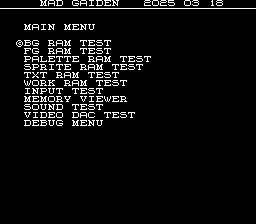
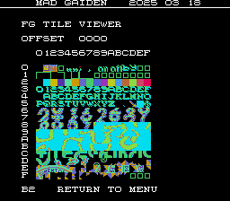
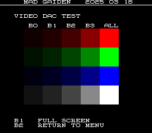
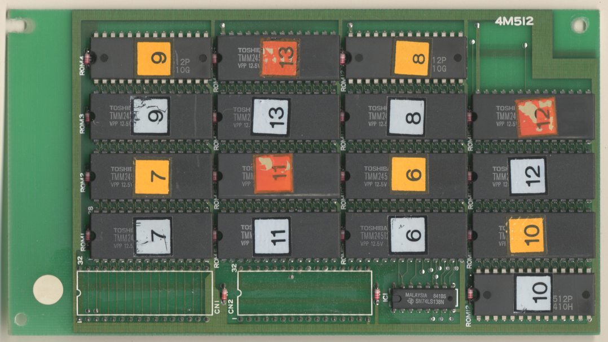
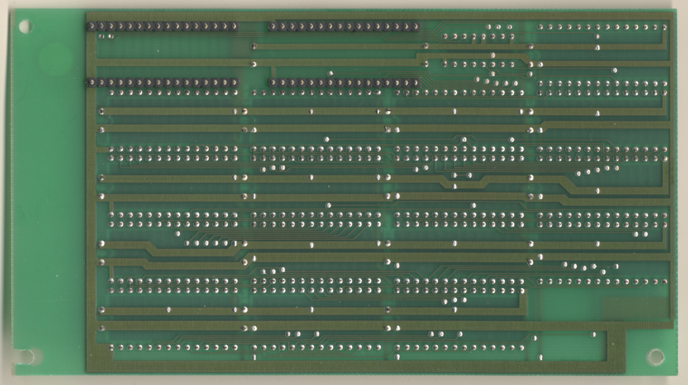

# Ninja Gaiden




## PCBs
CPU Board:<br>
<a href="docs/images/gaiden_cpu_pcb_top.png"></a>
<a href="docs/images/gaiden_cpu_pcb_bottom.png"></a>
<p>
Graphics Board:<br>
<a href="docs/images/gaiden_graphics_pcb_top.png"></a>
<a href="docs/images/gaiden_graphics_pcb_bottom.png"></a>
<p>
Sprite ROM Board:<br>
<a href="docs/images/gaiden_sprite_rom_pcb_top.png"></a>
<a href="docs/images/gaiden_sprite_rom_pcb_bottom.png"></a>

The CPU and graphics board are oriented such that the solder side of the boards
face each other.  The sprite ROM board plugs into the graphics board in the 2 sockets
in the top left of the graphics board picture.  There may also be a version of
game where the 8 empty rom locations in the top left of the graphics board picture are
populated with the sprite roms instead of there being a dedicated sprite rom board.

## MAD Eproms

| Diag | Eprom Type | Location(s) |
| ---- | ---------- | ----------- |
| Main | 27c010 or 27c1001 | gaiden_1.3s @ S3<br>gaiden_2.4s @ S4 |
| Sound | 27c512 | gaiden_3.4b @ B4 |

## RAM Locations
| RAM | Location | Type |
| -------- | :------- | ----- |
| BG RAM Lower | D1 on graphics PCB | TC5563APL-12 (8k x 8bit) |
| BG RAM Upper | D3 on graphics PCB | TC5563APL-12 (8k x 8bit) |
| FG RAM Lower | D4 on graphics PCB | TC5563APL-12 (8k x 8bit) |
| FG RAM Upper | D6 on graphics PCB | TC5563APL-12 (8k x 8bit) |
| Palette RAM Lower Nibble in Lower Byte | H3 on CPU PCB | MB81C68A-35 (4k x 4bit) |
| Palette RAM Upper Nibble in Lower Byte | J3 on CPU PCB | MB81C68A-35 (4k x 4bit) |
| Palette RAM Lower Nibble in Upper Byte | K3 on CPU PCB | MB81C68A-35 (4k x 4bit) |
| Sound CPU RAM | D4 on CPU PCB | MB8464A-15L-SK (8k x 8bit) |
| Sprite RAM Lower | M7 on graphics PCB | TC5563APL-12 (8k x 8bit) |
| Sprite RAM Upper | N7 on graphics PCB | TC5563APL-12 (8k x 8bit) |
| TXT RAM Lower | D7 on graphics PCB | LH5164-10L (8k x 8bit) |
| TXT RAM Upper | C7 on graphics PCB | LH5164-10L (8k x 8bit) |
| Work RAM Lower | U5 on CPU PCB | MB8464A-15L-SK (8k x 8bit) |
| Work RAM Upper | U3 on CPU PCB | MB8464A-15L-SK (8k x 8bit) |

Additionally there are 12x M41464-10 (64k x 4bit) DRAM chips between K2 and H5
that are not accessible by the CPU and can't be tested.  They seem to be related
to sprites and/or rendering the screen.

## Errors/Error Codes
The main CPU and sound CPU MAD rom should be used independently from each
other.  ie: MAD for the main CPU is expecting the games origin sound rom to be there
in order to play sounds, including making beep codes.

### Main CPU
The main CPU is a motorola 68000.  If an error is encountered during tests
MAD will print the error to the screen, play the beep code, then jump to the
error address

On 68000 the error address is `$6000 | error_code << 5`.  Error codes on 68000
are 7 bits.  Gaiden however has a watchdog address that must be written to
periodically or the game will reset.

```
watchdog address: $07a800 = 0000 0111 1010 1000 0000 0000
error address:    $006000 = 0000 0000 0110 EEEE EEE0 0000
  E = error code
```
The watchdog address is in conflict with the error address.  However instead of
doing a loop to self instruction at the error address, MAD instead does a delay loop
so it stays within the error address range 99.9% of the time and 0.1% of the
time it will ping the watchdog.  This is enough for the error addresses to still
be viable to use with a logic probe.  It just means address lines not be 100%
high or low, but 99% of the time.

<!-- ec_table_main_start -->
| Hex  | Number | Beep Code |     Error Address (A23..A1)    |           Error Text           |
| ---: | -----: | --------: | :----------------------------: | :----------------------------- |
| 0x01 |      1 | 0000 0001 |  000 0000 0011 0000 0001 xxxx  | BG RAM ADDRESS                 |
| 0x02 |      2 | 0000 0010 |  000 0000 0011 0000 0010 xxxx  | BG RAM DATA LOWER              |
| 0x03 |      3 | 0000 0011 |  000 0000 0011 0000 0011 xxxx  | BG RAM DATA UPPER              |
| 0x04 |      4 | 0000 0100 |  000 0000 0011 0000 0100 xxxx  | BG RAM DATA BOTH               |
| 0x05 |      5 | 0000 0101 |  000 0000 0011 0000 0101 xxxx  | BG RAM MARCH LOWER             |
| 0x06 |      6 | 0000 0110 |  000 0000 0011 0000 0110 xxxx  | BG RAM MARCH UPPER             |
| 0x07 |      7 | 0000 0111 |  000 0000 0011 0000 0111 xxxx  | BG RAM MARCH BOTH              |
| 0x08 |      8 | 0000 1000 |  000 0000 0011 0000 1000 xxxx  | BG RAM OUTPUT LOWER            |
| 0x09 |      9 | 0000 1001 |  000 0000 0011 0000 1001 xxxx  | BG RAM OUTPUT UPPER            |
| 0x0a |     10 | 0000 1010 |  000 0000 0011 0000 1010 xxxx  | BG RAM OUTPUT BOTH             |
| 0x0b |     11 | 0000 1011 |  000 0000 0011 0000 1011 xxxx  | BG RAM WRITE LOWER             |
| 0x0c |     12 | 0000 1100 |  000 0000 0011 0000 1100 xxxx  | BG RAM WRITE UPPER             |
| 0x0d |     13 | 0000 1101 |  000 0000 0011 0000 1101 xxxx  | BG RAM WRITE BOTH              |
| 0x0e |     14 | 0000 1110 |  000 0000 0011 0000 1110 xxxx  | FG RAM ADDRESS                 |
| 0x0f |     15 | 0000 1111 |  000 0000 0011 0000 1111 xxxx  | FG RAM DATA LOWER              |
| 0x10 |     16 | 0001 0000 |  000 0000 0011 0001 0000 xxxx  | FG RAM DATA UPPER              |
| 0x11 |     17 | 0001 0001 |  000 0000 0011 0001 0001 xxxx  | FG RAM DATA BOTH               |
| 0x12 |     18 | 0001 0010 |  000 0000 0011 0001 0010 xxxx  | FG RAM MARCH LOWER             |
| 0x13 |     19 | 0001 0011 |  000 0000 0011 0001 0011 xxxx  | FG RAM MARCH UPPER             |
| 0x14 |     20 | 0001 0100 |  000 0000 0011 0001 0100 xxxx  | FG RAM MARCH BOTH              |
| 0x15 |     21 | 0001 0101 |  000 0000 0011 0001 0101 xxxx  | FG RAM OUTPUT LOWER            |
| 0x16 |     22 | 0001 0110 |  000 0000 0011 0001 0110 xxxx  | FG RAM OUTPUT UPPER            |
| 0x17 |     23 | 0001 0111 |  000 0000 0011 0001 0111 xxxx  | FG RAM OUTPUT BOTH             |
| 0x18 |     24 | 0001 1000 |  000 0000 0011 0001 1000 xxxx  | FG RAM WRITE LOWER             |
| 0x19 |     25 | 0001 1001 |  000 0000 0011 0001 1001 xxxx  | FG RAM WRITE UPPER             |
| 0x1a |     26 | 0001 1010 |  000 0000 0011 0001 1010 xxxx  | FG RAM WRITE BOTH              |
| 0x1b |     27 | 0001 1011 |  000 0000 0011 0001 1011 xxxx  | PALETTE RAM ADDRESS            |
| 0x1c |     28 | 0001 1100 |  000 0000 0011 0001 1100 xxxx  | PALETTE RAM DATA LOWER         |
| 0x1d |     29 | 0001 1101 |  000 0000 0011 0001 1101 xxxx  | PALETTE RAM DATA UPPER         |
| 0x1e |     30 | 0001 1110 |  000 0000 0011 0001 1110 xxxx  | PALETTE RAM DATA BOTH          |
| 0x1f |     31 | 0001 1111 |  000 0000 0011 0001 1111 xxxx  | PALETTE RAM MARCH LOWER        |
| 0x20 |     32 | 0010 0000 |  000 0000 0011 0010 0000 xxxx  | PALETTE RAM MARCH UPPER        |
| 0x21 |     33 | 0010 0001 |  000 0000 0011 0010 0001 xxxx  | PALETTE RAM MARCH BOTH         |
| 0x22 |     34 | 0010 0010 |  000 0000 0011 0010 0010 xxxx  | PALETTE RAM OUTPUT LOWER       |
| 0x23 |     35 | 0010 0011 |  000 0000 0011 0010 0011 xxxx  | PALETTE RAM OUTPUT UPPER       |
| 0x24 |     36 | 0010 0100 |  000 0000 0011 0010 0100 xxxx  | PALETTE RAM OUTPUT BOTH        |
| 0x25 |     37 | 0010 0101 |  000 0000 0011 0010 0101 xxxx  | PALETTE RAM WRITE LOWER        |
| 0x26 |     38 | 0010 0110 |  000 0000 0011 0010 0110 xxxx  | PALETTE RAM WRITE UPPER        |
| 0x27 |     39 | 0010 0111 |  000 0000 0011 0010 0111 xxxx  | PALETTE RAM WRITE BOTH         |
| 0x28 |     40 | 0010 1000 |  000 0000 0011 0010 1000 xxxx  | SPRITE RAM ADDRESS             |
| 0x29 |     41 | 0010 1001 |  000 0000 0011 0010 1001 xxxx  | SPRITE RAM DATA LOWER          |
| 0x2a |     42 | 0010 1010 |  000 0000 0011 0010 1010 xxxx  | SPRITE RAM DATA UPPER          |
| 0x2b |     43 | 0010 1011 |  000 0000 0011 0010 1011 xxxx  | SPRITE RAM DATA BOTH           |
| 0x2c |     44 | 0010 1100 |  000 0000 0011 0010 1100 xxxx  | SPRITE RAM MARCH LOWER         |
| 0x2d |     45 | 0010 1101 |  000 0000 0011 0010 1101 xxxx  | SPRITE RAM MARCH UPPER         |
| 0x2e |     46 | 0010 1110 |  000 0000 0011 0010 1110 xxxx  | SPRITE RAM MARCH BOTH          |
| 0x2f |     47 | 0010 1111 |  000 0000 0011 0010 1111 xxxx  | SPRITE RAM OUTPUT LOWER        |
| 0x30 |     48 | 0011 0000 |  000 0000 0011 0011 0000 xxxx  | SPRITE RAM OUTPUT UPPER        |
| 0x31 |     49 | 0011 0001 |  000 0000 0011 0011 0001 xxxx  | SPRITE RAM OUTPUT BOTH         |
| 0x32 |     50 | 0011 0010 |  000 0000 0011 0011 0010 xxxx  | SPRITE RAM WRITE LOWER         |
| 0x33 |     51 | 0011 0011 |  000 0000 0011 0011 0011 xxxx  | SPRITE RAM WRITE UPPER         |
| 0x34 |     52 | 0011 0100 |  000 0000 0011 0011 0100 xxxx  | SPRITE RAM WRITE BOTH          |
| 0x35 |     53 | 0011 0101 |  000 0000 0011 0011 0101 xxxx  | TXT RAM ADDRESS                |
| 0x36 |     54 | 0011 0110 |  000 0000 0011 0011 0110 xxxx  | TXT RAM DATA LOWER             |
| 0x37 |     55 | 0011 0111 |  000 0000 0011 0011 0111 xxxx  | TXT RAM DATA UPPER             |
| 0x38 |     56 | 0011 1000 |  000 0000 0011 0011 1000 xxxx  | TXT RAM DATA BOTH              |
| 0x39 |     57 | 0011 1001 |  000 0000 0011 0011 1001 xxxx  | TXT RAM MARCH LOWER            |
| 0x3a |     58 | 0011 1010 |  000 0000 0011 0011 1010 xxxx  | TXT RAM MARCH UPPER            |
| 0x3b |     59 | 0011 1011 |  000 0000 0011 0011 1011 xxxx  | TXT RAM MARCH BOTH             |
| 0x3c |     60 | 0011 1100 |  000 0000 0011 0011 1100 xxxx  | TXT RAM OUTPUT LOWER           |
| 0x3d |     61 | 0011 1101 |  000 0000 0011 0011 1101 xxxx  | TXT RAM OUTPUT UPPER           |
| 0x3e |     62 | 0011 1110 |  000 0000 0011 0011 1110 xxxx  | TXT RAM OUTPUT BOTH            |
| 0x3f |     63 | 0011 1111 |  000 0000 0011 0011 1111 xxxx  | TXT RAM WRITE LOWER            |
| 0x40 |     64 | 0100 0000 |  000 0000 0011 0100 0000 xxxx  | TXT RAM WRITE UPPER            |
| 0x41 |     65 | 0100 0001 |  000 0000 0011 0100 0001 xxxx  | TXT RAM WRITE BOTH             |
| 0x42 |     66 | 0100 0010 |  000 0000 0011 0100 0010 xxxx  | WORK RAM ADDRESS               |
| 0x43 |     67 | 0100 0011 |  000 0000 0011 0100 0011 xxxx  | WORK RAM DATA LOWER            |
| 0x44 |     68 | 0100 0100 |  000 0000 0011 0100 0100 xxxx  | WORK RAM DATA UPPER            |
| 0x45 |     69 | 0100 0101 |  000 0000 0011 0100 0101 xxxx  | WORK RAM DATA BOTH             |
| 0x46 |     70 | 0100 0110 |  000 0000 0011 0100 0110 xxxx  | WORK RAM MARCH LOWER           |
| 0x47 |     71 | 0100 0111 |  000 0000 0011 0100 0111 xxxx  | WORK RAM MARCH UPPER           |
| 0x48 |     72 | 0100 1000 |  000 0000 0011 0100 1000 xxxx  | WORK RAM MARCH BOTH            |
| 0x49 |     73 | 0100 1001 |  000 0000 0011 0100 1001 xxxx  | WORK RAM OUTPUT LOWER          |
| 0x4a |     74 | 0100 1010 |  000 0000 0011 0100 1010 xxxx  | WORK RAM OUTPUT UPPER          |
| 0x4b |     75 | 0100 1011 |  000 0000 0011 0100 1011 xxxx  | WORK RAM OUTPUT BOTH           |
| 0x4c |     76 | 0100 1100 |  000 0000 0011 0100 1100 xxxx  | WORK RAM WRITE LOWER           |
| 0x4d |     77 | 0100 1101 |  000 0000 0011 0100 1101 xxxx  | WORK RAM WRITE UPPER           |
| 0x4e |     78 | 0100 1110 |  000 0000 0011 0100 1110 xxxx  | WORK RAM WRITE BOTH            |
| 0x7e |    126 | 0111 1110 |  000 0000 0011 0111 1110 xxxx  | MAD ROM ADDRESS                |
| 0x7f |    127 | 0111 1111 |  000 0000 0011 0111 1111 xxxx  | MAD ROM CRC32                  |

<sup>Table last updated by gen-error-codes-markdown-table on 2025-03-22 @ 19:02 UTC</sup>
<!-- ec_table_main_end -->

### Sound CPU
The sound CPU is a z80.  If an error is encountered (or all tests pass) MAD will jump
to one of the below error addresses.

On z80 the error address is `$2000 | error_code << 7`.  Error codes on z80 are 6 bits.

<!-- ec_table_sound_start -->
| Hex  | Number |     Error Address (A15..A0)    |           Error Text           |
| ---: | -----: | :----------------------------: | :----------------------------- |
| 0x00 |      0 |      0010 0000 0xxx xxxx       | ALL TESTS PASSED               |
| 0x01 |      1 |      0010 0000 1xxx xxxx       | MCPU LATCH OUTPUT              |
| 0x02 |      2 |      0010 0001 0xxx xxxx       | MSM6295 ALREADY PLAYING        |
| 0x03 |      3 |      0010 0001 1xxx xxxx       | MSM6295 PLAY                   |
| 0x04 |      4 |      0010 0010 0xxx xxxx       | MSM6295 OUTPUT                 |
| 0x05 |      5 |      0010 0010 1xxx xxxx       | WORK RAM ADDRESS               |
| 0x06 |      6 |      0010 0011 0xxx xxxx       | WORK RAM DATA                  |
| 0x07 |      7 |      0010 0011 1xxx xxxx       | WORK RAM MARCH                 |
| 0x08 |      8 |      0010 0100 0xxx xxxx       | WORK RAM OUTPUT                |
| 0x09 |      9 |      0010 0100 1xxx xxxx       | WORK RAM WRITE                 |
| 0x0a |     10 |      0010 0101 0xxx xxxx       | YM2203 BUSY TIMEOUT            |
| 0x0b |     11 |      0010 0101 1xxx xxxx       | YM2203 1 BUSY BIT              |
| 0x0c |     12 |      0010 0110 0xxx xxxx       | YM2203 1 OUTPUT                |
| 0x0d |     13 |      0010 0110 1xxx xxxx       | YM2203 1 TIMERA IRQ            |
| 0x0e |     14 |      0010 0111 0xxx xxxx       | YM2203 1 TIMERB IRQ            |
| 0x0f |     15 |      0010 0111 1xxx xxxx       | YM2203 1 UNEXPECTED IRQ        |
| 0x10 |     16 |      0010 1000 0xxx xxxx       | YM2203 2 BUSY BIT              |
| 0x11 |     17 |      0010 1000 1xxx xxxx       | YM2203 2 OUTPUT                |
| 0x3e |     62 |      0011 1111 0xxx xxxx       | MAD ROM ADDRESS                |
| 0x3f |     63 |      0011 1111 1xxx xxxx       | MAD ROM CRC32                  |

<sup>Table last updated by gen-error-codes-markdown-table on 2025-03-22 @ 19:01 UTC</sup>
<!-- ec_table_sound_end -->

## MAME vs Hardware

* There is some inconsistency with the 'y' scroll register (`$07a104`)
    * A value of $20 causes MAD's header to be off the top of the screen in mame, while its
      correct on hardware
    * A value of $0 causes MAD's header to be correct in mame, but down 2 rows
      on hardware
