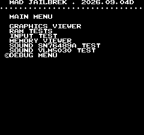
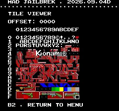
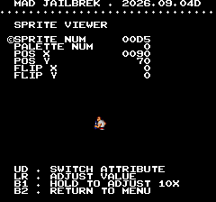
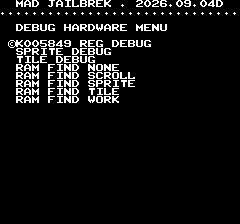
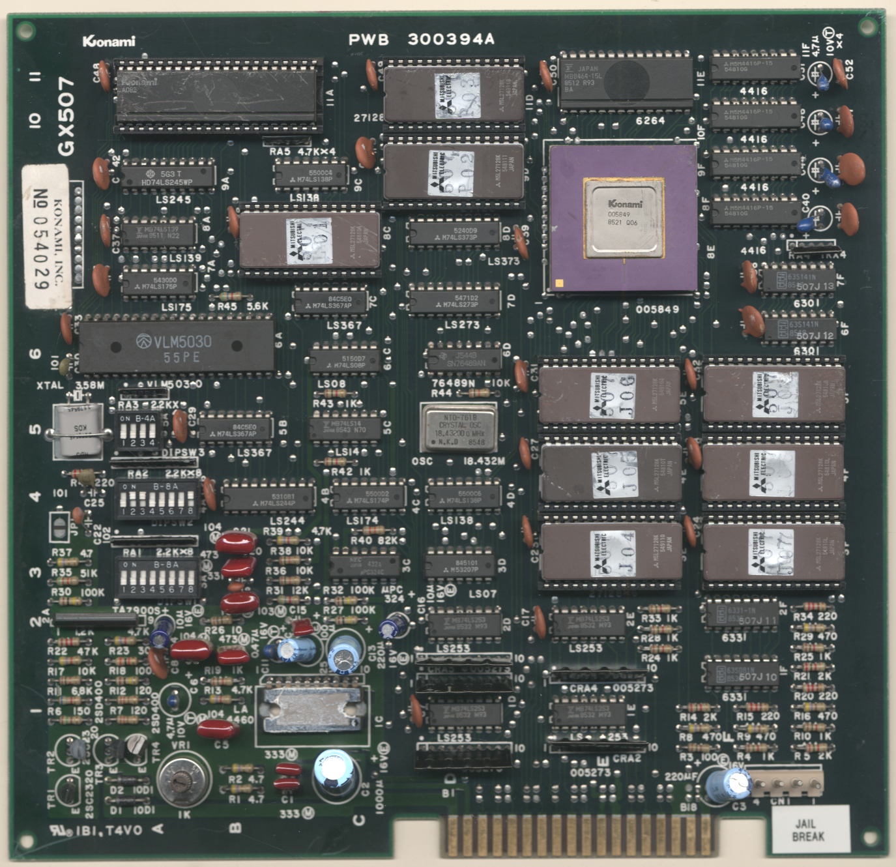
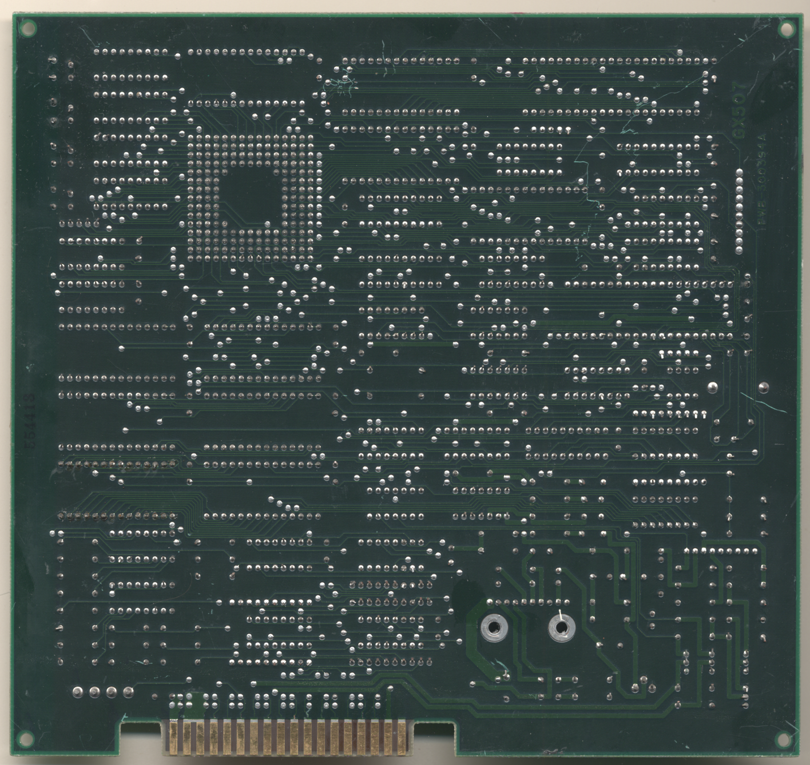

# Jail Break
- [MAD Pictures](#mad-pictures)
- [PCB Pictures](#pcb-pictures)
- [Manual / Schematics](#manual-schematics)
- [MAD Eproms](#mad-eproms)
- [RAM Locations](#ram-locations)
- [Errors/Error Codes](#errorserror-codes)
   - [Main CPU](#main-cpu)
   - [Sound CPU](#sound-cpu)
- [MAD Notes](#mad-notes)
   - [Static palette colors](#static-palette-colors)
   - [No Video DAC Test](#no-video-dac-test)
- [MAME vs Hardware](#mame-vs-hardware)

<a name="mad-pictures"></a>
## MAD Pictures

<br>



<a name="pcb-pictures"></a>
## PCB Pictures
<a href="docs/images/jail_break_pcb_top.png"></a>
<a href="docs/images/jail_break_pcb_bottom.png"></a>

<a name="manual-schematics"></a>
## Manual / Schematics
[Manual](docs/jail_break_manual.pdf)<br>
[Schematics](docs/jail_break_schematicsl.pdf)

<a name="mad-eproms"></a>
## MAD Eproms
| Diag | Eprom Type | Location | Notes |
| ---- | ---------- | ----------- | ----- |
| Main | 27c128 | 507p02.9d @ 9D | |

<a name="ram-locations"></a>
## RAM Locations
| RAM | Location | Type | Notes |
| -------- | :------- | ----- | ----- |
| RAM | 11E | MB8464-15L (8k x 8bit) | |

All work/sprite/tile data is within that single SRAM chip.  There are 4x
M5M4416P-15 (16k x 4 bit) DRAM chips that are not accessible by the CPU and
probably line buffers used by th 005849 custom chip.

<a name="errorserror-codes"></a>
## Errors/Error Codes
Error codes play through the VLM5030 IC.

<a name="main-cpu"></a>
### Main CPU
The main CPU is a Konami1 CPU (6809 based CPU). If an error is encountered
during tests, MAD will print the error to the screen, play the beep code, then
jump to the error address

On Konami2 the error address is `$f000 | error_code << 4`. Error codes on the
Konami2 CPU are are 6 bits. Jail Break however has a watchdog address that must be
written to periodically or the game will reset.

```
watchdog address: $3300 = 0011 0011 0000 1000
error address:    $f000 = 1111 00EE EEEE 0000
  E = error code
```
The watchdog address is in conflict with the error address. However instead of
doing a loop to self instruction at the error address, MAD instead does a delay
loop so it stays within the error address range 99.9% of the time and 0.1% of
the time it will ping the watchdog. This is enough for the error addresses to
still be viable to use with a logic probe. It just means address lines not be
100% high or low, but 99% of the time.

<!-- ec_table_main_start -->
| Hex  | Number |     Error Address (A15..A0)    |           Error Text           |
| ---: | -----: | :----------------------------: | :----------------------------- |
| 0x01 |      1 |      1111 0000 0001 xxxx       | SCROLL RAM ADDRESS             |
| 0x02 |      2 |      1111 0000 0010 xxxx       | SCROLL RAM DATA                |
| 0x03 |      3 |      1111 0000 0011 xxxx       | SCROLL RAM MARCH               |
| 0x04 |      4 |      1111 0000 0100 xxxx       | SCROLL RAM OUTPUT              |
| 0x05 |      5 |      1111 0000 0101 xxxx       | SCROLL RAM WRITE               |
| 0x06 |      6 |      1111 0000 0110 xxxx       | WORK RAM ADDRESS               |
| 0x07 |      7 |      1111 0000 0111 xxxx       | WORK RAM DATA                  |
| 0x08 |      8 |      1111 0000 1000 xxxx       | WORK RAM MARCH                 |
| 0x09 |      9 |      1111 0000 1001 xxxx       | WORK RAM OUTPUT                |
| 0x0a |     10 |      1111 0000 1010 xxxx       | WORK RAM WRITE                 |
| 0x3e |     62 |      1111 0011 1110 xxxx       | MAD ROM ADDRESS                |
| 0x3f |     63 |      1111 0011 1111 xxxx       | MAD ROM CRC16                  |

<sup>Table last updated by gen-error-codes-markdown-table on 2026-09-16 @ 16:50 UTC</sup>
<!-- ec_table_main_end -->

<a name="sound-cpu"></a>
### Sound CPU
This board doesn't have a dedicated Sound CPU.  The main CPU handles playing
sounds.

<a name="mad-notes"></a>
## MAD Notes
<a name="mad-notes"></a>
### Static palette colors
The game's palette comes from proms and are unchangeable.

<a name="no-video-dac-test"></a>
### No Video DAC Test
The static palette makes it impossible to do this test.

<a name="mame-vs-hardware"></a>
## MAME vs Hardware
Nothing to warrant different builds.
