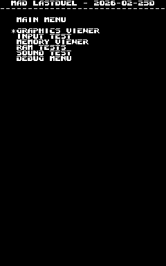
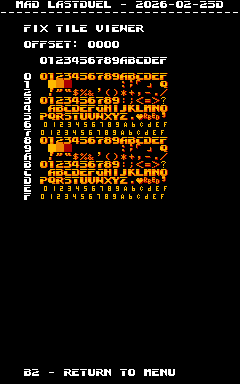
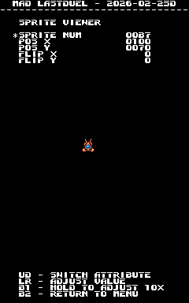

# Last Duel
- [MAD Pictures](#mad-pictures)
- [PCB Pictures](#pcb-pictures)
- [Manual / Schematics](#manual-schematics)
- [MAD Eproms](#mad-eproms)
- [RAM Locations](#ram-locations)
- [Errors/Error Codes](#errorserror-codes)
  - [Main CPU](#main-cpu)
  - [Sound CPU](#sound-cpu)
- [MAD Notes](#mad-notes)
  - [No Video DAC Test](#no-video-dac-test)
- [MAME vs Hardware](#mame-vs-hardware)

## MAD Pictures

## PCB Pictures
CPU Board: 

Graphics Board: 

The CPU and graphics board are oriented such that the solder side of the boards
face each other.

## Manual / Schematics
[Manual](docs/last_duel_manual.pdf)

Schematics don't seem to exist.

## MAD Eproms
| Diag | Eprom Type | Location(s) | Notes |
| ---- | ---------- | ----------- | ----- |
| Main on CPU PCB | 27c301 | ldu_05b.12k @ 12K on CPU PCB ldu_06b.13k @ 13K on CPU PCB | |
| Sound on CPU PCB | 27c512 | 16H on CPU PCB | No MAD ROM exists yet |

## RAM Locations
| RAM | Location | Type |
| -------- | :------- | ----- |
| BG RAM Lower | 4H on Graphics PCB | D4364CX-10LL (8k x 8bit) |
| BG RAM Upper | 3H on Graphics PCB | D4364CX-10LL (8k x 8bit) |
| FG RAM Lower | 8H on Graphics PCB | D4364CX-10LL (8k x 8bit) |
| FG RAM Upper | 7H on Graphics PCB | D4364CX-10LL (8k x 8bit) |
| Fix RAM Lower | 7G on CPU PCB | D4016CX-15 (2k x 8bit) |
| Fix RAM Upper | 8G on CPU PCB | D4016CX-15 (2k x 8bit) |
| Palette RAM Lower | 7E on CPU PCB | CXK5814P-35L (2k x 8bit) |
| Palette RAM Upper | 6E on CPU PCB | CXK5814P-35L (2k x 8bit) |
| Sound CPU RAM | 15H on CPU PCB | D4016CX-15 (2k x 8bit) |
| Sprite RAM Lower | 2H on CPU PCB | D4016CX-15 (2k x 8bit) |
| Sprite RAM Upper | 3H on CPU PCB | D4016CX-15 (2k x 8bit) |
| Work RAM 0xff8000 to 0xffbfff Lower | 4K on CPU PCB | D4364CX-10LL (8k x 8bit) |
| Work RAM 0xff8000 to 0xffbfff Upper | 5K on CPU PCB | D4364CX-10LL (8k x 8bit) |
| Work RAM 0xffc000 to 0xffffff Lower | 2K on CPU PCB | D4364CX-10LL (8k x 8bit) |
| Work RAM 0xffc000 to 0xffffff Upper | 3K on CPU PCB | D4364CX-10LL (8k x 8bit) |

There are 4 Work RAM chips, 2 handle that handle the 0xff8000 to 0xffbfff
address range and the other 2 handle 0xffc000 to 0xffffff.  As such if you get a Work
RAM error be mindful of the address that gets reported for figuring which set of
Work RAM chips it applies to. 

There are a number of additional RAM chips on the graphics board that the CPU
doesn't have access to and thus is unable to test.

## Errors/Error Codes
MAD for the main CPU is expecting the game's original sound rom to be there
in order to play sounds, including making beep codes.

### Main CPU
The main CPU is a motorola 68000.  If an error is encountered during tests
MAD will print the error to the screen, play the beep code, then jump to the
error address

On 68000 the error address is `$6000 | error_code << 5`.  Error codes on 68000
are 7 bits.

<!-- ec_table_main_start -->
| Hex  | Number | Beep Code |     Error Address (A23..A1)    |           Error Text           |
| ---: | -----: | --------: | :----------------------------: | :----------------------------- |
| 0x01 |      1 | 0000 0001 |  000 0000 0011 0000 0001 xxxx  | BG TILE RAM ADDRESS            |
| 0x02 |      2 | 0000 0010 |  000 0000 0011 0000 0010 xxxx  | BG TILE RAM DATA LOWER         |
| 0x03 |      3 | 0000 0011 |  000 0000 0011 0000 0011 xxxx  | BG TILE RAM DATA UPPER         |
| 0x04 |      4 | 0000 0100 |  000 0000 0011 0000 0100 xxxx  | BG TILE RAM DATA BOTH          |
| 0x05 |      5 | 0000 0101 |  000 0000 0011 0000 0101 xxxx  | BG TILE RAM MARCH LOWER        |
| 0x06 |      6 | 0000 0110 |  000 0000 0011 0000 0110 xxxx  | BG TILE RAM MARCH UPPER        |
| 0x07 |      7 | 0000 0111 |  000 0000 0011 0000 0111 xxxx  | BG TILE RAM MARCH BOTH         |
| 0x08 |      8 | 0000 1000 |  000 0000 0011 0000 1000 xxxx  | BG TILE RAM OUTPUT LOWER       |
| 0x09 |      9 | 0000 1001 |  000 0000 0011 0000 1001 xxxx  | BG TILE RAM OUTPUT UPPER       |
| 0x0a |     10 | 0000 1010 |  000 0000 0011 0000 1010 xxxx  | BG TILE RAM OUTPUT BOTH        |
| 0x0b |     11 | 0000 1011 |  000 0000 0011 0000 1011 xxxx  | BG TILE RAM WRITE LOWER        |
| 0x0c |     12 | 0000 1100 |  000 0000 0011 0000 1100 xxxx  | BG TILE RAM WRITE UPPER        |
| 0x0d |     13 | 0000 1101 |  000 0000 0011 0000 1101 xxxx  | BG TILE RAM WRITE BOTH         |
| 0x0e |     14 | 0000 1110 |  000 0000 0011 0000 1110 xxxx  | FG TILE RAM ADDRESS            |
| 0x0f |     15 | 0000 1111 |  000 0000 0011 0000 1111 xxxx  | FG TILE RAM DATA LOWER         |
| 0x10 |     16 | 0001 0000 |  000 0000 0011 0001 0000 xxxx  | FG TILE RAM DATA UPPER         |
| 0x11 |     17 | 0001 0001 |  000 0000 0011 0001 0001 xxxx  | FG TILE RAM DATA BOTH          |
| 0x12 |     18 | 0001 0010 |  000 0000 0011 0001 0010 xxxx  | FG TILE RAM MARCH LOWER        |
| 0x13 |     19 | 0001 0011 |  000 0000 0011 0001 0011 xxxx  | FG TILE RAM MARCH UPPER        |
| 0x14 |     20 | 0001 0100 |  000 0000 0011 0001 0100 xxxx  | FG TILE RAM MARCH BOTH         |
| 0x15 |     21 | 0001 0101 |  000 0000 0011 0001 0101 xxxx  | FG TILE RAM OUTPUT LOWER       |
| 0x16 |     22 | 0001 0110 |  000 0000 0011 0001 0110 xxxx  | FG TILE RAM OUTPUT UPPER       |
| 0x17 |     23 | 0001 0111 |  000 0000 0011 0001 0111 xxxx  | FG TILE RAM OUTPUT BOTH        |
| 0x18 |     24 | 0001 1000 |  000 0000 0011 0001 1000 xxxx  | FG TILE RAM WRITE LOWER        |
| 0x19 |     25 | 0001 1001 |  000 0000 0011 0001 1001 xxxx  | FG TILE RAM WRITE UPPER        |
| 0x1a |     26 | 0001 1010 |  000 0000 0011 0001 1010 xxxx  | FG TILE RAM WRITE BOTH         |
| 0x1b |     27 | 0001 1011 |  000 0000 0011 0001 1011 xxxx  | FIX TILE RAM ADDRESS           |
| 0x1c |     28 | 0001 1100 |  000 0000 0011 0001 1100 xxxx  | FIX TILE RAM DATA LOWER        |
| 0x1d |     29 | 0001 1101 |  000 0000 0011 0001 1101 xxxx  | FIX TILE RAM DATA UPPER        |
| 0x1e |     30 | 0001 1110 |  000 0000 0011 0001 1110 xxxx  | FIX TILE RAM DATA BOTH         |
| 0x1f |     31 | 0001 1111 |  000 0000 0011 0001 1111 xxxx  | FIX TILE RAM MARCH LOWER       |
| 0x20 |     32 | 0010 0000 |  000 0000 0011 0010 0000 xxxx  | FIX TILE RAM MARCH UPPER       |
| 0x21 |     33 | 0010 0001 |  000 0000 0011 0010 0001 xxxx  | FIX TILE RAM MARCH BOTH        |
| 0x22 |     34 | 0010 0010 |  000 0000 0011 0010 0010 xxxx  | FIX TILE RAM OUTPUT LOWER      |
| 0x23 |     35 | 0010 0011 |  000 0000 0011 0010 0011 xxxx  | FIX TILE RAM OUTPUT UPPER      |
| 0x24 |     36 | 0010 0100 |  000 0000 0011 0010 0100 xxxx  | FIX TILE RAM OUTPUT BOTH       |
| 0x25 |     37 | 0010 0101 |  000 0000 0011 0010 0101 xxxx  | FIX TILE RAM WRITE LOWER       |
| 0x26 |     38 | 0010 0110 |  000 0000 0011 0010 0110 xxxx  | FIX TILE RAM WRITE UPPER       |
| 0x27 |     39 | 0010 0111 |  000 0000 0011 0010 0111 xxxx  | FIX TILE RAM WRITE BOTH        |
| 0x28 |     40 | 0010 1000 |  000 0000 0011 0010 1000 xxxx  | PALETTE RAM ADDRESS            |
| 0x29 |     41 | 0010 1001 |  000 0000 0011 0010 1001 xxxx  | PALETTE RAM DATA LOWER         |
| 0x2a |     42 | 0010 1010 |  000 0000 0011 0010 1010 xxxx  | PALETTE RAM DATA UPPER         |
| 0x2b |     43 | 0010 1011 |  000 0000 0011 0010 1011 xxxx  | PALETTE RAM DATA BOTH          |
| 0x2c |     44 | 0010 1100 |  000 0000 0011 0010 1100 xxxx  | PALETTE RAM MARCH LOWER        |
| 0x2d |     45 | 0010 1101 |  000 0000 0011 0010 1101 xxxx  | PALETTE RAM MARCH UPPER        |
| 0x2e |     46 | 0010 1110 |  000 0000 0011 0010 1110 xxxx  | PALETTE RAM MARCH BOTH         |
| 0x2f |     47 | 0010 1111 |  000 0000 0011 0010 1111 xxxx  | PALETTE RAM OUTPUT LOWER       |
| 0x30 |     48 | 0011 0000 |  000 0000 0011 0011 0000 xxxx  | PALETTE RAM OUTPUT UPPER       |
| 0x31 |     49 | 0011 0001 |  000 0000 0011 0011 0001 xxxx  | PALETTE RAM OUTPUT BOTH        |
| 0x32 |     50 | 0011 0010 |  000 0000 0011 0011 0010 xxxx  | PALETTE RAM WRITE LOWER        |
| 0x33 |     51 | 0011 0011 |  000 0000 0011 0011 0011 xxxx  | PALETTE RAM WRITE UPPER        |
| 0x34 |     52 | 0011 0100 |  000 0000 0011 0011 0100 xxxx  | PALETTE RAM WRITE BOTH         |
| 0x35 |     53 | 0011 0101 |  000 0000 0011 0011 0101 xxxx  | SPRITE RAM ADDRESS             |
| 0x36 |     54 | 0011 0110 |  000 0000 0011 0011 0110 xxxx  | SPRITE RAM DATA LOWER          |
| 0x37 |     55 | 0011 0111 |  000 0000 0011 0011 0111 xxxx  | SPRITE RAM DATA UPPER          |
| 0x38 |     56 | 0011 1000 |  000 0000 0011 0011 1000 xxxx  | SPRITE RAM DATA BOTH           |
| 0x39 |     57 | 0011 1001 |  000 0000 0011 0011 1001 xxxx  | SPRITE RAM MARCH LOWER         |
| 0x3a |     58 | 0011 1010 |  000 0000 0011 0011 1010 xxxx  | SPRITE RAM MARCH UPPER         |
| 0x3b |     59 | 0011 1011 |  000 0000 0011 0011 1011 xxxx  | SPRITE RAM MARCH BOTH          |
| 0x3c |     60 | 0011 1100 |  000 0000 0011 0011 1100 xxxx  | SPRITE RAM OUTPUT LOWER        |
| 0x3d |     61 | 0011 1101 |  000 0000 0011 0011 1101 xxxx  | SPRITE RAM OUTPUT UPPER        |
| 0x3e |     62 | 0011 1110 |  000 0000 0011 0011 1110 xxxx  | SPRITE RAM OUTPUT BOTH         |
| 0x3f |     63 | 0011 1111 |  000 0000 0011 0011 1111 xxxx  | SPRITE RAM WRITE LOWER         |
| 0x40 |     64 | 0100 0000 |  000 0000 0011 0100 0000 xxxx  | SPRITE RAM WRITE UPPER         |
| 0x41 |     65 | 0100 0001 |  000 0000 0011 0100 0001 xxxx  | SPRITE RAM WRITE BOTH          |
| 0x42 |     66 | 0100 0010 |  000 0000 0011 0100 0010 xxxx  | WORK RAM ADDRESS               |
| 0x43 |     67 | 0100 0011 |  000 0000 0011 0100 0011 xxxx  | WORK RAM DATA LOWER            |
| 0x44 |     68 | 0100 0100 |  000 0000 0011 0100 0100 xxxx  | WORK RAM DATA UPPER            |
| 0x45 |     69 | 0100 0101 |  000 0000 0011 0100 0101 xxxx  | WORK RAM DATA BOTH             |
| 0x46 |     70 | 0100 0110 |  000 0000 0011 0100 0110 xxxx  | WORK RAM MARCH LOWER           |
| 0x47 |     71 | 0100 0111 |  000 0000 0011 0100 0111 xxxx  | WORK RAM MARCH UPPER           |
| 0x48 |     72 | 0100 1000 |  000 0000 0011 0100 1000 xxxx  | WORK RAM MARCH BOTH            |
| 0x49 |     73 | 0100 1001 |  000 0000 0011 0100 1001 xxxx  | WORK RAM OUTPUT LOWER          |
| 0x4a |     74 | 0100 1010 |  000 0000 0011 0100 1010 xxxx  | WORK RAM OUTPUT UPPER          |
| 0x4b |     75 | 0100 1011 |  000 0000 0011 0100 1011 xxxx  | WORK RAM OUTPUT BOTH           |
| 0x4c |     76 | 0100 1100 |  000 0000 0011 0100 1100 xxxx  | WORK RAM WRITE LOWER           |
| 0x4d |     77 | 0100 1101 |  000 0000 0011 0100 1101 xxxx  | WORK RAM WRITE UPPER           |
| 0x4e |     78 | 0100 1110 |  000 0000 0011 0100 1110 xxxx  | WORK RAM WRITE BOTH            |
| 0x7e |    126 | 0111 1110 |  000 0000 0011 0111 1110 xxxx  | MAD ROM ADDRESS                |
| 0x7f |    127 | 0111 1111 |  000 0000 0011 0111 1111 xxxx  | MAD ROM CRC32                  |

Table last updated by gen-error-codes-markdown-table on 2026-02-27 @ 02:09 UTC
<!-- ec_table_main_end -->

### Sound CPU
The sound CPU is a z80.  No MAD rom exists yet for the sound CPU.

## MAD Notes
### No Video DAC Test
It should be possible to make one, but will be a pita to do.  Fix tile only has
3 colors per palette.

## MAME vs Hardware
Nothing that required a MAME specific build
