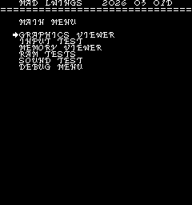
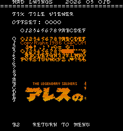
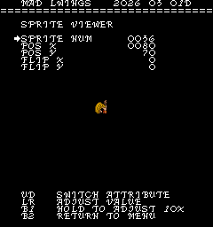

# Legendary Wings
- [MAD Pictures](#mad-pictures)
- [PCB Pictures](#pcb-pictures)
- [Manual / Schematics](#manual-schematics)
- [MAD Eproms](#mad-eproms)
- [RAM Locations](#ram-locations)
- [Errors/Error Codes](#errorserror-codes)
  - [Main CPU](#main-cpu)
  - [Sound CPUs](#sound-cpus)
- [MAD Notes](#mad-notes)
  - [Corrupt/Blank Screen/Palette at Startup](#corruptblank-screenpalette-at-startup)
  - [No Video DAC Test](#no-video-dac-test)
- [MAME vs Hardware](#mame-vs-hardware)

## MAD Pictures

## PCB Pictures

The CPU and Graphics PCB have their solder sides facing each other.

The sound CPU and RAM is within the 85H001 black plastic box.

## Manual / Schematics
[Manual](docs/legendary_wings_manual.pdf) 

Schematics don't seem to exist.
## MAD Eproms

| Diag | Eprom Type | Location | Notes |
| ---- | ---------- | ----------- | ----- |
| Main | 27c256 | lwu_01c.6c @ 6C | |
| Sound | 27c256 | 11E | No MAD ROM exists yet |

## RAM Locations
| RAM | Location | Type |
| -------- | :------- | ----- |
| BG Tile RAM | 9C on Graphics Board | M58725P (2k x 8bit) |
| Sound RAM | Inside 85H001 on CPU Board | ??? (2k x 8bit) |
| Fix Tile RAM | 8F on CPU Board | M58725P (2k x 8bit) |
| Palette RAM | 10L/11L/12L on CPU Board | MB8148L-55 (1k x 4bit) |
| Work/Sprite RAM | 4CN on CPU Board | MB8464-15L (8k x 8bit) |

Palette RAM is not readable by the CPU, so its impossible to test.

There are additional RAM chips on the graphics board that are not accessible by
the CPU.

## Errors/Error Codes
MAD for the main CPU is expecting the game's original ADPCM sound rom to be there
in order to play sounds, including making beep codes.

### Main CPU
The main CPU is a Z80.  If an error is encountered during tests, MAD will print
the error to the screen, play the beep code, then jump to the error address

On Z80's the error address is `$6000 | error_code << 7`.  Error codes on the
Z80 CPU are are 6 bits.

<!-- ec_table_main_start -->
| Hex  | Number | Beep Code |     Error Address (A15..A0)    |           Error Text           |
| ---: | -----: | --------: | :----------------------------: | :----------------------------- |
| 0x01 |      1 | 0000 0001 |      0110 0000 1xxx xxxx       | BG TILE RAM ADDRESS            |
| 0x02 |      2 | 0000 0010 |      0110 0001 0xxx xxxx       | BG TILE RAM DATA               |
| 0x03 |      3 | 0000 0011 |      0110 0001 1xxx xxxx       | BG TILE RAM MARCH              |
| 0x04 |      4 | 0000 0100 |      0110 0010 0xxx xxxx       | BG TILE RAM OUTPUT             |
| 0x05 |      5 | 0000 0101 |      0110 0010 1xxx xxxx       | BG TILE RAM WRITE              |
| 0x06 |      6 | 0000 0110 |      0110 0011 0xxx xxxx       | FIX TILE RAM ADDRESS           |
| 0x07 |      7 | 0000 0111 |      0110 0011 1xxx xxxx       | FIX TILE RAM DATA              |
| 0x08 |      8 | 0000 1000 |      0110 0100 0xxx xxxx       | FIX TILE RAM MARCH             |
| 0x09 |      9 | 0000 1001 |      0110 0100 1xxx xxxx       | FIX TILE RAM OUTPUT            |
| 0x0a |     10 | 0000 1010 |      0110 0101 0xxx xxxx       | FIX TILE RAM WRITE             |
| 0x0b |     11 | 0000 1011 |      0110 0101 1xxx xxxx       | WORK RAM ADDRESS               |
| 0x0c |     12 | 0000 1100 |      0110 0110 0xxx xxxx       | WORK RAM DATA                  |
| 0x0d |     13 | 0000 1101 |      0110 0110 1xxx xxxx       | WORK RAM MARCH                 |
| 0x0e |     14 | 0000 1110 |      0110 0111 0xxx xxxx       | WORK RAM OUTPUT                |
| 0x0f |     15 | 0000 1111 |      0110 0111 1xxx xxxx       | WORK RAM WRITE                 |
| 0x3e |     62 | 0011 1110 |      0111 1111 0xxx xxxx       | MAD ROM ADDRESS                |
| 0x3f |     63 | 0011 1111 |      0111 1111 1xxx xxxx       | MAD ROM CRC32                  |

Table last updated by gen-error-codes-markdown-table on 2026-03-03 @ 02:19 UTC
<!-- ec_table_main_end -->

### Sound CPUs
The sound CPUs is a z80.  No MAD rom exists yet for the sound CPU.

## MAD Notes
### Corrupt/Blank Screen/Palette at Startup
The board has some pretty strict timing around writing to palette ram.  It needs
to happen within vblank or weird stuff happens to the screen.  The only way
we can do this is during an nmi, but we can't enable nmi until work ram as been
tested good.  Thus prior to work ram test completing the screen/palette will
likely be corrupt or even blank.  Allow about 10 seconds for MAD to get past
work ram tests.

### No Video DAC Test
It should be possible to make one, but will be a pita to do.  Fix tile only has
3 colors per palette.

## MAME vs Hardware
Nothing that required a MAME specific build
