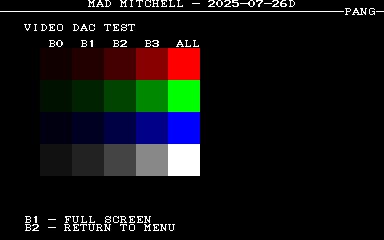
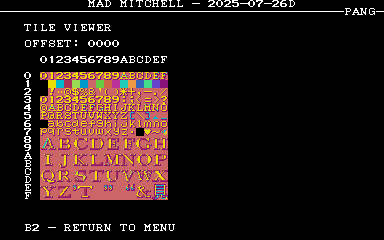
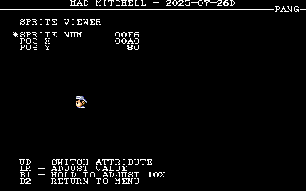
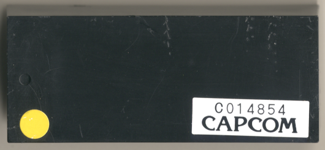
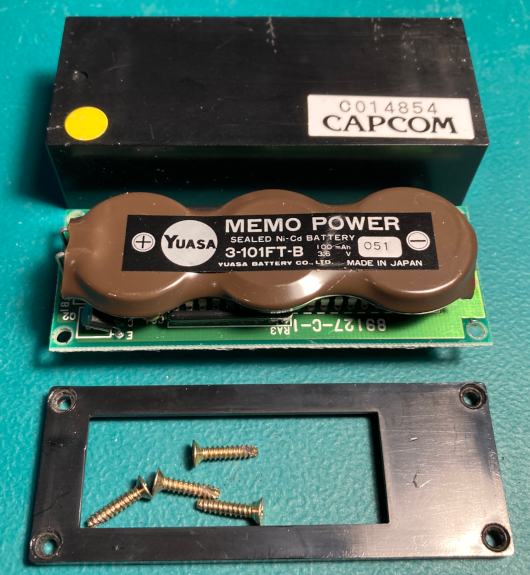
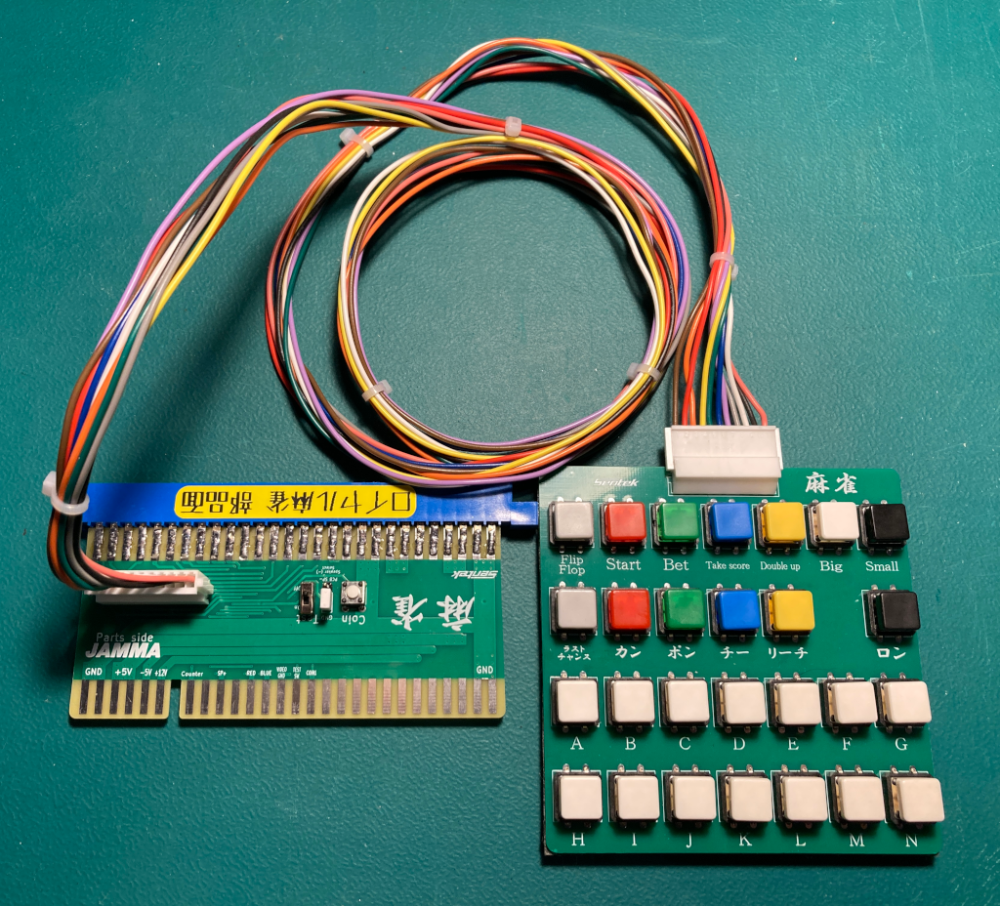
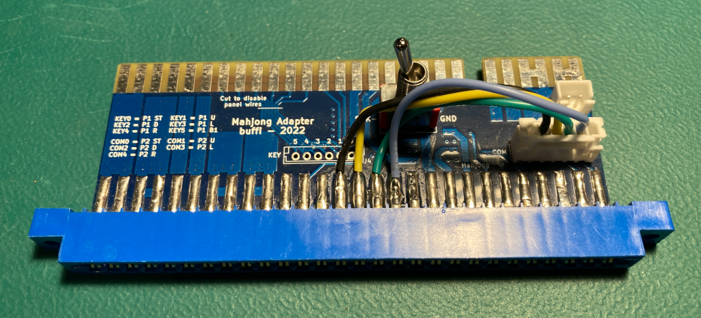

# Mitchell Hardware
  * [MAD Pictures](#mad-pictures)
  * [PCBs / ROM sets](#pcbs---rom-sets)
    + [Mahjong Gakuen 2 Gakuen-chou no Fukushuu (mgakuen2)](#mahjong-gakuen-2-gakuen-chou-no-fukushuu--mgakuen2-)
      - [MAD Eprom](#mad-eprom)
      - [RAM Locations](#ram-locations)
      - [Navigation](#navigation)
    + [Pang / Buster Bros](#pang---buster-bros)
      - [MAD Eprom](#mad-eprom-1)
      - [RAM Locations](#ram-locations-1)
    + [Poker Ladies (pkladies)](#poker-ladies--pkladies-)
      - [MAD Eprom](#mad-eprom-2)
      - [RAM Locations](#ram-locations-2)
      - [Navigation](#navigation-1)
    + [Quiz Sangokush (qsangoku)](#quiz-sangokush--qsangoku-)
      - [MAD Eprom](#mad-eprom-3)
      - [RAM Locations](#ram-locations-3)
      - [Navigation](#navigation-2)
    + [Quiz Tonosama no Yabou (qtono1)](#quiz-tonosama-no-yabou--qtono1-)
      - [MAD Eprom](#mad-eprom-4)
      - [RAM Locations](#ram-locations-4)
      - [Navigation](#navigation-3)
    + [Super Pang / Super Buster Bros](#super-pang---super-buster-bros)
      - [MAD Eprom](#mad-eprom-5)
      - [RAM Locations](#ram-locations-5)
  * [Errors/Error Codes](#errors-error-codes)
    + [Main CPU](#main-cpu)
  * [MAD Notes](#mad-notes)
    + [Navigation](#navigation-4)
      - [Mahjong Matrix](#mahjong-matrix)
      - [Mahjong Non-Matrix](#mahjong-non-matrix)
    + [Tile/Sprite Viewers](#tile-sprite-viewers)
  * [MAME vs Hardware](#mame-vs-hardware)

**IMPORTANT** In order to use MAD on mitchell based PCBs, you will need to swap the kabuki CPU with a
normal Z80 CPU. 

## MAD Pictures

 

## PCBs / ROM sets
MAD currently supports the following PCBs/ROM sets.

### Mahjong Gakuen 2 Gakuen-chou no Fukushuu (mgakuen2)
**IMPORTANT**: This board has a mahjong style edge connector and is **NOT**
JAMMA.  Using a JAMMA harness will damage the board!!! 

#### MAD Eprom
| Diag | Eprom Type | Location |
| ---- | ---------- | ----------- |
| Main| 27c256 | 1J |

#### RAM Locations
| RAM | Location | Type |
| -------- | :------- | ----- |
| Palette RAM (red) | 11A | CXK5814P-45L (2k x 8bit) |
| Palette RAM (green,blue) | 13A | CXK5814P-45L (2k x 8bit) |
| Sprite/Tile RAM | 17G | D4364CX-12L (8k x 8bit) |
| Tile Attr RAM | 14D | D4016CX-15 (2k x 8bit) | 
| Work RAM | 2J | D4364CX-12L (8k x 8bit) |

There are 2 additional CXK5814P-45L (2k x 8bit) RAM chips located at 10M and 15M
which I assume are related to rendering sprites or screen buffer.

#### Navigation
This board uses [Mahjong Matrix](#mahjong-matrix) for inputs.

| Action | Hardware | MAME |
|:------:|:--------:|:----:|
| UP | A | A |
| DOWN | B | B |
| LEFT | C | C |
| RIGHT | D | D |
| B1 | E | E |
| B2 | F | F |

### Pang / Buster Bros

#### MAD Eprom
| Diag | Eprom Type | Location |
| ---- | ---------- | ----------- |
| Main| 27c256 | 11H |

#### RAM Locations
| RAM | Location | Type |
| -------- | :------- | ----- |
| Palette RAM (red) | 8C | CXK5814P-35L (2k x 8bit) |
| Palette RAM (green,blue) | 9C | CXK5814P-35L (2k x 8bit) |
| Sprite/Tile RAM | 7G | D4364CX-15LL (8k x 8bit) |
| Tile Attr RAM | 9G | DH5116D-10 (2k x 8bit) | 
| Work RAM | 14K | D4364CX-15LL (8k x 8bit) |

### Poker Ladies (pkladies)
**IMPORTANT**: This board has a mahjong style edge connector and is **NOT**
JAMMA.  Using a JAMMA harness will damage the board!!! 

#### MAD Eprom
| Diag | Eprom Type | Location |
| ---- | ---------- | ----------- |
| Main| 27c256 | 14F |

#### RAM Locations
| RAM | Location | Type |
| -------- | :------- | ----- |
| Palette RAM (red) | 10C | CXK5814P-45L (2k x 8bit) |
| Palette RAM (green,blue) | 11C | CXK5814P-45L (2k x 8bit) |
| Sprite/Tile RAM | 6G | TMM2063P-15 (8k x 8bit) |
| Tile Attr RAM | 6E-A | TMM2015BP-90(2k x 8bit) | 
| Work RAM | 16C | D4364CX-15LL (8k x 8bit) |

#### Navigation
This board uses [Mahjong Matrix](#mahjong-matrix) for inputs.

| Action | Hardware | MAME |
|:------:|:--------:|:----:|
| UP | A | Z |
| DOWN | B | X |
| LEFT | C | C |
| RIGHT | D | V |
| B1 | E | B |
| B2 | I | Left CTRL |

### Quiz Sangokush (qsangoku)
**IMPORTANT**: This board has a mahjong style edge connector and is **NOT**
JAMMA.  Using a JAMMA harness will damage the board!!! 

 
Instead of just having a kabuki CPU in the CPU socket, this board has the CPU in
a plastic CAPCOM box as seen below.  It just seems to be a kabuki CPU with an
(extra?) battery and battery related charging logic. 

#### MAD Eprom
| Diag | Eprom Type | Location |
| ---- | ---------- | ----------- |
| Main| 27c256 | 14F |

#### RAM Locations
| RAM | Location | Type |
| -------- | :------- | ----- |
| Palette RAM (red) | 10C | CXK5814P-35L (2k x 8bit) |
| Palette RAM (green,blue) | 11C | CXK5814P-35L (2k x 8bit) |
| Sprite/Tile RAM | 6G | D4364CX-15LL (8k x 8bit) |
| Tile Attr RAM | 6E-A | DH5116D-10 (2k x 8bit) | 
| Work RAM | 16C | D4364CX-15LL (8k x 8bit) |

#### Navigation
This board uses [Mahjong Non-Matrix](#mahjong-non-matrix) for inputs.

| Action | Hardware | MAME |
|:------:|:---------|:----:|
| UP | JAMMA P1 UP | Left CTRL |
| DOWN | JAMMA P1 DOWN | Left ALT |
| LEFT | JAMMA P1 LEFT | Space |
| RIGHT | JAMMA P1 RIGHT | Left Shift |
| B1 | JAMMA P2 UP | A |
| B2 | JAMMA P2 DOWN | S |

### Quiz Tonosama no Yabou (qtono1)
**IMPORTANT**: This board has a mahjong style edge connector and is **NOT**
JAMMA.  Using a JAMMA harness will damage the board!!! 

#### MAD Eprom
| Diag | Eprom Type | Location |
| ---- | ---------- | ----------- |
| Main| 27c256 | 14F |

#### RAM Locations
| RAM | Location | Type |
| -------- | :------- | ----- |
| Palette RAM (red) | 11A | CXK5814P-45L (2k x 8bit) |
| Palette RAM (green,blue) | 13A | CXK5814P-45L (2k x 8bit) |
| Sprite/Tile RAM | 17G | D4364CX-12L (8k x 8bit) |
| Tile Attr RAM | 14D | D4016CX-15 (2k x 8bit) | 
| Work RAM | 2J | D4364CX-12L (8k x 8bit) |

#### Navigation
This board uses [Mahjong Non-Matrix](#mahjong-non-matrix) for inputs.

| Action | Hardware | MAME |
|:------:|:---------|:----:|
| UP | JAMMA P1 UP | Left CTRL |
| DOWN | JAMMA P1 DOWN | Left ALT |
| LEFT | JAMMA P1 LEFT | Space |
| RIGHT | JAMMA P1 RIGHT | Left Shift |
| B1 | JAMMA P2 UP | A |
| B2 | JAMMA P2 DOWN | S |

### Super Pang / Super Buster Bros

#### MAD Eprom
| Diag | Eprom Type | Location |
| ---- | ---------- | ----------- |
| Main| 27c256 | 11H |

#### RAM Locations
| RAM | Location | Type |
| -------- | :------- | ----- |
| Palette RAM (red) | 10C | CXK5814P-45L (2k x 8bit) |
| Palette RAM (green,blue) | 11C | CXK5814P-45L (2k x 8bit) |
| Sprite/Tile RAM | 6G | TMM2063P-15 (8k x 8bit) |
| Tile Attr RAM | 6E-A | TMM2015BP-90(2k x 8bit) | 
| Work RAM | 16C | D4364CX-15LL (8k x 8bit) |

## Errors/Error Codes
### Main CPU
The CPU is a Kabuki CPU, but needs to be replaced with a normal Z80 in
order to run MAD on the game.  If an error is encountered during tests, MAD will
print the error to the screen, play the beep code, then jump to the error
address

On Z80's the error address is `$6000 | error_code << 7`.  Error codes on the
Z80 CPU are are 6 bits.

<!-- ec_table_main_start -->
| Hex  | Number | Beep Code |     Error Address (A15..A0)    |           Error Text           |
| ---: | -----: | --------: | :----------------------------: | :----------------------------- |
| 0x01 |      1 | 0000 0001 |      0110 0000 1xxx xxxx       | SPRITE RAM ADDRESS             |
| 0x02 |      2 | 0000 0010 |      0110 0001 0xxx xxxx       | SPRITE RAM DATA                |
| 0x03 |      3 | 0000 0011 |      0110 0001 1xxx xxxx       | SPRITE RAM MARCH               |
| 0x04 |      4 | 0000 0100 |      0110 0010 0xxx xxxx       | SPRITE RAM OUTPUT              |
| 0x05 |      5 | 0000 0101 |      0110 0010 1xxx xxxx       | SPRITE RAM WRITE               |
| 0x06 |      6 | 0000 0110 |      0110 0011 0xxx xxxx       | TILE RAM ADDRESS               |
| 0x07 |      7 | 0000 0111 |      0110 0011 1xxx xxxx       | TILE RAM DATA                  |
| 0x08 |      8 | 0000 1000 |      0110 0100 0xxx xxxx       | TILE RAM MARCH                 |
| 0x09 |      9 | 0000 1001 |      0110 0100 1xxx xxxx       | TILE RAM OUTPUT                |
| 0x0a |     10 | 0000 1010 |      0110 0101 0xxx xxxx       | TILE RAM WRITE                 |
| 0x0b |     11 | 0000 1011 |      0110 0101 1xxx xxxx       | TILE ATTR RAM ADDRESS          |
| 0x0c |     12 | 0000 1100 |      0110 0110 0xxx xxxx       | TILE ATTR RAM DATA             |
| 0x0d |     13 | 0000 1101 |      0110 0110 1xxx xxxx       | TILE ATTR RAM MARCH            |
| 0x0e |     14 | 0000 1110 |      0110 0111 0xxx xxxx       | TILE ATTR RAM OUTPUT           |
| 0x0f |     15 | 0000 1111 |      0110 0111 1xxx xxxx       | TILE ATTR RAM WRITE            |
| 0x10 |     16 | 0001 0000 |      0110 1000 0xxx xxxx       | WORK RAM ADDRESS               |
| 0x11 |     17 | 0001 0001 |      0110 1000 1xxx xxxx       | WORK RAM DATA                  |
| 0x12 |     18 | 0001 0010 |      0110 1001 0xxx xxxx       | WORK RAM MARCH                 |
| 0x13 |     19 | 0001 0011 |      0110 1001 1xxx xxxx       | WORK RAM OUTPUT                |
| 0x14 |     20 | 0001 0100 |      0110 1010 0xxx xxxx       | WORK RAM WRITE                 |
| 0x3e |     62 | 0011 1110 |      0111 1111 0xxx xxxx       | MAD ROM ADDRESS                |
| 0x3f |     63 | 0011 1111 |      0111 1111 1xxx xxxx       | MAD ROM CRC32                  |

Table last updated by gen-error-codes-markdown-table on 2025-07-28 @ 04:30 UTC
<!-- ec_table_main_end -->

## MAD Notes
### Navigation
Most of the mitchell based PCBs have a mahjong edge connector instead of JAMMA.
Some of the PCBs use the mahjong style input matrix while others bypass the
matrix and just use the values on the P1/P2 4/5/8/9/11/1 inputs.

[buffi](https://www.arcade-projects.com/members/buffi.5985/) has a good page that goes over mahjong pinouts/adapters here:

https://arcademahjong.com/hardware.html

And there is some discussion here as well

https://www.arcade-projects.com/threads/mahjong-jamma-adapters-interest-check.19718/

#### Mahjong Matrix
This is the adapter I'm using for the boards that make use of the input matrix.

This was purchased from this auctions.yahoo.jp seller per suggestioned on buffi's
page.

https://auctions.yahoo.co.jp/seller/hkmtnx?sid=hkmtnx&b=1&n=50&p=%E9%BA%BB%E9%9B%80%E3%83%8F%E3%83%BC%E3%83%8D%E3%82%B9&auccat=&aq=-1&oq=&anchor=1&slider=

This provides an all in one adapter for using mahjong controls on a supergun.
Note: This adapter does not pass any JAMMA player inputs onto the mahjong edge
connectors, everything comes from the buttons on the provided board.

#### Mahjong Non-Matrix
I use this modified buffi's mahjong adapter for the games that just read the P1/P2
4/5/8/9/11/1 inputs directly.

buffi's board maps JAMMA P1 inputs to the P1 inputs on the mahjong edge, while
JAMMA P2 inputs goto the COM inputs on the mahjong edge.  The modification
routes the JAMMA P2 inputs to also goto the P2 inputs on the mahjong edge.

### Tile/Sprite Viewers
Both viewers have a random palette and the initial sprite number is random too.

## MAME vs Hardware
* Palette RAM is not readable by the CPU, but MAME allows it
