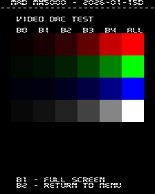
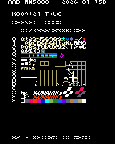
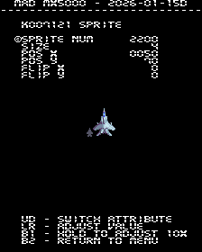
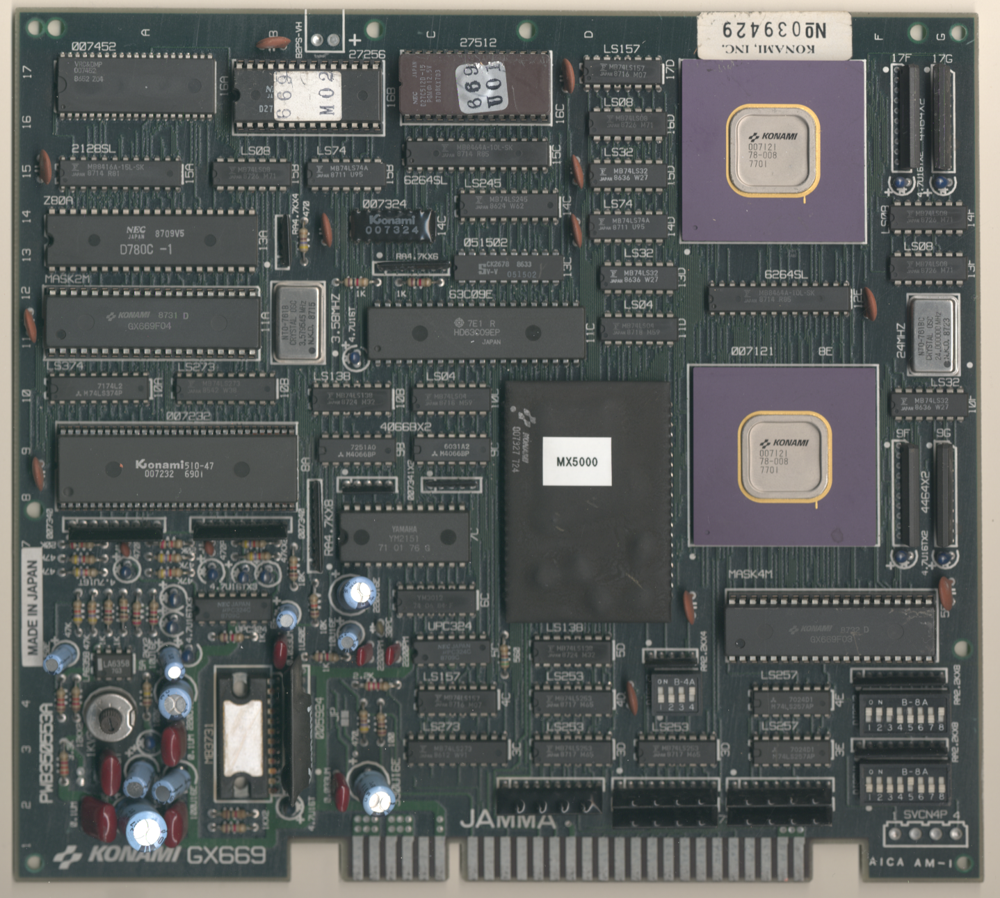
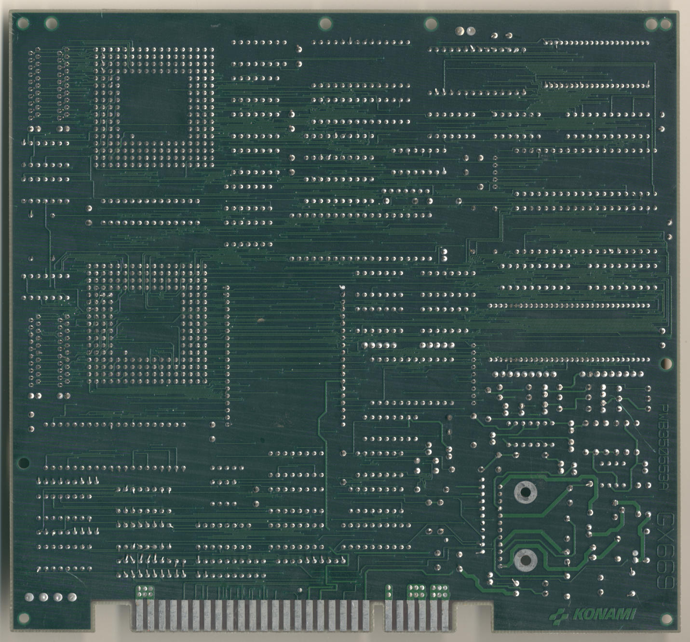

# MX5000 / Flak Attack
- [MAD Pictures](#mad-pictures)
- [PCB Pictures](#pcb-pictures)
- [Manual / Schematics](#manual-schematics)
- [MAD Eproms](#mad-eproms)
- [RAM Locations](#ram-locations)
- [Errors/Error Codes](#errorserror-codes)
  - [Main CPU](#main-cpu)
- [MAD Notes](#mad-notes)
  - [Tile Viewer](#tile-viewer)
  - [Sprite Viewer](#sprite-viewer)
- [MAME vs Hardware](#mame-vs-hardware)

## MAD Pictures

<br>



## PCB Pictures
<a href="docs/images/mx5000_pcb_top.png"></a>
<a href="docs/images/mx5000_pcb_bottom.png"></a>
<p>

## Manual / Schematics
[Manual](docs/mx5000_manual.pdf)

Schematics don't seem to exist.

## MAD Eproms
| Diag | Eprom Type | Location | Notes |
| ---- | ---------- | ----------- | ----- |
| Main | 27c512 | 669_r01.16c @ 17C | |
| Sound | 27c256 | 16B | No MAD ROM exists yet |

## RAM Locations
| RAM | Location | Type |
| -------- | :------- | ----- |
| Palette RAM | 10D | Inside 007327? | | 
| Sound RAM | 15A | MB8416A-15L-SK (2k x 8bit) | |
| 007121 RAM | 12E | MB8464A-10L-SK (8k x 8bit) |
| Work RAM | 15C | MB8464A-10L-SK (8k x 8bit) | |

## Errors/Error Codes
MAD for the main CPU is expecting the game's original sound rom to be there
in order to play sounds, including making beep codes.

### Main CPU
The main CPU is a HD6309 CPU.  If an error is encountered during
tests, MAD will print the error to the screen, play the beep code, then jump to
the error address

On HD6309 the error address is `$f000 | error_code << 4`.  Error codes on the
HD6309 CPU are are 6 bits.  mx5000 however has a watchdog address that must
be written to periodically or the game will reset.

```
watchdog address: $041c = 0000 0100 0001 1100
error address:    $f000 = 1111 00EE EEEE 0000
  E = error code
```
The watchdog address is in conflict with the error address.  However instead of
doing a loop to self instruction at the error address, MAD instead does a delay
loop so it stays within the error address range 99.9% of the time and 0.1% of
the time it will ping the watchdog.  This is enough for the error addresses to
still be viable to use with a logic probe.  It just means address lines not be
100% high or low, but 99% of the time.

<!-- ec_table_main_start -->
| Hex  | Number | Beep Code |     Error Address (A15..A0)    |           Error Text           |
| ---: | -----: | --------: | :----------------------------: | :----------------------------- |
| 0x01 |      1 | 0000 0001 |      1111 0000 0001 xxxx       | PALETTE RAM ADDRESS            |
| 0x02 |      2 | 0000 0010 |      1111 0000 0010 xxxx       | PALETTE RAM DATA               |
| 0x03 |      3 | 0000 0011 |      1111 0000 0011 xxxx       | PALETTE RAM MARCH              |
| 0x04 |      4 | 0000 0100 |      1111 0000 0100 xxxx       | PALETTE RAM OUTPUT             |
| 0x05 |      5 | 0000 0101 |      1111 0000 0101 xxxx       | PALETTE RAM WRITE              |
| 0x06 |      6 | 0000 0110 |      1111 0000 0110 xxxx       | K007121 RAM ADDRESS            |
| 0x07 |      7 | 0000 0111 |      1111 0000 0111 xxxx       | K007121 RAM DATA               |
| 0x08 |      8 | 0000 1000 |      1111 0000 1000 xxxx       | K007121 RAM MARCH              |
| 0x09 |      9 | 0000 1001 |      1111 0000 1001 xxxx       | K007121 RAM OUTPUT             |
| 0x0a |     10 | 0000 1010 |      1111 0000 1010 xxxx       | K007121 RAM WRITE              |
| 0x0b |     11 | 0000 1011 |      1111 0000 1011 xxxx       | WORK RAM ADDRESS               |
| 0x0c |     12 | 0000 1100 |      1111 0000 1100 xxxx       | WORK RAM DATA                  |
| 0x0d |     13 | 0000 1101 |      1111 0000 1101 xxxx       | WORK RAM MARCH                 |
| 0x0e |     14 | 0000 1110 |      1111 0000 1110 xxxx       | WORK RAM OUTPUT                |
| 0x0f |     15 | 0000 1111 |      1111 0000 1111 xxxx       | WORK RAM WRITE                 |
| 0x3e |     62 | 0011 1110 |      1111 0011 1110 xxxx       | MAD ROM ADDRESS                |
| 0x3f |     63 | 0011 1111 |      1111 0011 1111 xxxx       | MAD ROM CRC32                  |

<sup>Table last updated by gen-error-codes-markdown-table on 2026-01-16 @ 02:09 UTC</sup>
<!-- ec_table_main_end -->

### Sound CPU
The sound CPU is a z80.  No MAD rom exists yet for the sound CPU.

## MAD Notes

### Tile Viewer
007121 is used for rendering the text on screen.  In order to display all the
tiles it requires doing bank switching, which will also effect text tiles on
screen.  This will mean the viewer's text tiles will display other tiles while a
bankswitch is active.  This will correct itself when you exit the viewer.

### Sprite Viewer
There is a basic sprite viewer in MAD.  Sprites are a little tricky to
setup/view because I don't know the correct width/height of each sprite.  There
are options to change those values in the viewer.

The color palette is the one the game uses for the player.  So the colors for
the players plane should be correct, but maybe completely wrong for other sprites.

## MAME vs Hardware
Nothing that required a MAME specific build
