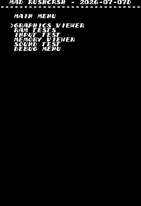
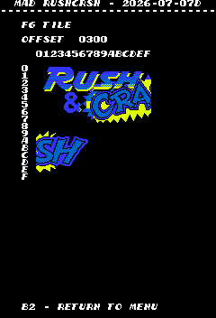
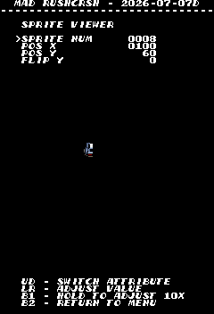

# Rush and Crash
- [MAD Pictures](#mad-pictures)
- [PCB Pictures](#pcb-pictures)
- [Manual / Schematics](#manual-schematics)
- [MAD Eproms](#mad-eproms)
- [RAM Locations](#ram-locations)
- [Errors/Error Codes](#errorserror-codes)
   - [Main CPU](#main-cpu)
   - [Sound CPU](#sound-cpu)
- [MAD Notes](#mad-notes)
   - [Random colors on boot](#random-colors-on-boot)
- [MAME vs Hardware](#mame-vs-hardware)

## MAD Pictures

## PCB Pictures

The CPU board in on top of the graphics board, with the parts side of the
graphics board facing the solder side of the CPU board.  There are 2x50pin
ribbon cables that connect the boards on the side side of the board relative to
the jamma edge

## Manual / Schematics
[Manual](docs/rush_and_crash_manual.pdf)

Schematics don't seem to exist.

## MAD Eproms
| Diag | Eprom Type | Location | Notes |
| ---- | ---------- | ----------- | ----- |
| Main | 27c256 |  rc03.13e @ 13E  | |
| Sound | 27c256 |  rc05.2f @ 2F | No MAD ROM exists yet ||

## RAM Locations
| RAM | Location | Type | Notes |
| -------- | :------- | ----- | ----- |
| BG Tile RAM | 8A on Graphics PCB | D4364CX-15L (8k x 8bit) | |
| FG Tile RAM | 6D on CPU PCB | D4364CX-15L (8k x 8bit) | |
| Palette RAM Even Address | 4D on CPU PCB | TMM2018D-45 (2k x 8bit) | |
| Palette RAM Odd Address | 3D on CPU PCB | TMM2018D-45 (2k x 8bit) | |
| Sound RAM | 3F on CPU PCB | TMM2015AP-15 (2k x 8bit) | |
| Work/Sprite RAM | 15F on CPU PCB | D4364CX-15L (8k x 8bit) | |

The CPU can only read from Work and BG Tile RAM, so mad is pretty limited in
testing.  There are additional RAM chips on the graphics board that the CPU
has no access to at all.

## Errors/Error Codes
MAD for the main CPU is expecting the game's original sound rom to be there
in order to play sounds, including making beep codes.

### Main CPU
The main CPU is a 6809 CPU.  If an error is encountered during tests, MAD will
print the error to the screen, play the beep code, then jump to the error
address

On 6809 CPU the error address is `$f000 | error_code << 4`.  Error codes on the
6809 CPU are are 6 bits.  The games does not have a watchdog.

<!-- ec_table_main_start -->
| Hex  | Number |     Error Address (A15..A0)    |           Error Text           |
| ---: | -----: | :----------------------------: | :----------------------------- |
| 0x01 |      1 |      1111 0000 0001 xxxx       | BG TILE RAM ADDRESS            |
| 0x02 |      2 |      1111 0000 0010 xxxx       | BG TILE RAM DATA               |
| 0x03 |      3 |      1111 0000 0011 xxxx       | BG TILE RAM MARCH              |
| 0x04 |      4 |      1111 0000 0100 xxxx       | BG TILE RAM OUTPUT             |
| 0x05 |      5 |      1111 0000 0101 xxxx       | BG TILE RAM WRITE              |
| 0x06 |      6 |      1111 0000 0110 xxxx       | WORK RAM ADDRESS               |
| 0x07 |      7 |      1111 0000 0111 xxxx       | WORK RAM DATA                  |
| 0x08 |      8 |      1111 0000 1000 xxxx       | WORK RAM MARCH                 |
| 0x09 |      9 |      1111 0000 1001 xxxx       | WORK RAM OUTPUT                |
| 0x0a |     10 |      1111 0000 1010 xxxx       | WORK RAM WRITE                 |
| 0x3e |     62 |      1111 0011 1110 xxxx       | MAD ROM ADDRESS                |
| 0x3f |     63 |      1111 0011 1111 xxxx       | MAD ROM CRC16                  |

Table last updated by gen-error-codes-markdown-table on 2026-07-06 @ 00:33 UTC
<!-- ec_table_main_end -->

### Sound CPU
The sound CPU is a Z80.  No MAD rom exists yet for the sound CPU.

## MAD Notes

### Random colors on boot
During boot, palette colors will be random. Its only possible to write to palette
ram during a vblank, but we won't know when there is a vblank until we can
enable irqs. This can't be done until after we have tested work ram.

## MAME vs Hardware
Nothing to warrant different builds.
