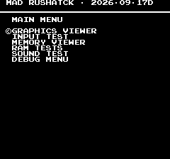
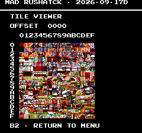
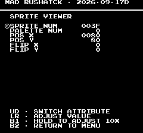
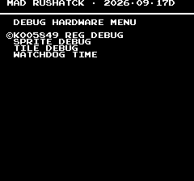
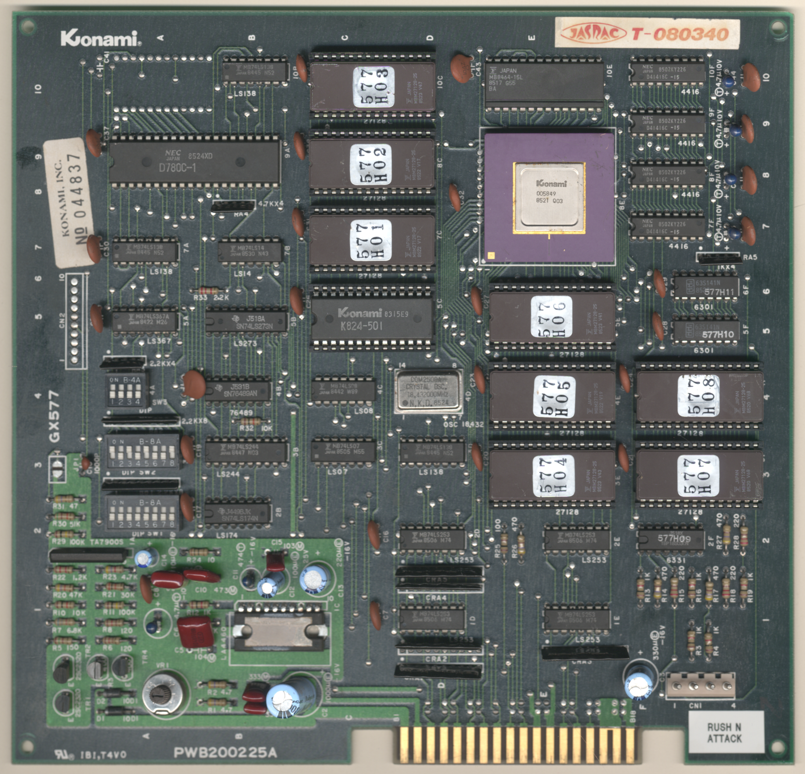
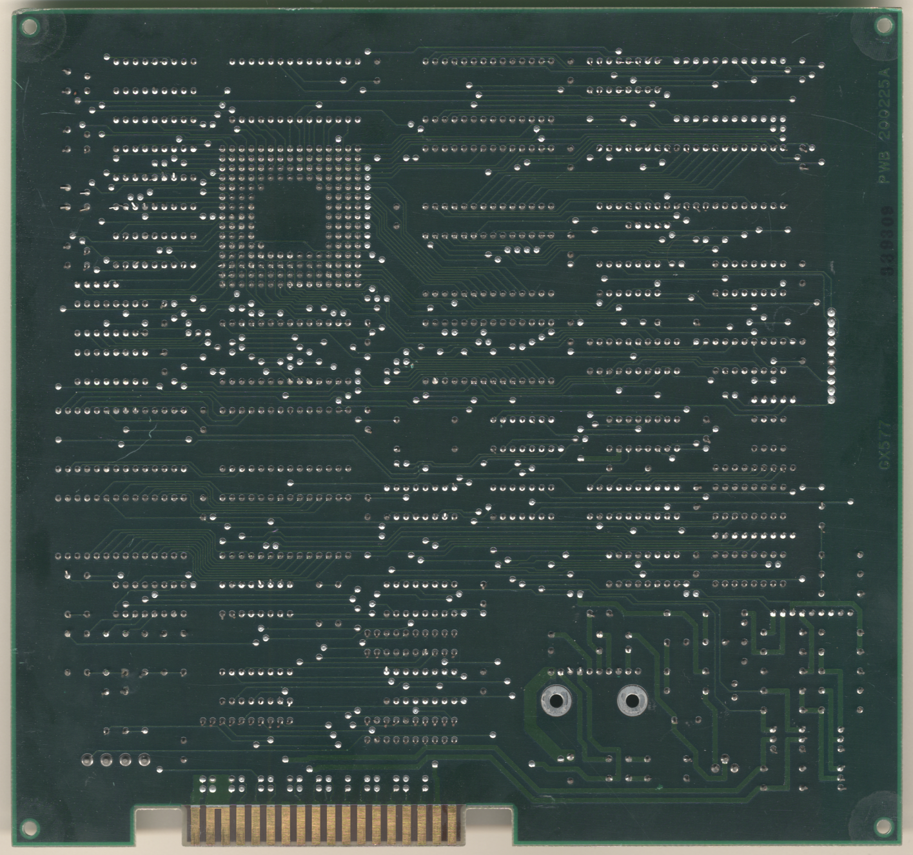

# Rush'n Attack
- [MAD Pictures](#mad-pictures)
- [PCB Pictures](#pcb-pictures)
- [Manual / Schematics](#manual-schematics)
- [MAD Eproms](#mad-eproms)
- [RAM Locations](#ram-locations)
- [Errors/Error Codes](#errorserror-codes)
   - [Main CPU](#main-cpu)
   - [Sound CPU](#sound-cpu)
- [MAD Notes](#mad-notes)
   - [Static palette colors](#static-palette-colors)
   - [No Video DAC Test](#no-video-dac-test)
- [MAME vs Hardware](#mame-vs-hardware)

<a name="mad-pictures"></a>
## MAD Pictures

<br>



<a name="pcb-pictures"></a>
## PCB Pictures
<a href="docs/images/rush_n_attack_pcb_top.png"></a>
<a href="docs/images/rush_n_attack_pcb_bottom.png"></a>

<a name="manual-schematics"></a>
## Manual / Schematics
[Manual](docs/rush_n_attack_manual.pdf)<br>
[Schematics](docs/rush_n_attack_schematics.png)

<a name="mad-eproms"></a>
## MAD Eproms
| Diag | Eprom Type | Location | Notes |
| ---- | ---------- | ----------- | ----- |
| Main | 27c128 | 577h03.10c @ 10C | |

<a name="ram-locations"></a>
## RAM Locations
| RAM | Location | Type | Notes |
| -------- | :------- | ----- | ----- |
| RAM | 10E | MB8464-15L (8k x 8bit) | |

All work/sprite/tile data is within that single SRAM chip.  There are 4x
D41416C-15 (16k x 4 bit) DRAM chips that are not accessible by the CPU and
probably line buffers used by th 005849 custom chip.

<a name="errorserror-codes"></a>
## Errors/Error Codes

<a name="main-cpu"></a> 
### Main CPU
The main CPU is a Z80 CPU. If an error is encountered during tests, MAD will
print the error to the screen, play the beep code, then jump to the error
address

On Z80's the error address is $2000 | error_code << 7. Error codes on the Z80
CPU are are 6 bits. Rush N Attack however has a watchdog address that must be
written to periodically or the game will reset.

```
watchdog address: $f600 = 1111 0110 0000 0000
error address:    $2000 = 001E EEEE E000 0000
  E = error code
```
The watchdog address is in conflict with the error address. However instead of
doing a loop to self instruction at the error address, MAD instead does a delay
loop so it stays within the error address range 99.9% of the time and 0.1% of
the time it will ping the watchdog. This is enough for the error addresses to
still be viable to use with a logic probe. It just means address lines not be
100% high or low, but 99% of the time.

<!-- ec_table_main_start -->
| Hex  | Number | Beep Code |     Error Address (A15..A0)    |           Error Text           |
| ---: | -----: | --------: | :----------------------------: | :----------------------------- |
| 0x01 |      1 | 0000 0001 |      0110 0000 1xxx xxxx       | SCROLL RAM ADDRESS             |
| 0x02 |      2 | 0000 0010 |      0110 0001 0xxx xxxx       | SCROLL RAM DATA                |
| 0x03 |      3 | 0000 0011 |      0110 0001 1xxx xxxx       | SCROLL RAM MARCH               |
| 0x04 |      4 | 0000 0100 |      0110 0010 0xxx xxxx       | SCROLL RAM OUTPUT              |
| 0x05 |      5 | 0000 0101 |      0110 0010 1xxx xxxx       | SCROLL RAM WRITE               |
| 0x06 |      6 | 0000 0110 |      0110 0011 0xxx xxxx       | WORK RAM ADDRESS               |
| 0x07 |      7 | 0000 0111 |      0110 0011 1xxx xxxx       | WORK RAM DATA                  |
| 0x08 |      8 | 0000 1000 |      0110 0100 0xxx xxxx       | WORK RAM MARCH                 |
| 0x09 |      9 | 0000 1001 |      0110 0100 1xxx xxxx       | WORK RAM OUTPUT                |
| 0x0a |     10 | 0000 1010 |      0110 0101 0xxx xxxx       | WORK RAM WRITE                 |
| 0x3e |     62 | 0011 1110 |      0111 1111 0xxx xxxx       | MAD ROM ADDRESS                |
| 0x3f |     63 | 0011 1111 |      0111 1111 1xxx xxxx       | MAD ROM CRC32                  |

<sup>Table last updated by gen-error-codes-markdown-table on 2026-09-19 @ 21:23 UTC</sup>
<!-- ec_table_main_end -->

<a name="sound-cpu"></a>
### Sound CPU
This board doesn't have a dedicated Sound CPU.  The main CPU handles playing
sounds.

<a name="mad-notes"></a>
## MAD Notes
<a name="mad-notes"></a>
### Static palette colors
The game's palette comes from proms and are unchangeable.

<a name="no-video-dac-test"></a>
### No Video DAC Test
The static palette makes it impossible to do this test.

<a name="mame-vs-hardware"></a>
## MAME vs Hardware
  * bit 3 of 0xe043 register is used to have the k005849 custom IC flip/flop
    between reading sprite data from 2 different memory locations (0xd000 and
    0xd100).  MAME currently has this flip/flop backwards.  When the bit is
    unset sprite data should be read from 0xd000 and when set 0xd100.  This
    causes MAD's sprite test/debug to not display the sprite when running in MAME.
