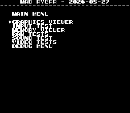
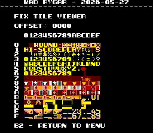
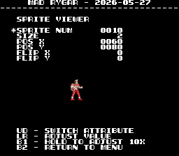

# Rygar
- [MAD Pictures](#mad-pictures)
- [PCB Pictures](#pcb-pictures)
- [Manual / Schematics](#manual-schematics)
- [MAD Eproms](#mad-eproms)
- [RAM Locations](#ram-locations)
- [Errors/Error Codes](#errorserror-codes)
   * [Main CPU](#main-cpu)
   * [Sound CPU](#sound-cpu)
- [MAD Notes](#mad-notes)
   * [No Video DAC Test](#no-video-dac-test)
- [MAME vs Hardware](#mame-vs-hardware)

## MAD Pictures

<bnr>


## PCB Pictures
<a href="docs/images/rygar_cpu_pcb_top.png"></a>
<a href="docs/images/rygar_cpu_pcb_bottom.png"></a>
<p>
<a href="docs/images/rygar_graphics_pcb_top.png"></a>
<a href="docs/images/rygar_graphics_pcb_bottom.png"></a>
<p>

The CPU and Graphics PCB have their solder sides facing each other.

## Manual / Schematics
[Manual](docs/rygar_manual.pdf)<br>
[Schematics](docs/rygar_schematics.pdf)<br>

## MAD Eproms

| Diag | Eprom Type | Location | Notes |
| ---- | ---------- | ----------- | ----- |
| Main | 27c256 | 5.5p @ 5P on CPU Board | |
| Sound | 27c64 | 4h on CPU Board | No MAD ROM exists yet |

## RAM Locations
| RAM | Location | Type |
| -------- | :------- | ----- |
| BG Tile RAM | 6T on Graphics Board | D4016C-3 (2k x 8bit) |
| FG Tile RAM | 6A on Graphics Board | D4016C-3 (2k x 8bit) |
| Fix Tile RAM | 7L on CPU Board | D4016C-3 (2k x 8bit) |
| Palette RAM (Even Addresses, Low Nibble, Blue) | 7A on CPU Board | MBM2148L-55 (1k x 4bit) |
| Palette RAM (Odd Addresses, Low Nibble, Green) | 7C on CPU Board | MBM2148L-55 (1k x 4bit) |
| Palette RAM (Odd Addresses, High Nibble, Red) | 7B on CPU Board | MBM2148L-55 (1k x 4bit) |
| Sound RAM | 4E on CPU Board | D4016C-3 (2k x 8bit) |
| Sprite RAM | 3B on Graphics Board | D4016C-3 (2k x 8bit) |
| Work RAM | 10E on CPU Board | HM6264LP-16 (8k x 8bit) |

Palette RAM consists of 3x 4bit RAM chips.  The high nibble on even addresses
is not mapped to any RAM chip and will always return $f when read.

## Errors/Error Codes
MAD for the main CPU is expecting the game's original sound rom to be there
in order to play sounds, including making beep codes.

### Main CPU
The main CPU is a Z80.  If an error is encountered during tests, MAD will print
the error to the screen, play the beep code, then jump to the error address

On Z80's the error address is `$6000 | error_code << 7`.  Error codes on the
Z80 CPU are are 6 bits.  Rygar however has a watchdog address that must be
written to periodically or the game will reset.

```
 watchdog address 0xf80b = 1111 1000 0rrr rrrr
 error addresses  0x6000 = 001E EEEE Errr rrrr
  E = error code
  r = refresh/useable
```
This puts 3 of the error code bits in conflict with having to write to the
watchdog.  error address jump locations exist every 128 bytes, 0x6000, 0x6080,
0x6100, etc.  Normally we would just have a jump self at each of those
locations. However to work around the watchdog conflict we are instead using the
entire 128 bytes for the error address loops

 - ping watchdog
 - bunch of nops to fill almost all of the 128 bytes
 - loop

If any of the top 3 bits of the error address end up being low and in conflict
with the watchdog address they will show up on a logic probe as LOW 99% of the
time and 1% HIGH.  So you hear/see it being LOW with and occasional HIGH pulse.

<!-- ec_table_main_start -->
| Hex  | Number | Beep Code |     Error Address (A15..A0)    |           Error Text           |
| ---: | -----: | --------: | :----------------------------: | :----------------------------- |
| 0x01 |      1 | 0000 0001 |      0110 0000 1xxx xxxx       | BG TILE RAM ADDRESS            |
| 0x02 |      2 | 0000 0010 |      0110 0001 0xxx xxxx       | BG TILE RAM DATA               |
| 0x03 |      3 | 0000 0011 |      0110 0001 1xxx xxxx       | BG TILE RAM MARCH              |
| 0x04 |      4 | 0000 0100 |      0110 0010 0xxx xxxx       | BG TILE RAM OUTPUT             |
| 0x05 |      5 | 0000 0101 |      0110 0010 1xxx xxxx       | BG TILE RAM WRITE              |
| 0x06 |      6 | 0000 0110 |      0110 0011 0xxx xxxx       | FG TILE RAM ADDRESS            |
| 0x07 |      7 | 0000 0111 |      0110 0011 1xxx xxxx       | FG TILE RAM DATA               |
| 0x08 |      8 | 0000 1000 |      0110 0100 0xxx xxxx       | FG TILE RAM MARCH              |
| 0x09 |      9 | 0000 1001 |      0110 0100 1xxx xxxx       | FG TILE RAM OUTPUT             |
| 0x0a |     10 | 0000 1010 |      0110 0101 0xxx xxxx       | FG TILE RAM WRITE              |
| 0x0b |     11 | 0000 1011 |      0110 0101 1xxx xxxx       | FIX TILE RAM ADDRESS           |
| 0x0c |     12 | 0000 1100 |      0110 0110 0xxx xxxx       | FIX TILE RAM DATA              |
| 0x0d |     13 | 0000 1101 |      0110 0110 1xxx xxxx       | FIX TILE RAM MARCH             |
| 0x0e |     14 | 0000 1110 |      0110 0111 0xxx xxxx       | FIX TILE RAM OUTPUT            |
| 0x0f |     15 | 0000 1111 |      0110 0111 1xxx xxxx       | FIX TILE RAM WRITE             |
| 0x10 |     16 | 0001 0000 |      0110 1000 0xxx xxxx       | PALETTE RAM ADDRESS            |
| 0x11 |     17 | 0001 0001 |      0110 1000 1xxx xxxx       | PALETTE RAM DATA               |
| 0x12 |     18 | 0001 0010 |      0110 1001 0xxx xxxx       | PALETTE RAM MARCH              |
| 0x13 |     19 | 0001 0011 |      0110 1001 1xxx xxxx       | PALETTE RAM OUTPUT             |
| 0x14 |     20 | 0001 0100 |      0110 1010 0xxx xxxx       | PALETTE RAM WRITE              |
| 0x15 |     21 | 0001 0101 |      0110 1010 1xxx xxxx       | SPRITE RAM ADDRESS             |
| 0x16 |     22 | 0001 0110 |      0110 1011 0xxx xxxx       | SPRITE RAM DATA                |
| 0x17 |     23 | 0001 0111 |      0110 1011 1xxx xxxx       | SPRITE RAM MARCH               |
| 0x18 |     24 | 0001 1000 |      0110 1100 0xxx xxxx       | SPRITE RAM OUTPUT              |
| 0x19 |     25 | 0001 1001 |      0110 1100 1xxx xxxx       | SPRITE RAM WRITE               |
| 0x1a |     26 | 0001 1010 |      0110 1101 0xxx xxxx       | WORK RAM ADDRESS               |
| 0x1b |     27 | 0001 1011 |      0110 1101 1xxx xxxx       | WORK RAM DATA                  |
| 0x1c |     28 | 0001 1100 |      0110 1110 0xxx xxxx       | WORK RAM MARCH                 |
| 0x1d |     29 | 0001 1101 |      0110 1110 1xxx xxxx       | WORK RAM OUTPUT                |
| 0x1e |     30 | 0001 1110 |      0110 1111 0xxx xxxx       | WORK RAM WRITE                 |
| 0x3e |     62 | 0011 1110 |      0111 1111 0xxx xxxx       | MAD ROM ADDRESS                |
| 0x3f |     63 | 0011 1111 |      0111 1111 1xxx xxxx       | MAD ROM CRC32                  |

<sup>Table last updated by gen-error-codes-markdown-table on 2026-05-25 @ 02:35 UTC</sup>
<!-- ec_table_main_end -->

### Sound CPU
The sound CPU is a z80.  No MAD rom exists yet for the sound CPU.

## MAD Notes
### No Video DAC Test
It should be possible to make one, but will be a pita to do as there aren't any
solid color fix tiles.

## MAME vs Hardware
Nothing that required a MAME specific build
