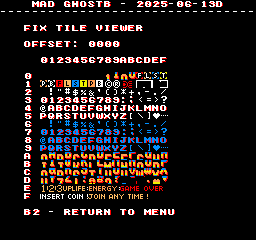
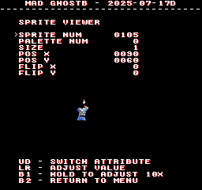

# The Real Ghostbusters
- [MAD Pictures](#mad-pictures)
- [PCB Pictures](#pcb-pictures)
- [Manual / Schematics](#manual---schematics)
- [MAD Eproms](#mad-eproms)
- [RAM Locations](#ram-locations)
- [Errors/Error Codes](#errors-error-codes)
  * [Main CPU](#main-cpu)
  * [Sound CPU](#sound-cpu)
- [MAD Notes](#mad-notes)
  * [Static palette colors](#static-palette-colors)
  * [No Video DAC Test](#no-video-dac-test)
- [MAME vs Hardware](#mame-vs-hardware)

## MAD Pictures

## PCB Pictures

The CPU board in on top of the graphics board, with the parts side of the
graphics board facing the solder side of the CPU board.  There are 2x50pin
ribbon cables that connect the boards on the side side of the board relative to
the jamma edge.  There is also a 2 pin power cable that connects between the
boards near the jamma edge, though in testing it doesn't seem to be required for
operation.

## Manual / Schematics
[Manual](docs/the_real_ghostbusters.pdf)

Schematics don't seem to exist.

## MAD Eproms
| Diag | Eprom Type | Location | Notes |
| ---- | ---------- | ----------- | ----- |
| Main | 27c256 | dz01-22.1d @ 1D | |
| Sound | 27c256 | dz06.5f @ 5F | No MAD ROM exists yet ||

## RAM Locations
| RAM | Location | Type | Notes |
| -------- | :------- | ----- | ----- |
| BAC06 RAM (Even Addresses) | H16 on CPU PCB | CXK5814P-55L (2k x 8bit) | |
| BAC06 RAM (Odd Addresses) | J16 on CPU PCB | CXK5814P-55L (2k x 8bit) | |
| Sound RAM | 6F on CPU PCB | MB8416A-15L-SK (2k x 8bit) | |
| Sprite RAM | 6A on CPU PCB | CXK5814P-55L (2k x 8bit) | |
| Video/Work RAM | 14A on CPU PCB | TMM2063P-10 (8k x 8bit) | I believe these are both on this RAM chip |

There are also 10x CXK5814P-55L (2k x 8bit) on the graphics PCB that aren't
accessible directly by the CPU and are thus untestable.  I believe all of these
are going to be related to sprite processing.

## Errors/Error Codes
MAD for the main CPU is expecting the game's original sound rom to be there
in order to play sounds, including making beep codes.

### Main CPU
The main CPU is a HD6309 CPU.  If an error is encountered during tests, MAD will
print the error to the screen, play the beep code, then jump to the error
address

On HD6309 CPU the error address is `$f000 | error_code << 4`.  Error codes on the
HD6309 CPU are are 6 bits.  The games does not have a watchdog.

<!-- ec_table_main_start -->
| Hex  | Number | Beep Code |     Error Address (A15..A0)    |           Error Text           |
| ---: | -----: | --------: | :----------------------------: | :----------------------------- |
| 0x01 |      1 | 0000 0001 |      1111 0000 0001 xxxx       | BAC06 RAM ADDRESS              |
| 0x02 |      2 | 0000 0010 |      1111 0000 0010 xxxx       | BAC06 RAM DATA                 |
| 0x03 |      3 | 0000 0011 |      1111 0000 0011 xxxx       | BAC06 RAM MARCH                |
| 0x04 |      4 | 0000 0100 |      1111 0000 0100 xxxx       | BAC06 RAM OUTPUT               |
| 0x05 |      5 | 0000 0101 |      1111 0000 0101 xxxx       | BAC06 RAM WRITE                |
| 0x06 |      6 | 0000 0110 |      1111 0000 0110 xxxx       | SPRITE RAM ADDRESS             |
| 0x07 |      7 | 0000 0111 |      1111 0000 0111 xxxx       | SPRITE RAM DATA                |
| 0x08 |      8 | 0000 1000 |      1111 0000 1000 xxxx       | SPRITE RAM MARCH               |
| 0x09 |      9 | 0000 1001 |      1111 0000 1001 xxxx       | SPRITE RAM OUTPUT              |
| 0x0a |     10 | 0000 1010 |      1111 0000 1010 xxxx       | SPRITE RAM WRITE               |
| 0x0b |     11 | 0000 1011 |      1111 0000 1011 xxxx       | VIDEO RAM ADDRESS              |
| 0x0c |     12 | 0000 1100 |      1111 0000 1100 xxxx       | VIDEO RAM DATA                 |
| 0x0d |     13 | 0000 1101 |      1111 0000 1101 xxxx       | VIDEO RAM MARCH                |
| 0x0e |     14 | 0000 1110 |      1111 0000 1110 xxxx       | VIDEO RAM OUTPUT               |
| 0x0f |     15 | 0000 1111 |      1111 0000 1111 xxxx       | VIDEO RAM WRITE                |
| 0x10 |     16 | 0001 0000 |      1111 0001 0000 xxxx       | WORK RAM ADDRESS               |
| 0x11 |     17 | 0001 0001 |      1111 0001 0001 xxxx       | WORK RAM DATA                  |
| 0x12 |     18 | 0001 0010 |      1111 0001 0010 xxxx       | WORK RAM MARCH                 |
| 0x13 |     19 | 0001 0011 |      1111 0001 0011 xxxx       | WORK RAM OUTPUT                |
| 0x14 |     20 | 0001 0100 |      1111 0001 0100 xxxx       | WORK RAM WRITE                 |
| 0x3e |     62 | 0011 1110 |      1111 0011 1110 xxxx       | MAD ROM ADDRESS                |
| 0x3f |     63 | 0011 1111 |      1111 0011 1111 xxxx       | MAD ROM CRC32                  |

Table last updated by gen-error-codes-markdown-table on 2025-06-17 @ 01:51 UTC
<!-- ec_table_main_end -->

### Sound CPU
The sound CPU is a DEC 222?.  No MAD rom exists yet for the sound CPU.

## MAD Notes
### Static palette colors
The game's palette comes from proms and are unchangeable.  This is why the text
has the red shadow.

### No Video DAC Test
The static palette makes it impossible to do this test.

## MAME vs Hardware
* MAME and hardware don't agree on the orientation of the screen.  Bit 3 of the
control register at $3840 is used to control screen flip.  On hardware if the
bit is unset the screen is upside down, and set its right side up.  MAME is the
opposite with unset being right side up, and set is upside down.  The game uses
dip switch1 #7 for screen orientation.  The on/off state of this dip switch maps
directly to the value bit 3.  The manual says this switch is for screen flip,
with "normal" being off and "flip" being on.  With my board I need to switch on
for the game to display right side up. 
