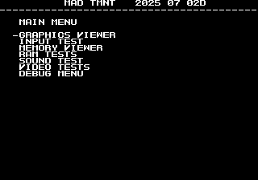

# Teenage Mutant Ninja Turtles
- [MAD Pictures](#mad-pictures)
- [PCB Pictures](#pcb-pictures)
- [Manual / Schematics](#manual---schematics)
- [MAD Eproms](#mad-eproms)
- [RAM Locations](#ram-locations)
- [Errors/Error Codes](#errors-error-codes)
  * [Main CPU](#main-cpu)
  * [Sound CPU](#sound-cpu)
- [MAD Notes](#mad-notes)
  * [Palette RAM](#palette-ram)
  * [Tile Layers](#tile-layers)
  * [Sprite Viewer](#sprite-viewer)
- [MAME vs Hardware](#mame-vs-hardware)

## MAD Pictures

<br>


## PCB Pictures
<a href="docs/images/tmnt_pcb_top.png"></a>
<a href="docs/images/tmnt_pcb_bottom.png"></a>
<p>

## Manual / Schematics
[Manual w/Schematics](docs/tmnt_manual_schematics.pdf)

## MAD Eproms

| Diag | Eprom Type | Location(s) | Notes |
| ---- | ---------- | ----------- | ----- |
| Main on CPU PCB | 27c010 or 27c1001 | 963-x23.j17 @ J17<br>963-x24.k17 @ K17 |
| Sound on CPU PCB | 27c256 | G13 | No MAD ROM exists yet |

## RAM Locations
| RAM | Location | Type |
| -------- | :------- | ----- |
| [Palette RAM](#palette-ram) | F22 | MCM2018AN45 (2k x 8bit) |
| [Palette RAM](#palette-ram) | F23 | MCM2018AN45 (2k x 8bit) |
| Sound CPU RAM | F16 | MB8416A-15L-SK (2k x 8bit) |
| Sprite RAM | G6 | MCM2018AN45 (2k x 8bit) |
| Tile RAM Lower | G28 | MB8486A-10L-SK (8k x 8bit) |
| Tile RAM Upper | G27 | MB8486A-10L-SK (8k x 8bit) |
| Work RAM Lower | L13 | MB8486A-10L-SK (8k x 8bit) |
| Work RAM Upper | J13 | MB8486A-10L-SK (8k x 8bit) |

## Errors/Error Codes
MAD for the main CPU is expecting the game's original sound rom to be there
in order to play sounds, including making beep codes.

### Main CPU
The main CPU is a motorola 68000.  If an error is encountered during tests
MAD will print the error to the screen, play the beep code, then jump to the
error address

On 68000 the error address is `$6000 | error_code << 5`.  Error codes on 68000
are 7 bits.  TMNT however has a watchdog address that must be written to
periodically or the game will reset.

```
watchdog address: $0a0011 = 0000 1010 0000 0000 0001 0001
error address:    $006000 = 0000 0000 0110 EEEE EEE0 0000
  E = error code
```
The watchdog address is in conflict with the error address.  However instead of
doing a loop to self instruction at the error address, MAD instead does a delay
loop so it stays within the error address range 99.9% of the time and 0.1% of
the time it will ping the watchdog.  This is enough for the error addresses to
still be viable to use with a logic probe.  It just means address lines not be
100% high or low, but 99% of the time.

<!-- ec_table_main_start -->
| Hex  | Number | Beep Code |     Error Address (A23..A1)    |           Error Text           |
| ---: | -----: | --------: | :----------------------------: | :----------------------------- |
| 0x01 |      1 | 0000 0001 |  000 0000 0011 0000 0001 xxxx  | PALETTE RAM ADDRESS            |
| 0x02 |      2 | 0000 0010 |  000 0000 0011 0000 0010 xxxx  | PALETTE RAM DATA               |
| 0x05 |      5 | 0000 0101 |  000 0000 0011 0000 0101 xxxx  | PALETTE RAM MARCH              |
| 0x08 |      8 | 0000 1000 |  000 0000 0011 0000 1000 xxxx  | PALETTE RAM OUTPUT             |
| 0x0b |     11 | 0000 1011 |  000 0000 0011 0000 1011 xxxx  | PALETTE RAM WRITE              |
| 0x0e |     14 | 0000 1110 |  000 0000 0011 0000 1110 xxxx  | SPRITE RAM ADDRESS             |
| 0x0f |     15 | 0000 1111 |  000 0000 0011 0000 1111 xxxx  | SPRITE RAM DATA                |
| 0x12 |     18 | 0001 0010 |  000 0000 0011 0001 0010 xxxx  | SPRITE RAM MARCH               |
| 0x15 |     21 | 0001 0101 |  000 0000 0011 0001 0101 xxxx  | SPRITE RAM OUTPUT              |
| 0x18 |     24 | 0001 1000 |  000 0000 0011 0001 1000 xxxx  | SPRITE RAM WRITE               |
| 0x1b |     27 | 0001 1011 |  000 0000 0011 0001 1011 xxxx  | TILE RAM ADDRESS               |
| 0x1c |     28 | 0001 1100 |  000 0000 0011 0001 1100 xxxx  | TILE RAM DATA LOWER            |
| 0x1d |     29 | 0001 1101 |  000 0000 0011 0001 1101 xxxx  | TILE RAM DATA UPPER            |
| 0x1e |     30 | 0001 1110 |  000 0000 0011 0001 1110 xxxx  | TILE RAM DATA BOTH             |
| 0x1f |     31 | 0001 1111 |  000 0000 0011 0001 1111 xxxx  | TILE RAM MARCH LOWER           |
| 0x20 |     32 | 0010 0000 |  000 0000 0011 0010 0000 xxxx  | TILE RAM MARCH UPPER           |
| 0x21 |     33 | 0010 0001 |  000 0000 0011 0010 0001 xxxx  | TILE RAM MARCH BOTH            |
| 0x22 |     34 | 0010 0010 |  000 0000 0011 0010 0010 xxxx  | TILE RAM OUTPUT LOWER          |
| 0x23 |     35 | 0010 0011 |  000 0000 0011 0010 0011 xxxx  | TILE RAM OUTPUT UPPER          |
| 0x24 |     36 | 0010 0100 |  000 0000 0011 0010 0100 xxxx  | TILE RAM OUTPUT BOTH           |
| 0x25 |     37 | 0010 0101 |  000 0000 0011 0010 0101 xxxx  | TILE RAM WRITE LOWER           |
| 0x26 |     38 | 0010 0110 |  000 0000 0011 0010 0110 xxxx  | TILE RAM WRITE UPPER           |
| 0x27 |     39 | 0010 0111 |  000 0000 0011 0010 0111 xxxx  | TILE RAM WRITE BOTH            |
| 0x28 |     40 | 0010 1000 |  000 0000 0011 0010 1000 xxxx  | WORK RAM ADDRESS               |
| 0x29 |     41 | 0010 1001 |  000 0000 0011 0010 1001 xxxx  | WORK RAM DATA LOWER            |
| 0x2a |     42 | 0010 1010 |  000 0000 0011 0010 1010 xxxx  | WORK RAM DATA UPPER            |
| 0x2b |     43 | 0010 1011 |  000 0000 0011 0010 1011 xxxx  | WORK RAM DATA BOTH             |
| 0x2c |     44 | 0010 1100 |  000 0000 0011 0010 1100 xxxx  | WORK RAM MARCH LOWER           |
| 0x2d |     45 | 0010 1101 |  000 0000 0011 0010 1101 xxxx  | WORK RAM MARCH UPPER           |
| 0x2e |     46 | 0010 1110 |  000 0000 0011 0010 1110 xxxx  | WORK RAM MARCH BOTH            |
| 0x2f |     47 | 0010 1111 |  000 0000 0011 0010 1111 xxxx  | WORK RAM OUTPUT LOWER          |
| 0x30 |     48 | 0011 0000 |  000 0000 0011 0011 0000 xxxx  | WORK RAM OUTPUT UPPER          |
| 0x31 |     49 | 0011 0001 |  000 0000 0011 0011 0001 xxxx  | WORK RAM OUTPUT BOTH           |
| 0x32 |     50 | 0011 0010 |  000 0000 0011 0011 0010 xxxx  | WORK RAM WRITE LOWER           |
| 0x33 |     51 | 0011 0011 |  000 0000 0011 0011 0011 xxxx  | WORK RAM WRITE UPPER           |
| 0x34 |     52 | 0011 0100 |  000 0000 0011 0011 0100 xxxx  | WORK RAM WRITE BOTH            |
| 0x7e |    126 | 0111 1110 |  000 0000 0011 0111 1110 xxxx  | MAD ROM ADDRESS                |
| 0x7f |    127 | 0111 1111 |  000 0000 0011 0111 1111 xxxx  | MAD ROM CRC32                  |

<sup>Table last updated by gen-error-codes-markdown-table on 2025-07-05 @ 19:07 UTC</sup>
<!-- ec_table_main_end -->

### Sound CPU
The sound CPU is a z80.  No MAD rom exists yet for the sound CPU.

## MAD Notes

### Palette RAM
The layout of palette ram is a little weird.  Only the lower byte at each
address is used.  Memory address are interleaved between the chips such that

```
$80000 = F22
$80002 = F23
$80004 = F22
$80006 = F23
etc
```

### Tile Layers
There are 3 tile layers (fix, layer a, and layer b).  They each use the same set
of tiles.  When you use the tile viewer for each they will display the same
tiles, but are on the corresponding layer.

The color palette is just a random one I picked, so none of the colors for the
tiles will look right compared to in game.

### Sprite Viewer
There is a basic sprite viewer in MAD.  Sprites are a little tricky to
setup/view because I don't know the correct size of each sprite.  The sprite
size also plays a role in the sprite number.  A size of 3 will mean sprites only
change every 4 sprite numbers, while a size of 0 will change the sprite every
number. 

The color palette is the one the game uses for the player.  So the colors for
the player should be correct, but maybe completely wrong for other sprites.

## MAME vs Hardware
Nothing that required a MAME specific build
