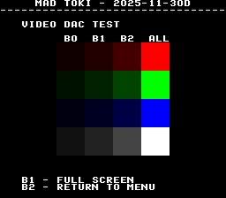
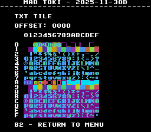
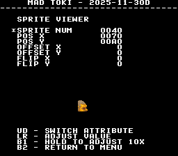

# Toki
- [MAD Pictures](#mad-pictures)
- [PCB Pictures](#pcb-pictures)
- [Manual / Schematics](#manual--schematics)
- [MAD Eproms](#mad-eproms)
- [RAM Locations](#ram-locations)
- [Errors/Error Codes](#errorserror-codes)
  - [Main CPU](#main-cpu)
  - [Sound CPU](#sound-cpu)
- [MAD Notes](#mad-notes)
- [MAME vs Hardware](#mame-vs-hardware)

# MAD Pictures

<br>



## PCB Pictures

<a href="docs/images/toki_pcb_top.png"></a>
<a href="docs/images/toki_pcb_bottom.png"></a>

## Manual / Schematics
[Manual](docs/toki_manual.pdf)

Schematics don't seem to exist.

## MAD Eproms

| Diag | Eprom Type | Location(s) |
| ---- | ---------- | ----------- |
| Main on CPU PCB | 27c010 or 27c1001 | 4e.k10 @ K10<br>6e.m10 @ M10 |
| Sound on CPU PCB | xxxx | No MAD ROM exists yet | |

## RAM Locations
| RAM | Location | Type |
| -------- | --------| ----- |
| RAM Lower | K12 | HM62256LP-15 (32k x 8bit) |
| RAM Upper | M12 | HM62256LP-15 (32k x 8bit) |

The ram setup is a bit non-standard on this board as everything
(work/palette/sprite/tile) seems to be housed in those 2x32K chips.  MAME folks
suspect all of the SIS6091 QFP80 chips might also be ram.  Certain address
writes will trigger data to be copied out of th 2x32K chips and into the logic
that handles it.

```
0x0a0040 - Tiles and palette data copy
0x0a0048 - Sprite data copy
```

These have been confirmed with a logic analyzer and from getting stuff to
display on screen.

## Errors/Error Codes
The main CPU and sound CPU MAD rom should be used independently from each
other.  ie: MAD for the main CPU is expecting the games origin sound rom to be there
in order to play sounds, including making beep codes.

### Main CPU
The main CPU is a motorola 68000.  If an error is encountered during tests
MAD will print the error to the screen, play the beep code, then jump to the
error address

On 68000 the error address is `$6000 | error_code << 5`.  Error codes on 68000
are 7 bits.

<!-- ec_table_main_start -->
| Hex  | Number | Beep Code |     Error Address (A23..A1)    |           Error Text           |
| ---: | -----: | --------: | :----------------------------: | :----------------------------- |
| 0x01 |      1 | 0000 0001 |  000 0000 0011 0000 0001 xxxx  | RAM ADDRESS                    |
| 0x02 |      2 | 0000 0010 |  000 0000 0011 0000 0010 xxxx  | RAM DATA LOWER                 |
| 0x03 |      3 | 0000 0011 |  000 0000 0011 0000 0011 xxxx  | RAM DATA UPPER                 |
| 0x04 |      4 | 0000 0100 |  000 0000 0011 0000 0100 xxxx  | RAM DATA BOTH                  |
| 0x05 |      5 | 0000 0101 |  000 0000 0011 0000 0101 xxxx  | RAM MARCH LOWER                |
| 0x06 |      6 | 0000 0110 |  000 0000 0011 0000 0110 xxxx  | RAM MARCH UPPER                |
| 0x07 |      7 | 0000 0111 |  000 0000 0011 0000 0111 xxxx  | RAM MARCH BOTH                 |
| 0x08 |      8 | 0000 1000 |  000 0000 0011 0000 1000 xxxx  | RAM OUTPUT LOWER               |
| 0x09 |      9 | 0000 1001 |  000 0000 0011 0000 1001 xxxx  | RAM OUTPUT UPPER               |
| 0x0a |     10 | 0000 1010 |  000 0000 0011 0000 1010 xxxx  | RAM OUTPUT BOTH                |
| 0x0b |     11 | 0000 1011 |  000 0000 0011 0000 1011 xxxx  | RAM WRITE LOWER                |
| 0x0c |     12 | 0000 1100 |  000 0000 0011 0000 1100 xxxx  | RAM WRITE UPPER                |
| 0x0d |     13 | 0000 1101 |  000 0000 0011 0000 1101 xxxx  | RAM WRITE BOTH                 |
| 0x7e |    126 | 0111 1110 |  000 0000 0011 0111 1110 xxxx  | MAD ROM ADDRESS                |
| 0x7f |    127 | 0111 1111 |  000 0000 0011 0111 1111 xxxx  | MAD ROM CRC32                  |

<sup>Table last updated by gen-error-codes-markdown-table on 2025-12-02 @ 05:00 UTC</sup>
<!-- ec_table_main_end -->

### Sound CPU
The sound CPU is a z80.  No MAD rom exists yet for the sound CPU.

## MAD Notes
None

## MAME vs Hardware
