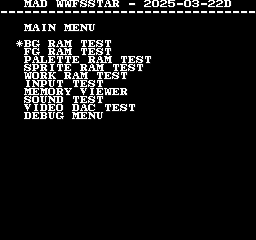
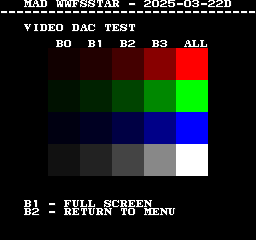

# WWF Superstars
- [MAD Pictures](#mad-pictures)
- [PCB Pictures](#pcb-pictures)
- [Manual / Schematics](#manual--schematics)
- [MAD Eproms](#mad-eproms)
- [RAM Locations](#ram-locations)
- [Errors/Error Codes](#errorserror-codes)
  - [Main CPU](#main-cpu)
  - [Sound CPU](#sound-cpu)
- [MAD Notes](#mad-notes)
- [MAME vs Hardware](#mame-vs-hardware)

## MAD Pictures

 

## PCB Pictures
CPU Board: 

Graphics Board: 

The CPU and graphics board are oriented such that the solder side of the boards
face each other.

## Manual / Schematics
[Manual](docs/wwf_superstars_manual.pdf)

Schematics don't seem to exist.

## MAD Eproms
| Diag | Eprom Type | Location(s) |
| ---- | ---------- | ----------- |
| Main on CPU PCB | 27c010 or 27c1001 | 24ac-0_j-1.34 @ IC34 24ad-0_j-1.35 @ IC35 |
| Sound on CPU PCB | 27c256 | 24ab-0.12 @ IC12 |

## RAM Locations
| RAM | Location | Type |
| -------- | :------- | ----- |
| BG RAM | IC24 on graphics PCB | TMM2018AP-35 (2k x 8bit) |
| FG RAM | IC22 on CPU PCB | MB8416A-15L-SK (2k x 8bit) |
| Palette RAM Lower | IC19 on CPU PCB | CXK5814P-35L (2k x 8bit) |
| Palette RAM Upper| IC20 on CPU PCB | CXK5814P-35L (2k x 8bit) |
| Sound CPU RAM | IC23 on CPU PCB | MB8416A-15L-SK (2k x 8bit) |
| Sprite RAM | IC39 on graphics PCB | MCM2018AN45 (2k x 8bit) |
| Work RAM Lower | IC35 on CPU PCB | LC3664N-10 (8k x 8bit) |
| Work RAM Upper | IC34 on CPU PCB | LC3664N-10 (8k x 8bit) |

There are additional MCM2018AN45 (2k x 8bit) RAM chips located at IC40, IC45 and
IC48 and IC71 on the graphics PCB that aren't accessible from the CPU and thus
can't be tested.

## Errors/Error Codes
The main CPU and sound CPU MAD rom should be used independently from each
other.  ie: MAD for the main CPU is expecting the games origin sound rom to be there
in order to play sounds, including making beep codes.

### Main CPU
The main CPU is a motorola 68000.  If an error is encountered during tests
MAD will print the error to the screen, play the beep code, then jump to the
error address

On 68000 the error address is `$6000 | error_code << 5`.  Error codes on 68000
are 7 bits.

<!-- ec_table_main_start -->
| Hex  | Number | Beep Code |     Error Address (A23..A1)    |           Error Text           |
| ---: | -----: | --------: | :----------------------------: | :----------------------------- |
| 0x01 |      1 | 0000 0001 |  000 0000 0011 0000 0001 xxxx  | BG RAM ADDRESS                 |
| 0x02 |      2 | 0000 0010 |  000 0000 0011 0000 0010 xxxx  | BG RAM DATA                    |
| 0x05 |      5 | 0000 0101 |  000 0000 0011 0000 0101 xxxx  | BG RAM MARCH                   |
| 0x08 |      8 | 0000 1000 |  000 0000 0011 0000 1000 xxxx  | BG RAM OUTPUT                  |
| 0x0b |     11 | 0000 1011 |  000 0000 0011 0000 1011 xxxx  | BG RAM WRITE                   |
| 0x0e |     14 | 0000 1110 |  000 0000 0011 0000 1110 xxxx  | FG RAM ADDRESS                 |
| 0x0f |     15 | 0000 1111 |  000 0000 0011 0000 1111 xxxx  | FG RAM DATA                    |
| 0x12 |     18 | 0001 0010 |  000 0000 0011 0001 0010 xxxx  | FG RAM MARCH                   |
| 0x15 |     21 | 0001 0101 |  000 0000 0011 0001 0101 xxxx  | FG RAM OUTPUT                  |
| 0x18 |     24 | 0001 1000 |  000 0000 0011 0001 1000 xxxx  | FG RAM WRITE                   |
| 0x1b |     27 | 0001 1011 |  000 0000 0011 0001 1011 xxxx  | PALETTE RAM ADDRESS            |
| 0x1c |     28 | 0001 1100 |  000 0000 0011 0001 1100 xxxx  | PALETTE RAM DATA LOWER         |
| 0x1d |     29 | 0001 1101 |  000 0000 0011 0001 1101 xxxx  | PALETTE RAM DATA UPPER         |
| 0x1e |     30 | 0001 1110 |  000 0000 0011 0001 1110 xxxx  | PALETTE RAM DATA BOTH          |
| 0x1f |     31 | 0001 1111 |  000 0000 0011 0001 1111 xxxx  | PALETTE RAM MARCH LOWER        |
| 0x20 |     32 | 0010 0000 |  000 0000 0011 0010 0000 xxxx  | PALETTE RAM MARCH UPPER        |
| 0x21 |     33 | 0010 0001 |  000 0000 0011 0010 0001 xxxx  | PALETTE RAM MARCH BOTH         |
| 0x22 |     34 | 0010 0010 |  000 0000 0011 0010 0010 xxxx  | PALETTE RAM OUTPUT LOWER       |
| 0x23 |     35 | 0010 0011 |  000 0000 0011 0010 0011 xxxx  | PALETTE RAM OUTPUT UPPER       |
| 0x24 |     36 | 0010 0100 |  000 0000 0011 0010 0100 xxxx  | PALETTE RAM OUTPUT BOTH        |
| 0x25 |     37 | 0010 0101 |  000 0000 0011 0010 0101 xxxx  | PALETTE RAM WRITE LOWER        |
| 0x26 |     38 | 0010 0110 |  000 0000 0011 0010 0110 xxxx  | PALETTE RAM WRITE UPPER        |
| 0x27 |     39 | 0010 0111 |  000 0000 0011 0010 0111 xxxx  | PALETTE RAM WRITE BOTH         |
| 0x28 |     40 | 0010 1000 |  000 0000 0011 0010 1000 xxxx  | SPRITE RAM ADDRESS             |
| 0x29 |     41 | 0010 1001 |  000 0000 0011 0010 1001 xxxx  | SPRITE RAM DATA                |
| 0x2c |     44 | 0010 1100 |  000 0000 0011 0010 1100 xxxx  | SPRITE RAM MARCH               |
| 0x2f |     47 | 0010 1111 |  000 0000 0011 0010 1111 xxxx  | SPRITE RAM OUTPUT              |
| 0x32 |     50 | 0011 0010 |  000 0000 0011 0011 0010 xxxx  | SPRITE RAM WRITE               |
| 0x35 |     53 | 0011 0101 |  000 0000 0011 0011 0101 xxxx  | WORK RAM ADDRESS               |
| 0x36 |     54 | 0011 0110 |  000 0000 0011 0011 0110 xxxx  | WORK RAM DATA LOWER            |
| 0x37 |     55 | 0011 0111 |  000 0000 0011 0011 0111 xxxx  | WORK RAM DATA UPPER            |
| 0x38 |     56 | 0011 1000 |  000 0000 0011 0011 1000 xxxx  | WORK RAM DATA BOTH             |
| 0x39 |     57 | 0011 1001 |  000 0000 0011 0011 1001 xxxx  | WORK RAM MARCH LOWER           |
| 0x3a |     58 | 0011 1010 |  000 0000 0011 0011 1010 xxxx  | WORK RAM MARCH UPPER           |
| 0x3b |     59 | 0011 1011 |  000 0000 0011 0011 1011 xxxx  | WORK RAM MARCH BOTH            |
| 0x3c |     60 | 0011 1100 |  000 0000 0011 0011 1100 xxxx  | WORK RAM OUTPUT LOWER          |
| 0x3d |     61 | 0011 1101 |  000 0000 0011 0011 1101 xxxx  | WORK RAM OUTPUT UPPER          |
| 0x3e |     62 | 0011 1110 |  000 0000 0011 0011 1110 xxxx  | WORK RAM OUTPUT BOTH           |
| 0x3f |     63 | 0011 1111 |  000 0000 0011 0011 1111 xxxx  | WORK RAM WRITE LOWER           |
| 0x40 |     64 | 0100 0000 |  000 0000 0011 0100 0000 xxxx  | WORK RAM WRITE UPPER           |
| 0x41 |     65 | 0100 0001 |  000 0000 0011 0100 0001 xxxx  | WORK RAM WRITE BOTH            |
| 0x7e |    126 | 0111 1110 |  000 0000 0011 0111 1110 xxxx  | MAD ROM ADDRESS                |
| 0x7f |    127 | 0111 1111 |  000 0000 0011 0111 1111 xxxx  | MAD ROM CRC32                  |

Table last updated by gen-error-codes-markdown-table on 2025-12-07 @ 02:46 UTC
<!-- ec_table_main_end -->

### Sound CPU
The sound CPU is a z80.  If an error is encountered (or all tests pass) MAD will jump
to one of the below error addresses.

On z80 the error address is `$2000 | error_code << 7`.  Error codes on z80 are 6 bits.

<!-- ec_table_sound_start -->
| Hex  | Number |     Error Address (A15..A0)    |           Error Text           |
| ---: | -----: | :----------------------------: | :----------------------------- |
| 0x00 |      0 |      0010 0000 0xxx xxxx       | ALL TESTS PASSED               |
| 0x01 |      1 |      0010 0000 1xxx xxxx       | MCPU LATCH OUTPUT              |
| 0x02 |      2 |      0010 0001 0xxx xxxx       | MSM6295 ALREADY PLAYING        |
| 0x03 |      3 |      0010 0001 1xxx xxxx       | MSM6295 PLAY                   |
| 0x04 |      4 |      0010 0010 0xxx xxxx       | MSM6295 OUTPUT                 |
| 0x05 |      5 |      0010 0010 1xxx xxxx       | WORK RAM ADDRESS               |
| 0x06 |      6 |      0010 0011 0xxx xxxx       | WORK RAM DATA                  |
| 0x07 |      7 |      0010 0011 1xxx xxxx       | WORK RAM MARCH                 |
| 0x08 |      8 |      0010 0100 0xxx xxxx       | WORK RAM OUTPUT                |
| 0x09 |      9 |      0010 0100 1xxx xxxx       | WORK RAM WRITE                 |
| 0x0a |     10 |      0010 0101 0xxx xxxx       | YM2151 BUSY BIT                |
| 0x0b |     11 |      0010 0101 1xxx xxxx       | YM2151 BUSY TIMEOUT            |
| 0x0c |     12 |      0010 0110 0xxx xxxx       | YM2151 OUTPUT                  |
| 0x0d |     13 |      0010 0110 1xxx xxxx       | YM2151 TIMERA IRQ              |
| 0x0e |     14 |      0010 0111 0xxx xxxx       | YM2151 TIMERB IRQ              |
| 0x0f |     15 |      0010 0111 1xxx xxxx       | YM2151 UNEXPECTED IRQ          |
| 0x3e |     62 |      0011 1111 0xxx xxxx       | MAD ROM ADDRESS                |
| 0x3f |     63 |      0011 1111 1xxx xxxx       | MAD ROM CRC32                  |

Table last updated by gen-error-codes-markdown-table on 2025-03-26 @ 01:45 UTC
<!-- ec_table_sound_end -->

## MAD Notes
None

## MAME vs Hardware

* MAME doesn't allow reading of palette RAM when hardware does
* Palette RAM size in MAME is `$300`, while its `$400` on hardware
  * If I recall MAME might also crash from this because not enough memory is
    allocated and causes an out of bounds read/write(?)
