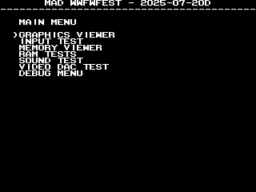
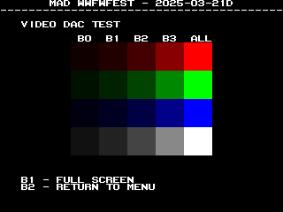
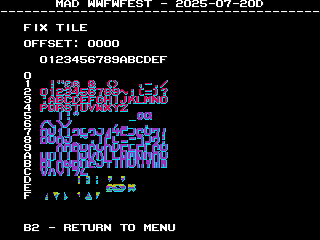
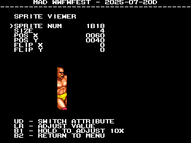

# WWF WrestleFest

<br>



## PCBs
<a href="docs/images/wwf_wrestlefest_pcb_top.png"></a>
<a href="docs/images/wwf_wrestlefest_pcb_bottom.png"></a>
<p>

## Manual / Schematics
[Manual](docs/wwf_wrestlefest_manual.pdf)

Schematics don't seem to exist.

## MAD Eproms

| Diag | Eprom Type | Location(s) | Notes |
| ---- | ---------- | ----------- | ----- |
| Main | 27c020| 31e13-0.ic19 @ IC19<br>31e14-0.ic18 @ IC18 | Using Makefile.hardware |
| Main Alt | 27c010 or 27c1001| 31e13-0.ic19 @ IC19<br>31e14-0.ic18 @ IC18 | Using Makefile.hardware-27c010 |
| Sound | 27c512 | 31a11-2.ic42 @ IC42 | |

The original program roms are on 27c020 eproms.  Its less common for people to have
27c020 eproms, so there is an alternate version of MAD that will work with
27c010/27c1001 eproms by building with Makefile.hardware-27c010.

NOTE: if you burn the MAD roms built from Makefile.hardware to 27c010/27c1001 eproms
you will get an `MAD ROM ADDRESS` error.

## RAM Locations
| RAM | Location | Type |
| -------- | :------- | ----- |
| BG RAM Lower | IC17 | UM6264AK-10L (8k x 8bit) |
| BG RAM Upper | IC16 | UM6264AK-10L (8k x 8bit) |
| Fix Tile/Sprite RAM | IC35 | UM6264AK-10L (8k x 8bit) |
| Palette RAM Lower | IC55 | UM6116A-35L (2k x 8bit) |
| Palette RAM Lower | IC54 | UM6116A-35L (2k x 8bit) |
| Sound RAM | IC411 | CXK5816SP-15L (2k x 8bit) |
| Work RAM Lower | IC31 | UM6264AK-10L (8k x 8bit) |
| Work RAM Upper | IC32 | UM6264AK-10L (8k x 8bit) |

Fix Tile and Sprite RAM share the same physical RAM chip.

There are additional UM6116K-35 (2k x 8bit) RAM chips located at IC24, IC26 and
IC27, that aren't accessible from the CPU and thus can't be tested.

## Errors/Error Codes
The main CPU and sound CPU MAD rom should be used independently from each
other.  ie: MAD for the main CPU is expecting the games origin sound rom to be there
in order to play sounds, including making beep codes.

### Main CPU
The main CPU is a motorola 68000.  If an error is encountered during tests
MAD will print the error to the screen, play the beep code, then jump to the
error address

On 68000 the error address is `$6000 | error_code << 5`.  Error codes on 68000
are 7 bits.  wwfwfest however has a watchdog address that must be written to
periodically or the game will reset.

```
watchdog address: $140016 = 0001 0010 0000 0000 0001 0110
error address:    $006000 = 0000 0000 0110 EEEE EEE0 0000
  E = error code
```
The watchdog address is in conflict with the error address.  However instead of
doing a loop to self instruction at the error address, MAD instead does a delay loop
so it stays within the error address range 99.9% of the time and 0.1% of the
time it will ping the watchdog.  This is enough for the error addresses to still
be viable to use with a logic probe.  It just means address lines not be 100%
high or low, but 99% of the time.

<!-- ec_table_main_start -->
| Hex  | Number | Beep Code |     Error Address (A23..A1)    |           Error Text           |
| ---: | -----: | --------: | :----------------------------: | :----------------------------- |
| 0x01 |      1 | 0000 0001 |  000 0000 0011 0000 0001 xxxx  | FIX SPRITE RAM ADDRESS         |
| 0x02 |      2 | 0000 0010 |  000 0000 0011 0000 0010 xxxx  | FIX SPRITE RAM DATA            |
| 0x05 |      5 | 0000 0101 |  000 0000 0011 0000 0101 xxxx  | FIX SPRITE RAM MARCH           |
| 0x08 |      8 | 0000 1000 |  000 0000 0011 0000 1000 xxxx  | FIX SPRITE RAM OUTPUT          |
| 0x0b |     11 | 0000 1011 |  000 0000 0011 0000 1011 xxxx  | FIX SPRITE RAM WRITE           |
| 0x0e |     14 | 0000 1110 |  000 0000 0011 0000 1110 xxxx  | PALETTE RAM ADDRESS            |
| 0x0f |     15 | 0000 1111 |  000 0000 0011 0000 1111 xxxx  | PALETTE RAM DATA LOWER         |
| 0x10 |     16 | 0001 0000 |  000 0000 0011 0001 0000 xxxx  | PALETTE RAM DATA UPPER         |
| 0x11 |     17 | 0001 0001 |  000 0000 0011 0001 0001 xxxx  | PALETTE RAM DATA BOTH          |
| 0x12 |     18 | 0001 0010 |  000 0000 0011 0001 0010 xxxx  | PALETTE RAM MARCH LOWER        |
| 0x13 |     19 | 0001 0011 |  000 0000 0011 0001 0011 xxxx  | PALETTE RAM MARCH UPPER        |
| 0x14 |     20 | 0001 0100 |  000 0000 0011 0001 0100 xxxx  | PALETTE RAM MARCH BOTH         |
| 0x15 |     21 | 0001 0101 |  000 0000 0011 0001 0101 xxxx  | PALETTE RAM OUTPUT LOWER       |
| 0x16 |     22 | 0001 0110 |  000 0000 0011 0001 0110 xxxx  | PALETTE RAM OUTPUT UPPER       |
| 0x17 |     23 | 0001 0111 |  000 0000 0011 0001 0111 xxxx  | PALETTE RAM OUTPUT BOTH        |
| 0x18 |     24 | 0001 1000 |  000 0000 0011 0001 1000 xxxx  | PALETTE RAM WRITE LOWER        |
| 0x19 |     25 | 0001 1001 |  000 0000 0011 0001 1001 xxxx  | PALETTE RAM WRITE UPPER        |
| 0x1a |     26 | 0001 1010 |  000 0000 0011 0001 1010 xxxx  | PALETTE RAM WRITE BOTH         |
| 0x1b |     27 | 0001 1011 |  000 0000 0011 0001 1011 xxxx  | TILE RAM ADDRESS               |
| 0x1c |     28 | 0001 1100 |  000 0000 0011 0001 1100 xxxx  | TILE RAM DATA LOWER            |
| 0x1d |     29 | 0001 1101 |  000 0000 0011 0001 1101 xxxx  | TILE RAM DATA UPPER            |
| 0x1e |     30 | 0001 1110 |  000 0000 0011 0001 1110 xxxx  | TILE RAM DATA BOTH             |
| 0x1f |     31 | 0001 1111 |  000 0000 0011 0001 1111 xxxx  | TILE RAM MARCH LOWER           |
| 0x20 |     32 | 0010 0000 |  000 0000 0011 0010 0000 xxxx  | TILE RAM MARCH UPPER           |
| 0x21 |     33 | 0010 0001 |  000 0000 0011 0010 0001 xxxx  | TILE RAM MARCH BOTH            |
| 0x22 |     34 | 0010 0010 |  000 0000 0011 0010 0010 xxxx  | TILE RAM OUTPUT LOWER          |
| 0x23 |     35 | 0010 0011 |  000 0000 0011 0010 0011 xxxx  | TILE RAM OUTPUT UPPER          |
| 0x24 |     36 | 0010 0100 |  000 0000 0011 0010 0100 xxxx  | TILE RAM OUTPUT BOTH           |
| 0x25 |     37 | 0010 0101 |  000 0000 0011 0010 0101 xxxx  | TILE RAM WRITE LOWER           |
| 0x26 |     38 | 0010 0110 |  000 0000 0011 0010 0110 xxxx  | TILE RAM WRITE UPPER           |
| 0x27 |     39 | 0010 0111 |  000 0000 0011 0010 0111 xxxx  | TILE RAM WRITE BOTH            |
| 0x28 |     40 | 0010 1000 |  000 0000 0011 0010 1000 xxxx  | WORK RAM ADDRESS               |
| 0x29 |     41 | 0010 1001 |  000 0000 0011 0010 1001 xxxx  | WORK RAM DATA LOWER            |
| 0x2a |     42 | 0010 1010 |  000 0000 0011 0010 1010 xxxx  | WORK RAM DATA UPPER            |
| 0x2b |     43 | 0010 1011 |  000 0000 0011 0010 1011 xxxx  | WORK RAM DATA BOTH             |
| 0x2c |     44 | 0010 1100 |  000 0000 0011 0010 1100 xxxx  | WORK RAM MARCH LOWER           |
| 0x2d |     45 | 0010 1101 |  000 0000 0011 0010 1101 xxxx  | WORK RAM MARCH UPPER           |
| 0x2e |     46 | 0010 1110 |  000 0000 0011 0010 1110 xxxx  | WORK RAM MARCH BOTH            |
| 0x2f |     47 | 0010 1111 |  000 0000 0011 0010 1111 xxxx  | WORK RAM OUTPUT LOWER          |
| 0x30 |     48 | 0011 0000 |  000 0000 0011 0011 0000 xxxx  | WORK RAM OUTPUT UPPER          |
| 0x31 |     49 | 0011 0001 |  000 0000 0011 0011 0001 xxxx  | WORK RAM OUTPUT BOTH           |
| 0x32 |     50 | 0011 0010 |  000 0000 0011 0011 0010 xxxx  | WORK RAM WRITE LOWER           |
| 0x33 |     51 | 0011 0011 |  000 0000 0011 0011 0011 xxxx  | WORK RAM WRITE UPPER           |
| 0x34 |     52 | 0011 0100 |  000 0000 0011 0011 0100 xxxx  | WORK RAM WRITE BOTH            |
| 0x7e |    126 | 0111 1110 |  000 0000 0011 0111 1110 xxxx  | MAD ROM ADDRESS                |
| 0x7f |    127 | 0111 1111 |  000 0000 0011 0111 1111 xxxx  | MAD ROM CRC32                  |

<sup>Table last updated by gen-error-codes-markdown-table on 2025-07-21 @ 01:08 UTC</sup>
<!-- ec_table_main_end -->

### Sound CPU
The sound CPU is a z80.  If an error is encountered (or all tests pass) MAD will jump
to one of the below error addresses.

On z80 the error address is `$2000 | error_code << 7`.  Error codes on z80 are 6 bits.

<!-- ec_table_sound_start -->
| Hex  | Number |     Error Address (A15..A0)    |           Error Text           |
| ---: | -----: | :----------------------------: | :----------------------------- |
| 0x00 |      0 |      0010 0000 0xxx xxxx       | ALL TESTS PASSED               |
| 0x01 |      1 |      0010 0000 1xxx xxxx       | MCPU LATCH OUTPUT              |
| 0x02 |      2 |      0010 0001 0xxx xxxx       | MSM6295 ALREADY PLAYING        |
| 0x03 |      3 |      0010 0001 1xxx xxxx       | MSM6295 PLAY                   |
| 0x04 |      4 |      0010 0010 0xxx xxxx       | MSM6295 OUTPUT                 |
| 0x05 |      5 |      0010 0010 1xxx xxxx       | WORK RAM ADDRESS               |
| 0x06 |      6 |      0010 0011 0xxx xxxx       | WORK RAM DATA                  |
| 0x07 |      7 |      0010 0011 1xxx xxxx       | WORK RAM MARCH                 |
| 0x08 |      8 |      0010 0100 0xxx xxxx       | WORK RAM OUTPUT                |
| 0x09 |      9 |      0010 0100 1xxx xxxx       | WORK RAM WRITE                 |
| 0x0a |     10 |      0010 0101 0xxx xxxx       | YM2151 BUSY BIT                |
| 0x0b |     11 |      0010 0101 1xxx xxxx       | YM2151 BUSY TIMEOUT            |
| 0x0c |     12 |      0010 0110 0xxx xxxx       | YM2151 OUTPUT                  |
| 0x0d |     13 |      0010 0110 1xxx xxxx       | YM2151 TIMERA IRQ              |
| 0x0e |     14 |      0010 0111 0xxx xxxx       | YM2151 TIMERB IRQ              |
| 0x0f |     15 |      0010 0111 1xxx xxxx       | YM2151 UNEXPECTED IRQ          |
| 0x3e |     62 |      0011 1111 0xxx xxxx       | MAD ROM ADDRESS                |
| 0x3f |     63 |      0011 1111 1xxx xxxx       | MAD ROM CRC32                  |

<sup>Table last updated by gen-error-codes-markdown-table on 2025-03-22 @ 19:01 UTC</sup>
<!-- ec_table_sound_end -->

## MAD Notes
### Fix Tile/Sprite RAM
The 68000 has a 16bit data bus.  The Fix Tile/Sprite RAM is only 8 bits wide and
is the lower byte in each word.

## MAME vs Hardware

* The BG RAM chips total 16K (2 x 8k)
    * Hardware allows reading and writing the entire range of `$080000` to `$083fff`
    * MAME only has `$080000` to `$080fff` and `$082000` to `$082fff` wired up.
      This causes a `BG RAM DATA BOTH` if MAD attempts to validate the entire
      range, so the BG test is disabled in MAME. 
* Main CPU Watchdog
    * There is a watchdog at `$140016` that is missing in MAME
