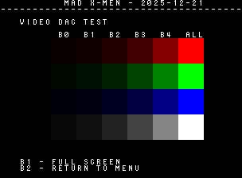
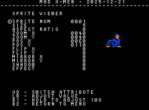
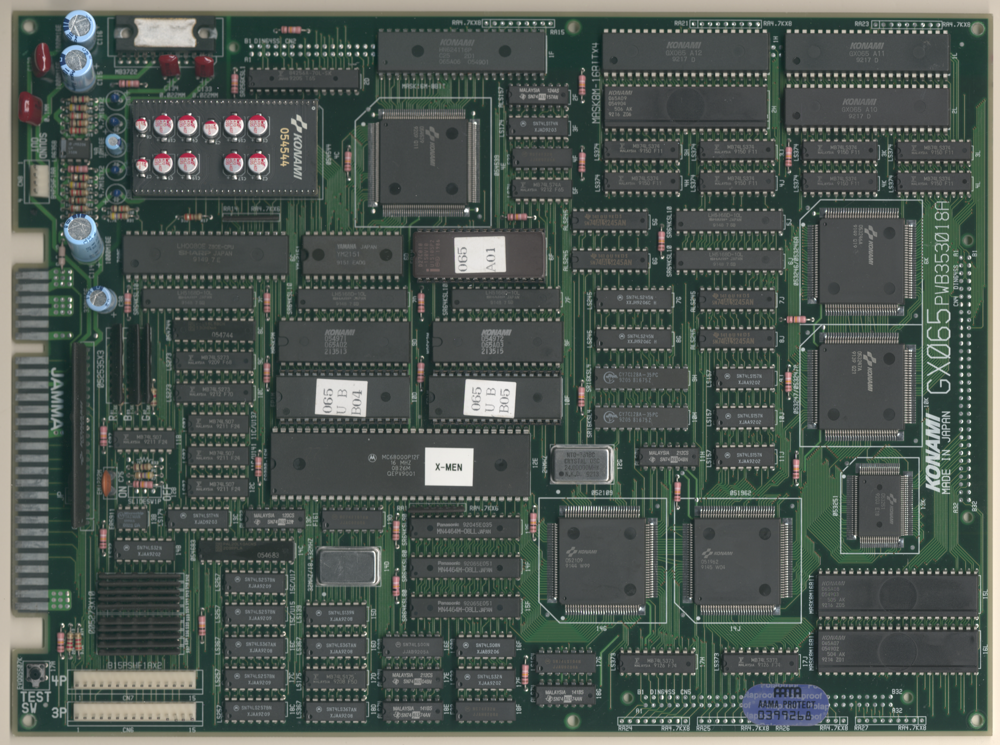
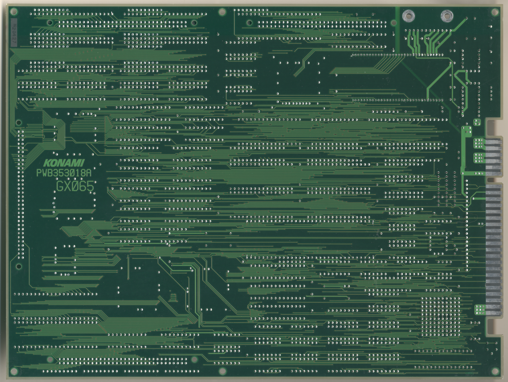

# X-Men
- [MAD Pictures](#mad-pictures)
- [PCB Pictures](#pcb-pictures)
- [Manual / Schematics](#manual-schematics)
- [MAD Eproms](#mad-eproms)
- [RAM Locations](#ram-locations)
- [Errors/Error Codes](#errorserror-codes)
  - [Main CPU](#main-cpu)
  - [Sound CPU](#sound-cpu)
- [MAD Notes](#mad-notes)
  - [Memory Viewer (crash)](#memory-viewer-crash)
  - [Tile Layers](#tile-layers)
  - [Sprite Viewer](#sprite-viewer)
- [MAME vs Hardware](#mame-vs-hardware)

## MAD Pictures

<br>



## PCB Pictures
<a href="docs/images/xmen_pcb_top.png"></a>
<a href="docs/images/xmen_pcb_bottom.png"></a>
<p>

## Manual / Schematics
[Manual w/Schematics](docs/xmen_manual_schematics.pdf)

## MAD Eproms

| Diag | Eprom Type | Location(s) | Notes |
| ---- | ---------- | ----------- | ----- |
| Main on CPU PCB | 27c010 or 27c1001 | 065-eba04.10d @ 10D<br>065-eba05.10f @ 10F |
| Sound on CPU PCB | 27c010 or 27c1001 | 6F | No MAD ROM exists yet |

## RAM Locations
| RAM | Location | Type |
| -------- | :------- | ----- |
| Palette RAM Lower | 9H | CY7C128A-35PC (2k x 8bit) |
| Palette RAM Upper | 10H | CY7C128A-35PC (2k x 8bit) |
| Sound CPU RAM | 7C | LH5168D-10L (8k x 8bit) |
| Sprite RAM Lower | 6J | LH5168D-10L (8k x 8bit) |
| Sprite RAM Upper | 5J | LH5168D-10L (8k x 8bit) |
| Tile RAM | 15F | MN4464M-08LL (8k x 8bit) |
| Tile Attr RAM | 13F | MN4464M-08LL (8k x 8bit) |
| Tile Ext RAM | 14F | MN4464M-08LL (8k x 8bit) |
| Work RAM Lower | 7F | LH5168D-10L (8k x 8bit) |
| Work RAM Upper | 7D | LH5168D-10L (8k x 8bit) |

## Errors/Error Codes
MAD for the main CPU is expecting the game's original sound rom to be there
in order to play sounds, including making beep codes.

### Main CPU
The main CPU is a motorola 68000.  If an error is encountered during tests
MAD will print the error to the screen, play the beep code, then jump to the
error address

On 68000 the error address is `$6000 | error_code << 5`.  Error codes on 68000
are 7 bits.  xmen however has a watchdog address that must be written to
periodically or the game will reset.

```
watchdog address: $10a000 = 0001 0000 1010 0000 0000 0000
error address:    $006000 = 0000 0000 0110 EEEE EEE0 0000
  E = error code
```
The watchdog address is in conflict with the error address.  However instead of
doing a loop to self instruction at the error address, MAD instead does a delay
loop so it stays within the error address range 99.9% of the time and 0.1% of
the time it will ping the watchdog.  This is enough for the error addresses to
still be viable to use with a logic probe.  It just means address lines not be
100% high or low, but 99% of the time.

<!-- ec_table_main_start -->
| Hex  | Number | Beep Code |     Error Address (A23..A1)    |           Error Text           |
| ---: | -----: | --------: | :----------------------------: | :----------------------------- |
| 0x01 |      1 | 0000 0001 |  000 0000 0011 0000 0001 xxxx  | PALETTE RAM ADDRESS            |
| 0x02 |      2 | 0000 0010 |  000 0000 0011 0000 0010 xxxx  | PALETTE RAM DATA LOWER         |
| 0x03 |      3 | 0000 0011 |  000 0000 0011 0000 0011 xxxx  | PALETTE RAM DATA UPPER         |
| 0x04 |      4 | 0000 0100 |  000 0000 0011 0000 0100 xxxx  | PALETTE RAM DATA BOTH          |
| 0x05 |      5 | 0000 0101 |  000 0000 0011 0000 0101 xxxx  | PALETTE RAM MARCH LOWER        |
| 0x06 |      6 | 0000 0110 |  000 0000 0011 0000 0110 xxxx  | PALETTE RAM MARCH UPPER        |
| 0x07 |      7 | 0000 0111 |  000 0000 0011 0000 0111 xxxx  | PALETTE RAM MARCH BOTH         |
| 0x08 |      8 | 0000 1000 |  000 0000 0011 0000 1000 xxxx  | PALETTE RAM OUTPUT LOWER       |
| 0x09 |      9 | 0000 1001 |  000 0000 0011 0000 1001 xxxx  | PALETTE RAM OUTPUT UPPER       |
| 0x0a |     10 | 0000 1010 |  000 0000 0011 0000 1010 xxxx  | PALETTE RAM OUTPUT BOTH        |
| 0x0b |     11 | 0000 1011 |  000 0000 0011 0000 1011 xxxx  | PALETTE RAM WRITE LOWER        |
| 0x0c |     12 | 0000 1100 |  000 0000 0011 0000 1100 xxxx  | PALETTE RAM WRITE UPPER        |
| 0x0d |     13 | 0000 1101 |  000 0000 0011 0000 1101 xxxx  | PALETTE RAM WRITE BOTH         |
| 0x0e |     14 | 0000 1110 |  000 0000 0011 0000 1110 xxxx  | SPRITE RAM ADDRESS             |
| 0x0f |     15 | 0000 1111 |  000 0000 0011 0000 1111 xxxx  | SPRITE RAM DATA LOWER          |
| 0x10 |     16 | 0001 0000 |  000 0000 0011 0001 0000 xxxx  | SPRITE RAM DATA UPPER          |
| 0x11 |     17 | 0001 0001 |  000 0000 0011 0001 0001 xxxx  | SPRITE RAM DATA BOTH           |
| 0x12 |     18 | 0001 0010 |  000 0000 0011 0001 0010 xxxx  | SPRITE RAM MARCH LOWER         |
| 0x13 |     19 | 0001 0011 |  000 0000 0011 0001 0011 xxxx  | SPRITE RAM MARCH UPPER         |
| 0x14 |     20 | 0001 0100 |  000 0000 0011 0001 0100 xxxx  | SPRITE RAM MARCH BOTH          |
| 0x15 |     21 | 0001 0101 |  000 0000 0011 0001 0101 xxxx  | SPRITE RAM OUTPUT LOWER        |
| 0x16 |     22 | 0001 0110 |  000 0000 0011 0001 0110 xxxx  | SPRITE RAM OUTPUT UPPER        |
| 0x17 |     23 | 0001 0111 |  000 0000 0011 0001 0111 xxxx  | SPRITE RAM OUTPUT BOTH         |
| 0x18 |     24 | 0001 1000 |  000 0000 0011 0001 1000 xxxx  | SPRITE RAM WRITE LOWER         |
| 0x19 |     25 | 0001 1001 |  000 0000 0011 0001 1001 xxxx  | SPRITE RAM WRITE UPPER         |
| 0x1a |     26 | 0001 1010 |  000 0000 0011 0001 1010 xxxx  | SPRITE RAM WRITE BOTH          |
| 0x1b |     27 | 0001 1011 |  000 0000 0011 0001 1011 xxxx  | TILE RAM ADDRESS               |
| 0x1c |     28 | 0001 1100 |  000 0000 0011 0001 1100 xxxx  | TILE RAM DATA                  |
| 0x1f |     31 | 0001 1111 |  000 0000 0011 0001 1111 xxxx  | TILE RAM MARCH                 |
| 0x22 |     34 | 0010 0010 |  000 0000 0011 0010 0010 xxxx  | TILE RAM OUTPUT                |
| 0x25 |     37 | 0010 0101 |  000 0000 0011 0010 0101 xxxx  | TILE RAM WRITE                 |
| 0x28 |     40 | 0010 1000 |  000 0000 0011 0010 1000 xxxx  | TILE ATTR RAM ADDRESS          |
| 0x29 |     41 | 0010 1001 |  000 0000 0011 0010 1001 xxxx  | TILE ATTR RAM DATA             |
| 0x2c |     44 | 0010 1100 |  000 0000 0011 0010 1100 xxxx  | TILE ATTR RAM MARCH            |
| 0x2f |     47 | 0010 1111 |  000 0000 0011 0010 1111 xxxx  | TILE ATTR RAM OUTPUT           |
| 0x32 |     50 | 0011 0010 |  000 0000 0011 0011 0010 xxxx  | TILE ATTR RAM WRITE            |
| 0x35 |     53 | 0011 0101 |  000 0000 0011 0011 0101 xxxx  | TILE EXT RAM ADDRESS           |
| 0x36 |     54 | 0011 0110 |  000 0000 0011 0011 0110 xxxx  | TILE EXT RAM DATA              |
| 0x39 |     57 | 0011 1001 |  000 0000 0011 0011 1001 xxxx  | TILE EXT RAM MARCH             |
| 0x3c |     60 | 0011 1100 |  000 0000 0011 0011 1100 xxxx  | TILE EXT RAM OUTPUT            |
| 0x3f |     63 | 0011 1111 |  000 0000 0011 0011 1111 xxxx  | TILE EXT RAM WRITE             |
| 0x42 |     66 | 0100 0010 |  000 0000 0011 0100 0010 xxxx  | WORK RAM ADDRESS               |
| 0x43 |     67 | 0100 0011 |  000 0000 0011 0100 0011 xxxx  | WORK RAM DATA LOWER            |
| 0x44 |     68 | 0100 0100 |  000 0000 0011 0100 0100 xxxx  | WORK RAM DATA UPPER            |
| 0x45 |     69 | 0100 0101 |  000 0000 0011 0100 0101 xxxx  | WORK RAM DATA BOTH             |
| 0x46 |     70 | 0100 0110 |  000 0000 0011 0100 0110 xxxx  | WORK RAM MARCH LOWER           |
| 0x47 |     71 | 0100 0111 |  000 0000 0011 0100 0111 xxxx  | WORK RAM MARCH UPPER           |
| 0x48 |     72 | 0100 1000 |  000 0000 0011 0100 1000 xxxx  | WORK RAM MARCH BOTH            |
| 0x49 |     73 | 0100 1001 |  000 0000 0011 0100 1001 xxxx  | WORK RAM OUTPUT LOWER          |
| 0x4a |     74 | 0100 1010 |  000 0000 0011 0100 1010 xxxx  | WORK RAM OUTPUT UPPER          |
| 0x4b |     75 | 0100 1011 |  000 0000 0011 0100 1011 xxxx  | WORK RAM OUTPUT BOTH           |
| 0x4c |     76 | 0100 1100 |  000 0000 0011 0100 1100 xxxx  | WORK RAM WRITE LOWER           |
| 0x4d |     77 | 0100 1101 |  000 0000 0011 0100 1101 xxxx  | WORK RAM WRITE UPPER           |
| 0x4e |     78 | 0100 1110 |  000 0000 0011 0100 1110 xxxx  | WORK RAM WRITE BOTH            |
| 0x7e |    126 | 0111 1110 |  000 0000 0011 0111 1110 xxxx  | MAD ROM ADDRESS                |
| 0x7f |    127 | 0111 1111 |  000 0000 0011 0111 1111 xxxx  | MAD ROM CRC32                  |

<sup>Table last updated by gen-error-codes-markdown-table on 2025-12-26 @ 18:33 UTC</sup>
<!-- ec_table_main_end -->

### Sound CPU
The sound CPU is a z80.  No MAD rom exists yet for the sound CPU.

## MAD Notes
### Memory Viewer (crash)
The X-Men hardware is pretty picky about doing byte reads on addresses that are
not mapped so something.  If you switch the memory viewer from word to byte
reads it can result in a board crash and watchdog reset.  It will definitely
cause a crash/reset when viewing any of the tile RAM.

### Tile Layers
There are 3 tile layers (fix, layer a, and layer b).  They each use the same set
of tiles.  When you use the tile viewer for each they will display the same
tiles, but are on the corresponding layer.

The color palette is just a random one I picked, so none of the colors for the
tiles will look right compared to in game.

### Sprite Viewer
There is a basic sprite viewer in MAD.  Sprites are a little tricky to
setup/view because I don't know the correct size of each sprite.

The color palette is the one the game uses for the player.  So the colors for
the player should be correct, but maybe completely wrong for other sprites.

## MAME vs Hardware
Nothing that required a MAME specific build
